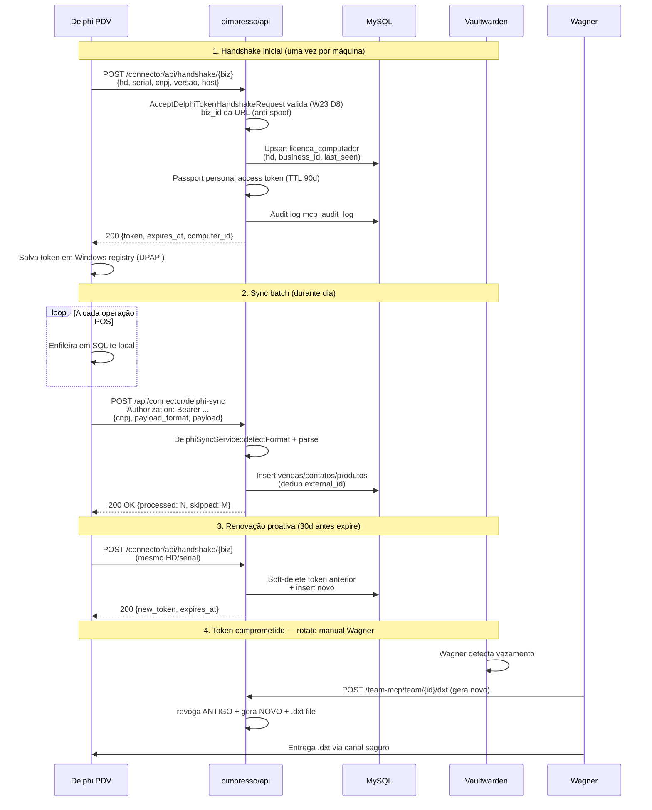

# Modules/Connector

> **API external pra POS / Delphi / app móvel.** Bridge entre clientes externos (apps móveis, ERP Delphi legacy) e o núcleo oimpresso. Roda sobre Laravel Passport (OAuth2 + token) e expõe ~25 endpoints REST.

## Status — Wave 18 RETRY (2026-05-16)

- **Multi-tenant Tier 0**: business_id sempre resolvido via token Passport (ADR 0093). NUNCA do input.
- **Pest tests**: 6 arquivos em `Tests/Feature/` (Auth, MultiTenant, Observability, Scaffold, SmokeApi, Wave18Saturation, CustomerJourney).
- **FormRequests**: 11 (RegisterUser, StoreContactApi, StoreFollowUp, StoreLicencaComputador, StoreOauthClient, UpdateFollowUp, StoreCashRegisterApi, StoreExpenseApi + Wave 18 RETRY: **StoreSync**, **UpdateContactApi**, **StoreProductApi**, **StoreSellPosApi**, **StoreAttendanceApi**).
- **Services**: ContactPayloadValidatorService (validação CPF/CNPJ/email/mobile BR), DelphiSyncService (3 formatos: pipe|json_flat|json_nested).
- **OTel**: spans `connector.contact.validate`, `connector.delphi.sync.*` via `App\Util\OtelHelper` canônico.

## Endpoints principais

| Rota | Método | FormRequest | Service |
|---|---|---|---|
| `/api/contactapi` | POST | StoreContactApiRequest | ContactController |
| `/api/contactapi/{id}` | PUT/PATCH | **UpdateContactApiRequest** (W18) | ContactController |
| `/api/product` | POST | **StoreProductApiRequest** (W18) | ProductController |
| `/api/sell` | POST | **StoreSellPosApiRequest** (W18) | SellController |
| `/api/attendance` | POST | **StoreAttendanceApiRequest** (W18) | AttendanceController |
| `/api/connector/delphi-sync` | POST | **StoreSyncRequest** (W18) | DelphiSyncService |
| `/api/expense` | POST | StoreExpenseApiRequest (W18) | ExpenseController |
| `/api/cashregister` | POST | StoreCashRegisterApiRequest (W18) | CashRegisterController |
| `/api/oauth/clients` | POST | StoreOauthClientRequest | (Passport) |
| `/api/connector/licenca-computador` | POST | StoreLicencaComputadorRequest | LicencaComputadorController |
| `/api/register-user` | POST | RegisterUserRequest | UserController |

## Customer Journey (validado em CustomerJourneyTest)

Fluxo típico POS móvel:

1. **Onboarding**: `POST /api/contactapi` → cria Customer.
2. **Edição**: `PUT /api/contactapi/{id}` → ajusta dados (PATCH parcial via `sometimes`).
3. **Catálogo**: `POST /api/product` → registra Produto novo no estoque.
4. **Venda**: `POST /api/sell` → fecha venda (products[] + payments[]).

Cada step tem FormRequest dedicado com `rules()` + mensagens PT-BR + ownership scoped via token Passport.

## Anti-patterns proibidos (Tier 0)

- ⛔ Aceitar `business_id` do payload — sempre derivar via token Passport.
- ⛔ Bypass `ContactPayloadValidatorService` ao gravar Contact via API (CPF/CNPJ formato BR).
- ⛔ Persistir Marcacao (ponto) sem `Marcacao::anular()` quando ajuste — Portaria 671/2021.

## Como cliente Delphi usa — handshake passo-a-passo (Wave 25)

Cliente legacy (UltimatePOS v6.7 Windows Delphi) integra com oimpresso via
fluxo "handshake → token cached → batch sync". Cada estação Windows fica
auto-suficiente offline e sincroniza em janelas.

### 1. Handshake inicial (uma vez por máquina/instalação)

```http
POST /connector/api/handshake/{business_id}
Content-Type: application/json

{
  "hd":            "ABC123DEF456",       // serial físico do HD
  "serial":        "SOFT-INSTALL-XYZ-001", // serial software (random per install)
  "versao":        "6.7.124",            // versão Delphi
  "ip":            "192.168.1.30",       // opcional, captured server-side
  "cnpj":          "12.345.678/0001-99", // CNPJ do business (validation leve)
  "razao_social":  "LOJA TESTE LTDA",    // audit only
  "host":          "PDV-CAIXA-01"        // hostname máquina
}
```

**Validação** (via `AcceptDelphiTokenHandshakeRequest` — Wave 23):
- `hd` regex `/^[A-Za-z0-9\-_]+$/` (UPPER coerce automatic)
- `serial` 8-120 chars (random per install)
- `versao` semver-like (max 32)
- ⛔ `business_id` no body → `prohibited` (anti-spoofing) — vem na URL

**Resposta** (sucesso 200):
```json
{
  "token":         "Bearer eyJhbGc...",  // Passport personal access token
  "expires_at":    "2026-08-16T00:00:00Z",
  "computer_id":   42,                    // licenca_computador.id
  "business_name": "LOJA TESTE LTDA",
  "ttl_seconds":   7776000                // 90d default
}
```

### 2. Cliente salva token em registry Windows + envia em todo request

```
Authorization: Bearer eyJhbGc...
X-Computer-Id: 42
X-Delphi-Version: 6.7.124
```

### 3. Sync batch (durante o dia)

Cada operação POS (venda fechada, contato novo, expense) é enfileirada localmente
em SQLite Delphi e mandada em batch via `POST /api/connector/delphi-sync`:

```http
POST /api/connector/delphi-sync
Authorization: Bearer eyJhbGc...

{
  "cnpj":    "12.345.678/0001-99",
  "payload_format": "pipe",  // ou "json_flat" ou "json_nested" (DelphiSyncService auto-detect)
  "payload": "venda|001|2026-05-15|123.45\ncontato|002|joao@x.com|..."
}
```

`DelphiSyncService::detectFormat()` lê primeira linha e roteia parser:
- **pipe** legacy = `tipo|id|campo1|campo2|...` (CSV custom)
- **json_flat** = `[{tipo, id, ...}]`
- **json_nested** = `{vendas: [...], contatos: [...]}`

### 4. Renovação de token (cron 30 dias antes expiry)

Cliente Delphi monitora `expires_at` e renova proativamente via:
```http
POST /connector/api/handshake/{business_id}
```
(mesmo HD/serial → backend faz upsert, devolve token novo + revoga anterior).

### Anti-padrões Delphi (Tier 0)

- ⛔ Cliente NÃO armazena CPF/CNPJ em payload pipe sem CNPJ business no header
- ⛔ Cliente NÃO retenta sync > 3× sem backoff exponencial (anti-thundering-herd)
- ⛔ Cliente NÃO envia `business_id` no body — server resolve via token Passport
- ⛔ Cliente NÃO compartilha token entre máquinas — 1 token = 1 `licenca_computador`

### Edge cases (catalogados Wave 25 + Wave 27)

| Cenário | Comportamento esperado |
|---|---|
| HD trocado (HD novo na mesma máquina) | Handshake retorna 401, cliente exige re-auth admin |
| Token expirado mid-sync | 401 → cliente para sync + agenda re-handshake |
| Payload pipe com encoding errado (latin1) | DelphiSyncService força UTF-8 + log warning |
| Sync de venda já enviada (idempotência) | Backend dedup por `external_id` + 200 OK |
| HD lookup retorna 2+ business (suporte cruzado) | Backend escolhe `business_id` da URL, audita warning |
| Clock skew estação Delphi > 5min vs servidor | `expires_at` parse leniente client-side; servidor não rejeita por skew (Tier 0 — Delphi roda em PC sem NTP) |
| Estação offline > TTL (90d) | Cliente perde token; Wagner re-emite via `/team-mcp/team/{id}/dxt` e entrega via Vaultwarden |
| Rede instável (TCP RST mid-batch) | Cliente reenvia batch completo; backend dedup `external_id` evita duplicidade |
| Backend Hostinger em manutenção (502/503) | Cliente para sync por 30min (backoff) + popup operador "off-line — vendas em cache" |
| Banco SQLite Delphi local cheio (disk full) | Cliente loga local + bloqueia novas vendas até liberar espaço; NUNCA descarta batches não-sync |

### Sequence diagram handshake (Wave 27)



## Referências

- ADR 0021 — Connector Delphi bridge (mãe)
- ADR 0093 — Multi-tenant Tier 0 IRREVOGÁVEL
- ADR 0101 — Tests business_id=1 (NUNCA cliente real)
- ADR 0155 — Module Grade v3 D5/D8 (FormRequests + Services extraction)
- `Tests/Feature/CustomerJourneyTest.php` — smoke journey end-to-end light
- `Tests/Feature/Wave18SaturationTest.php` — saturation D5+D6+D8 Wave 17+18
- `Tests/Feature/Wave23ConnectorSaturationTest.php` — Wave 23 handshake + observability
