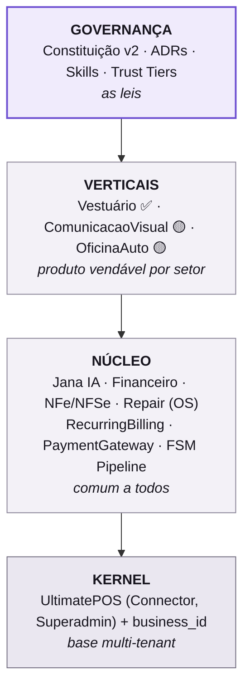
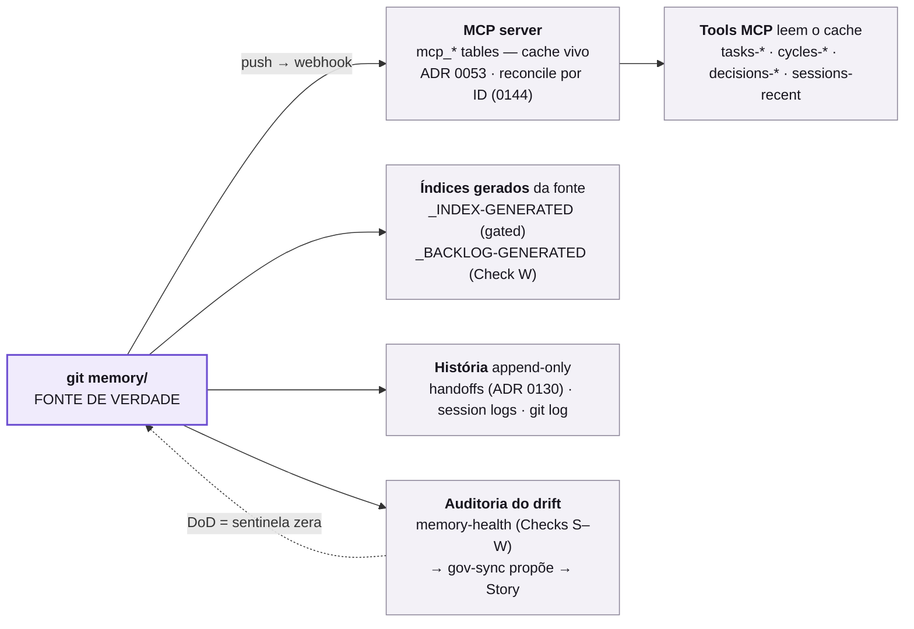

# Guia do Sistema — oimpresso

<!-- documentation-entrypoint: route:produto-operacao -->

> 🧭 Este guia é a **leitura humana** do sistema. Para o **retrato gerado** (estado vivo de módulos, gates required, workflows, ADRs) veja [`reference/PAINEL-SISTEMA.md`](reference/PAINEL-SISTEMA.md) (gerado por [`scripts/governance/system-map.mjs`](../scripts/governance/system-map.mjs)).

> **Pra quem:** Wagner e time, depois de escolher a rota **produto/operação** no [`README.md` da raiz](../README.md). Este guia explica o sistema numa página e aponta como operá-lo com agentes de IA.
>
> **Regra de ouro deste doc:** ele é um **mapa que aponta pras fontes vivas** — não copia o detalhe (detalhe copiado apodrece). Se um número/estado aqui divergir da fonte linkada, **a fonte manda**.
>
> **Estado VIVO (cycle, tasks, brief) nunca vem daqui** — vem das tools MCP: `brief-fetch`, `my-work`, `cycles-active`.

---

## PARTE A — O PRODUTO (o que é o oimpresso)

### A1. Em uma frase

ERP brasileiro **multi-tenant**, **modular especializado por vertical**: um **núcleo comum** (multi-tenant + Jana IA + Financeiro + NFe) que serve qualquer PME BR, e **módulos verticais** (`Modules/<Vertical>`) que aprofundam onde há cliente real. Construído sobre UltimatePOS v6. — [why-oimpresso.md](why-oimpresso.md) · [ADR 0121](decisions/0121-oimpresso-modular-especializado-por-vertical.md)

### A2. As camadas (mental model)

Camada de cima **herda** da de baixo e **nunca contradiz**. Detalhe canônico (arc42, 30+ módulos, trust level, runtime C4): **[governance/ARCHITECTURE.md](governance/ARCHITECTURE.md) — comece por aí pra o mapa técnico.**

### A3. Stack canônica (resumo — fonte: [what-oimpresso.md](what-oimpresso.md))

- **Laravel 13.6 + PHP 8.4** · **MySQL** · **Inertia v3 + React 19 + Tailwind 4** · **Pest v4**
- **nWidart Modules** (`Modules/<Nome>/`) — lista viva em [reference/PAINEL-SISTEMA.md](reference/PAINEL-SISTEMA.md) §"Módulos & verticais" (derivada da árvore; quantos são = `git ls-tree -d --name-only HEAD Modules/ | wc -l`)
- **IA:** `laravel/ai` (camada A) + Agents próprios Jana (camada B) + memória Meilisearch (camada C) — [ADR 0035](decisions/0035-stack-ai-canonica-wagner-2026-04-26.md)

### A4. Onde roda (Tier 0 IRREVOGÁVEL — [ADR 0062](decisions/0062-separacao-runtime-hostinger-ct100.md))

| Ambiente | O que roda | ⛔ Nunca |
|---|---|---|
| **Hostinger** (shared) | ERP web + `git pull` de deploy | daemons, `laravel/octane`, `laravel/mcp`, testes pesados |
| **CT 100 Proxmox** (tailscale) | FrankenPHP + Centrifugo + Meilisearch + **MCP server** + Ollama embedder + Vaultwarden + **testes/PHPStan** | — |
| **GitHub `origin/main`** | fonte de verdade do código + `memory/` | — |

Acesso/deploy detalhado: [reference/INFRA-ACESSO-CANON.md](reference/INFRA-ACESSO-CANON.md). **O desenho** desse runtime — quem fala com quem, num diagrama C4-Container em Mermaid, versionado e revisável em PR — é o **§1-bis** de [governance/ARCHITECTURE.md](governance/ARCHITECTURE.md). Fica lá e não é copiado pra cá **de propósito**: diagrama duplicado drifta do original em silêncio, e o de lá já carrega uma contagem de módulos que envelheceu — um segundo exemplar só multiplicaria o problema.

### A5. Verticais — estado (fonte: [why-oimpresso.md](why-oimpresso.md))

| Vertical | CNAE | Status | Cliente piloto |
|---|---|---|---|
| **Vestuario** | 4781-4/00 | ✅ em produção | **ROTA LIVRE** (Larissa, `business_id=4`, 99% do volume) |
| **ComunicacaoVisual** | 1813-0/01 | 🟡 em construção | 6 candidatos OfficeImpresso |
| **OficinaAuto** | 4520-0/01 | 🟡 piloto LIVE (prod biz=164) | Martinho (mecânica pesada, ~91 veículos) — é **reparo/mecânica**, nunca locação ([ADR 0265](decisions/0265-oficina-reparo-erradica-locacao.md)) |

> ROTA LIVRE não é exceção — é o **caso piloto validado em prod há 2+ anos**. Teste automatizado usa o tenant **fictício biz=98**, nunca biz=4 do cliente e nem mais biz=1 (que é a WR2, empresa real) — [ADR 0358](decisions/0358-doutrina-de-teste-tenant-98-supersede-0101.md). Smoke fiscal manual contra SEFAZ homologação segue em biz=1 (certificado do próprio [W]).

### A6. Peças transversais que vale conhecer

- **Jana IA** — copiloto conversacional com memória persistente ([Modules/Jana](../Modules/Jana/), skill `jana-arch`)
- **FSM Pipeline** — toda mudança de estado de Venda/OS passa por [`app/Domain/Fsm/Services/ExecuteStageActionService.php`](../app/Domain/Fsm/Services/ExecuteStageActionService.php) ([ADR 0143](decisions/0143-fsm-pipeline-live-prod-marco-2026-05-12.md)); UPDATE direto em `current_stage_id` é bloqueado pelo trait [`app/Domain/Fsm/Concerns/GuardsFsmTransitions.php`](../app/Domain/Fsm/Concerns/GuardsFsmTransitions.php)
- **MCP server** (`mcp.oimpresso.com`) — expõe conhecimento canônico do `memory/` como tools ([ADR 0053](decisions/0053-mcp-server-governanca-como-produto.md)). O servidor é [`Modules/Jana/Mcp/OimpressoMcpServer.php`](../Modules/Jana/Mcp/OimpressoMcpServer.php), e a rota que o monta está **dentro de um `if`**: sem `mcp.tools_exposed` ligado ela nem existe — por isso o Hostinger responde 404 e só o CT 100 serve tools ([ADR 0062](decisions/0062-separacao-runtime-hostinger-ct100.md))
- **Forja** — a **cara humana** do estado vivo que a PARTE B consulta por tool: Kanban, backlog, roadmap, triagem, caixa de entrada e burndown em `/project-mgmt`, sobre as mesmas tabelas `mcp_*` que as tools `tasks-*`/`cycles-*` leem. A administração do time e dos tokens MCP mora em `/team-mcp`, no mesmo módulo ([Modules/Forja](../Modules/Forja/))
- **Multi-tenant Tier 0** — `business_id` global scope obrigatório; vazar dado entre tenants é o pior bug possível ([ADR 0093](decisions/0093-multi-tenant-isolation-tier-0.md))

### A7. Por que existe assim — três eras

A forma atual do sistema é consequência direta da segunda era. Linhagem completa e datada em [HISTORIA-LINHAGEM.md](HISTORIA-LINHAGEM.md).

| Era | Período | O que aconteceu |
|---|---|---|
| **I — Delphi** | ~26 anos, até 2026 | WR Sistemas / OfficeImpresso: Object Pascal + Firebird, um `.FDB` por cliente, setor gráfico, sistema offline. Vinte e seis anos de domínio que o sistema novo ainda consulta como contrato de paridade. |
| **II — A decisão** | 2026-04 | Estender o **UltimatePOS v6** em vez de reescrever ou forkar ([ADR 0001](decisions/0001-estender-ultimatepos-opcao-c.md), decidida por Eliana), com modularidade nWidart ([ADR 0002](decisions/0002-nwidart-laravel-modules.md)). Nasce como módulo de ponto sob a Portaria MTP 671/2021 — hoje [`Modules/Ponto`](../Modules/Ponto/). |
| **III — oimpresso modular** | 2026+ | Pivô multi-vertical ([ADR 0121](decisions/0121-oimpresso-modular-especializado-por-vertical.md)) e Constituição v2 ([ADR 0094](decisions/0094-constituicao-v2-7-camadas-8-principios.md)). O Delphi legado **segue vivo**, com integração aditiva ([ADR 0113](decisions/0113-integracao-delphi-laravel-ads-3-caminhos.md)) e pipeline de migração Firebird ([ADR 0203](decisions/0203-legacy-migration-pipeline-firebird-oimpresso-w29.md)). |

**A era II explica quase tudo que veio depois:** o kernel herdado, o `business_id`, e os ~6.400 usos de `Form::` em Blade que ainda são preservados pelo shim [`app/View/Helpers/Form.php`](../app/View/Helpers/Form.php).

### A8. A Jana — o produto de IA

Não é um chatbot: é o **front de decisão do dono do negócio** sobre um ERP multi-tenant. Entrega chat com memória persistente por empresa, brief diário auto-gerado, sugestão de metas com apuração agendada, e alertas de desvio.

- **Três camadas** ([ADR 0035](decisions/0035-stack-ai-canonica-wagner-2026-04-26.md)): **(A)** wrapper `laravel/ai`; **(B)** agents próprios em [`Modules/Jana/Ai/Agents/`](../Modules/Jana/Ai/Agents/) — o Vizra ADK foi avaliado e **rejeitado** ([ADR 0048](decisions/0048-framework-agentes-laravel-ai-vizra-rejeitada.md)); **(C)** memória atrás da interface [`Modules/Jana/Contracts/MemoriaContrato.php`](../Modules/Jana/Contracts/MemoriaContrato.php) + Meilisearch + embeddings Ollama, com recall reordenado por decaimento no tempo.
- **O isolamento é mecânico, não instruído** — o `business_id` vem do **construtor da tool, nunca do modelo** ([ADR 0141](decisions/0141-agents-tool-use-pattern-claude-code.md) + [0093](decisions/0093-multi-tenant-isolation-tier-0.md)). Mesmo que o LLM tente injetar outro, a tool ignora. Não se confia no prompt para garantir isolamento — confia-se no código.
- **A qualidade morde o CI** — evals de recall e RAGAS com baseline que reprova regressão. ⚠️ O `jana:drift-sentinel` ([`Modules/Jana/Console/Commands/JanaDriftSentinelCommand.php`](../Modules/Jana/Console/Commands/JanaDriftSentinelCommand.php)) **não mede a qualidade da Jana**: ele pontua fidelidade comparando o gabarito consigo mesmo, o que dá `1.0` por construção. O que ele vigia é **o juiz** — se cair, quem quebrou foi o avaliador, não a Jana.

### A9. O IA-OS — governança que é código, não PDF

- **Constituição v2** ([ADR 0094](decisions/0094-constituicao-v2-7-camadas-8-principios.md)) — 7 camadas ascendentes, cada uma com **um dono e um contrato**; camada de cima só invoca primitivo da de baixo. ADRs são **append-only**: mudar uma exige escrever outra que a supersede.
- **A camada L2 é o ADS** (Adaptive Decision System) — o firewall que decidiria *quem* age e *com que autoridade* (bloquear · humano · modelo remoto · modelo local). Está **dormente por decisão, não por atraso** ([ADR 0105](decisions/0105-cliente-como-sinal-guiar-sem-mandar.md)): backlog só ativa com cliente que paga e reporta. **Enquanto ele dorme, o roteamento de decisão é o [W].**
- **Servidor MCP** ([ADR 0053](decisions/0053-mcp-server-governanca-como-produto.md)) — sincroniza `memory/*` do git por webhook (PII redigida no caminho) e serve o estado vivo. Toda ação vai para audit log imutável.
- **Identity Mesh** ([ADR 0081](decisions/0081-identity-mesh-mcp-actors.md)) — cada ator tem manifesto com trust level L0–L4. Sem manifesto, sem ação: default-deny.
- **A linha vermelha do contrato de agente** — agentes têm **ler** e **propor**; `git.merge` e `constituicao.edit` são **negados no token** ([ADR 0114](decisions/0114-prototipo-ui-cowork-loop-formalizado.md) · [0282](decisions/0282-protocolo-v2-colapso-ratificacao.md)). Propor é permitido; decidir o merge não é.
- **Doutrina** ([ADR 0256](decisions/0256-knowledge-survival-meia-vida-catraca-sentinela.md)): *derivado e enforçado sobrevive; escrito e lembrado apodrece*.

#### A9.1 — As sete camadas, e em que estado cada uma está

A [ADR 0094](decisions/0094-constituicao-v2-7-camadas-8-principios.md) descreve o **desenho**; o estado **real e datado** de cada camada é a [ADR 0330](decisions/0330-mapa-dos-niveis-estado-real-2026-07-constituicao.md), emendada pela [0333](decisions/0333-emenda-0330-eixo-rodar-e-observar-submedido.md). A tabela abaixo serve para saber **onde procurar** — contagens e datas ficam na ADR, que é a dona delas.

| Camada | O que é | Estado |
|---|---|---|
| **L7 · Daily Brief** | o estado consolidado que abre a sessão (`brief-fetch`) | ✅ em produção |
| **L6 · Charters** | a lei de cada tela, ao lado do `.tsx`, defendida por gate `required` | ✅ em produção |
| **L5 · ADRs canon** | as decisões, append-only, com índice **gerado** do disco | ⚠️ vivo — o volume passou da meta de poda, e podar ou aceitar é decisão em aberto |
| **L4 · Playbooks** | RUNBOOKs de procedimento operacional | 🔸 parcial — existem aos montes, mas o contrato de "quando foi testado pela última vez" nunca foi adotado |
| **L3 · Skills** | automações que carregam por contexto (Tier A sempre-on, Tier B por gatilho) | ✅ em produção |
| **L2 · ADS** | o firewall que decidiria *quem* age e com que autoridade | 🔸 **dormente por decisão** (ver o bullet acima) |
| **L1 · MCP Core** | tools + memória + audit log + tokens de time | ✅ em produção |

**Camada de cima invoca primitivo da de baixo, nunca o contrário.** Um 🔸 não é atraso a cobrar: é estado declarado, com a razão escrita na ADR.

#### A9.2 — O invariante anti-atrofia (por que a governança não pode virar o produto)

A [ADR 0334](decisions/0334-modelo-3-camadas-invariante-anti-atrofia-inteligencia-negocio.md) separa três coisas que se confundem com facilidade: **(A) o Produto ERP** — os módulos que o cliente usa; **(B) o Produto IA** — a Jana respondendo sobre o negócio *dele*, com dado real; e **(C) o IA-OS** — esta governança toda. E instala o invariante:

> **(C) existe para servir (A) + (B). (C) nunca cresce sistemicamente enquanto (A) + (B) atrofia sem sinal de cliente.**

Governança-meta é investimento — velocidade, segurança do cliente, onboarding do time — não um fim em si. **Quando a régua passa a dirigir a prioridade no lugar do sinal do cliente, a régua virou o produto**, e isso é a deriva que a ADR nomeia. O critério que separa atrofia de pausa disciplinada não é *"construiu pouca feature?"*, e sim *"a capacidade de sentir e agir sobre sinal do cliente está intacta e conectada?"*.

### A10. Como o conhecimento é indexado

O repositório é a fonte; o índice é cache governado. Nunca o contrário.

1. **Nasce em `memory/`, no git** — versionado, revisável, com histórico. Zero memória privada do agente ([ADR 0061](decisions/0061-conhecimento-canonico-git-mcp-zero-automem.md)).
2. **Webhook empurra para o MCP** — a cada push, os documentos vão para a tabela `mcp_memory_documents` — modelo [`Modules/Jana/Entities/Mcp/McpMemoryDocument.php`](../Modules/Jana/Entities/Mcp/McpMemoryDocument.php) — com PII redigida no caminho.
3. **Dois índices convivem, de propósito** — FULLTEXT no MySQL para casamento exato, e Meilisearch com embeddings Ollama para busca por sentido ([ADR 0033](decisions/0033-vector-store-meilisearch-pgvector-mem0.md) · [0036](decisions/0036-replanejamento-meilisearch-first.md)). Termo raro o léxico acha melhor; pergunta em linguagem natural, o vetor.
4. **O recall é reordenado** — reranking e decaimento no tempo ([ADR 0067](decisions/0067-sprint8-mcp-memory-document-searchable-retrieval.md) · [0068](decisions/0068-sprint9-retrieval-ollama-reranker-strategy.md)). Sem isso, a memória serve a verdade de seis meses atrás com a mesma confiança da de ontem.
5. **A qualidade é medida contra gabarito real** — `jana:ragas-real-eval` ([`Modules/Jana/Console/Commands/JanaRagasRealEvalCommand.php`](../Modules/Jana/Console/Commands/JanaRagasRealEvalCommand.php)) roda o pipeline de verdade; a versão anterior comparava o gabarito consigo mesmo e passava sempre, e foi morta por isso ([ADR 0318](decisions/0318-ragas-eval-real-mata-tautologia-ct100-staging.md)).

### A11. O que é observado

Quatro instrumentos, cada um respondendo uma pergunta diferente — saber qual abrir é metade do diagnóstico.

| Pergunta | Instrumento | Onde |
|---|---|---|
| A IA está cara, lenta ou alucinando? | **Langfuse** — trace por empresa ([ADR 0132](decisions/0132-langfuse-self-host-ct100.md)) | CT 100 |
| Onde o request gastou o tempo? | **Jaeger + OTel** ([ADR 0162](decisions/0162-otel-collector-prod-observability.md) · [0051](decisions/0051-schema-proprio-adapter-otel-genai.md)) | CT 100 |
| O sistema está saudável hoje? | [`php artisan jana:health-check`](../Modules/Jana/Console/Commands/HealthCheckCommand.php) — checks SQL diários | agendado |
| Os módulos estão apodrecendo? | **vital-signs** — regerado à noite | governança |

⚠️ **Ponto cego declarado:** a [ADR 0333](decisions/0333-emenda-0330-eixo-rodar-e-observar-submedido.md) registra que o eixo **rodar-e-observar está sub-medido** — a régua do projeto media bem construir-e-governar, e mal operar.

### A12. Como uma decisão vira lei

1. **Alguém propõe** — documento em `decisions/proposals/`, formato Nygard. Propor é permitido a todos.
2. **Vira ADR numerada, com status `proposto`** — entra no índice **gerado** ([ADR 0258](decisions/0258-processo-adr-estado-arte-indice-gerado-supersede-atomico.md)), derivado do disco.
3. **[W] ratifica — e o merge é o ato.** Um PR que vira *só* a linha de status. Não existe assinatura separada.
4. **A partir daí é append-only** — ADR aceita **não se edita**; um gate de CI bloqueia. Mudou de ideia? Escreve outra com `supersedes`.

O efeito colateral é o mais valioso do projeto: **existe um registro datado do raciocínio**. Quando alguém perguntar "por que decidimos assim?", a resposta não depende de lembrança.

### A13. Os quatro fluxos de operação

Todos passam pelo mesmo portão — e é isso que os torna auditáveis.

- **Uma venda** — nasce rascunho de orçamento e caminha até concluída. Não muda de estágio por atribuição: cada passo é uma **ação nomeada**, com papel autorizado por empresa. Dispara efeitos isolados, cada um numa classe própria em `app/Domain/Fsm/SideEffects/`: [`ReservarEstoque`](../app/Domain/Fsm/SideEffects/ReservarEstoque.php), [`ConsumirEstoque`](../app/Domain/Fsm/SideEffects/ConsumirEstoque.php), [`LiberarReserva`](../app/Domain/Fsm/SideEffects/LiberarReserva.php). A emissão fiscal está amarrada ao estágio, não a um botão avulso.
- **Uma ordem de serviço** — mesma mecânica, vocabulário de oficina: recebido para diagnóstico → orçamento → aprovação → execução → entrega. O Kanban é a projeção visual desses estágios; mover o cartão **é** executar a ação.
- **Um cancelamento** — o caso difícil, porque não é um `DELETE`: cancela a nota na SEFAZ **preservando o número sequencial** (a lei o considera usado), estorna no gateway, devolve o estoque, e avisa o cliente **só se ele consentiu** (LGPD).
- **Um deploy** ([ADR 0269](decisions/0269-deploy-automatico-build-no-runner.md)) — merge em `main` que toque código dispara build no runner, manutenção, migrations, reset de opcode e **smoke em `/login`**; se o boot falhar, um failsafe segura um 503 gracioso. Mudança só em documentação **não** dispara deploy (`paths-ignore: memory/** · **.md`) — o que economiza minutos de pipeline e tem um efeito que vale saber: **markdown novo só chega ao servidor no deploy seguinte**.

**O fio que une os quatro:** um portão único, efeitos com nome próprio, histórico que não se reescreve, permissão checada por empresa. Quando algo dá errado, *"o que aconteceu aqui?"* tem resposta — e essa é a diferença entre um ERP que se opera e um que se adivinha.

---

## PARTE B — COMO USAR (operar com o Claude Code)

### B1. Protocolo de sessão (o passo-a-passo)

1. **`brief-fetch`** — 1ª coisa, sempre. Estado consolidado (~3k tokens): cycle, tasks, decisões 24h, flags. (skill `brief-first`)
2. **`my-work`** / **`my-inbox`** — suas tasks e notificações
3. **Antes de mexer num módulo** → pré-flight: ler `SPEC.md` + `RUNBOOK*.md` + charter da tela (skill `preflight-modulo`)
4. **Trabalhar** (ler → editar → testar no CT 100)
5. **Commit** conventional + `[W]`/`[F]`/... + `Refs:` (skill `commit-discipline`)
6. **Fechar sessão** → handoff append-only + session log (skill `encerrar-sessao`)

Detalhe: [how-trabalhar.md](how-trabalhar.md).

### B2. Tools MCP — cola de bolso (estado vivo, nunca markdown)

| Pergunta | Tool |
|---|---|
| Estado do projeto (CHAME 1º) | `brief-fetch` |
| O que estou fazendo? | `my-work` |
| Caixa de entrada | `my-inbox` |
| Cycle ativo + goals | `cycles-active` |
| Backlog do módulo X | `tasks-list module:X` |
| Detalhe de uma task | `tasks-detail task_id:...` |
| Qual ADR fala sobre X? | `decisions-search query:"X"` |
| Ler ADR inteira | `decisions-fetch slug:"..."` |
| Fato do negócio sobre Y | `memoria-search query:"Y"` |

Tasks são entidades vivas no MCP (Jira-style), **não** arquivos markdown ([ADR 0070](decisions/0070-jira-style-task-management-current-md-removed.md)).

### B3. Como me pedir as coisas (o que funciona melhor)

- **Pedido vago = eu pergunto antes** de implementar (é regra, não preguiça). Quanto mais concreto o critério de "pronto", menos idas e voltas.
- **Tela nova / mudar tela** → comece pelo [guia atual de pedidos para agentes](../HOW_TO_ASK_CLAUDE.md). Design vem do **protótipo Cowork** (`prototipo-ui/`), não de Figma ([ADR 0299](decisions/0299-figma-nao-e-fonte-de-design.md)).
- **Auditar/comparar módulo com o mercado** → `/comparativo <Modulo>` ou agente `capterra-senior`.
- **"Como os melhores fazem X?"** → agente `estado-da-arte`.
- **Fazer em paralelo (N frentes isoladas)** → agente `coordenador-paralelo`.
- **Entender um pedido cru antes de executar** → agente `wagner-understand`.

### B4. As linhas vermelhas (Tier 0 — eu respeito automaticamente)

Fonte completa: [proibicoes.md](proibicoes.md). As que mais te afetam:

- **R1 — Smoke real, não narração.** "Funcionando/deployed" só com evidência (`curl` com status, ou screenshot pós-deploy de UI). Sem prova = não está pronto.
- **R10 — Aprovação humana** antes de `git push` / `pr merge` / deploy. **R11** — dentro de um escopo que você já aprovou, eu vou até o fim sem ficar te cutucando.
- **Regra Mestre de VALOR/ESTOQUE** — toda mudança que toque preço/total/desconto/imposto/estoque exige **dupla conferência com números** + eu te mostro a tabela **antes→depois** antes de aplicar.
- **"Mexeu, registra"** — mudança em módulo/schema/infra vai pro git + testes + docs na hora (nada de "depois eu commito").
- **Multi-tenant** — `business_id` sempre scopado. **Testes** só no CT 100. **PT-BR** em tudo. **Sem valores BRL no git** (só você e a Eliana veem valores; time vê escopo/contagem).

### B5. Governança em 30 segundos

- **Constituição v2** = lei máxima ([ADR 0094](decisions/0094-constituicao-v2-7-camadas-8-principios.md)): 7 camadas + 8 princípios duros. Append-only — muda só via ADR nova com `supersedes`.
- **ADRs** = decisões arquiteturais (`memory/decisions/`, formato Nygard). Índice vivo: [decisions/_INDEX-GENERATED.md](decisions/_INDEX-GENERATED.md).
- **Skills** = automações por contexto (`.claude/skills/`). **Tier A** sempre-on (multi-tenant, commit-discipline, smoke). **Tier B** disparam por path/intenção.
- **Rules path-scoped** (`.claude/rules/`) = instruções que só carregam ao tocar certos arquivos.
- **Saúde:** `php artisan jana:health-check` diário — os checks vivem no próprio comando ([`Modules/Jana/Console/Commands/HealthCheckCommand.php`](../Modules/Jana/Console/Commands/HealthCheckCommand.php) se auto-reporta a contagem); não fixar número à mão (LC-08).

### B6. Quem cuida da documentação (o modelo — não há um "responsável" único, por design)

- **Não existe um chefe/agente único de documentação.** Cada tipo de doc tem um **dono-máquina**: um gerador que a **DERIVA** da fonte + um gate que **morde** quando ela drifta (ADR 0256: *derivado+enforçado sobrevive; escrito+lembrado apodrece*).
- **Quem decide o canon é humano** ([W]/[F]): ADR, proposal, token/componente novo. A IA **gera e mantém sob os gates** — não altera sozinha a máquina que a fiscaliza.
- **O censo de TODAS as máquinas** (geradores + gates + hooks + skills + agents) é **derivado**, não escrito à mão: [governance/MAQUINAS-INVENTARIO.md](../governance/MAQUINAS-INVENTARIO.md) (regerado por [`scripts/governance/maquinas-inventario.mjs`](../scripts/governance/maquinas-inventario.mjs)). Donos por camada: [reference/PAINEL-SISTEMA.md](reference/PAINEL-SISTEMA.md). Saúde do ciclo documental (snapshot antes→correção no dono→depois): [`scripts/governance/documentation-loop.mjs`](../scripts/governance/documentation-loop.mjs).
- ⛔ A resposta pra *"onde acho X / quem faz Y"* **NÃO é um índice/mapa novo** — foi tentado e reprovado 2× ([proibicoes.md](proibicoes.md) §5 2026-07-23 e 2026-07-25). Os donos já existem: **estende ou aponta**, nunca abre paralelo.

#### B6.1 — Como pedir mudança de documentação (fluxo de 6 passos)

Origem: [W] 2026-08-02 — *"preciso de um responsável que não se desvie do foco e mantenha atualizado; já aconteceram muitos erros por causa disso"*. O responsável **não é uma pessoa nem um agente novo** (ver bullet 1 acima): é este procedimento + o workflow [`documentacao-tecnica`](../.claude/workflows/documentacao-tecnica.js), cuja lei já é *"escolha **exatamente 1** achado acionável"*.

1. **[W] pede em uma frase, no chat.** É o canal real — nenhuma US ou UC foi escrita por [W] sozinho em 60 dias (verificado 2026-07-16).
2. **O agente declara o escopo ANTES de tocar em nada** — uma linha: *"vou fazer X; não vou fazer Y nem Z"*. É aqui que [W] corta, não três PRs depois.
3. **Um item por vez**, via `documentacao-tecnica`: mede o drift → corrige **no dono existente** → prova com recibo antes→depois pelo mesmo detector → abre PR.
4. **O conteúdo vai pro DONO** (tabela abaixo). Nunca pra arquivo novo.
5. **[W] mergeia** — o merge é o ato de ratificação.
6. **A página não precisa de sincronização**, porque é derivada: `/documentacao` renderiza este arquivo em runtime e não existe cópia intermediária. ⚠️ Mas ela **não é instantânea**: o deploy ignora `memory/**` e `**.md` ([ADR 0269](decisions/0269-deploy-automatico-build-no-runner.md)), então o texto novo aparece no **próximo deploy de código** — ou num `quick-sync` disparado à mão. Nada a sincronizar ≠ chega na hora.

| O que é | Dono |
|---|---|
| Documentação do sistema | **este arquivo** (`GUIA-DO-SISTEMA.md`) |
| Decisão arquitetural | `decisions/NNNN-*.md` (append-only) |
| Estado de um módulo | `requisitos/<Mod>/BRIEFING.md` |
| Requisito | `requisitos/<Mod>/SPEC.md` |
| Procedimento operacional | `RUNBOOK-*.md` |
| Lei de uma tela | `<Tela>.charter.md`, ao lado do `.tsx` |
| Retrato gerado (módulos, gates) | [`reference/PAINEL-SISTEMA.md`](reference/PAINEL-SISTEMA.md) — **não se edita à mão** |

**As três regras que evitam os erros de 2026-08-02:**

- **Nada de cópia.** Nenhum HTML commitado, nenhum resumo paralelo. Se existe cópia, alguém tem que sincronizar — e ninguém sincroniza.
- **Nada de documento novo quando o dono existe.** A pergunta antes de criar é sempre: *quem já é dono deste assunto?*
- **Achado adjacente não emenda.** Encontrou outro problema no caminho? Reporta em UMA linha e **para**. [W] decide se vira trabalho, e quando. _(O que deu errado naquela sessão: cada achado adjacente virou "sim" por reflexo, e o pedido original — a documentação — ficou parado no meio.)_

---

## Backbone operacional — como tudo se conecta

> Como tarefas, backlog, changelog, ciclos e histórico ficam **em máquina e integrados** (auditoria 2026-07-04).

**A fonte é o git; o MCP é cache governado** (nunca o inverso — [ADR 0061](decisions/0061-conhecimento-canonico-git-mcp-zero-automem.md)):

| Sistema | Onde vive / máquina |
|---|---|
| **Tarefas / backlog** | US-* nos `SPEC.md` (git canon) → tabela `mcp_tasks`, modelo [`Modules/Jana/Entities/Mcp/McpTask.php`](../Modules/Jana/Entities/Mcp/McpTask.php) (cache). Índice `_BACKLOG-GENERATED` (gerado). Tools `tasks-*`. |
| **ADRs** | `decisions/*.md` (Nygard) → índice `_INDEX-GENERATED` (gerado + gated). Tool `decisions-search`. |
| **Changelog** | git history + índices gerados + shipped-logs. O `CHANGELOG.md` manual está **congelado** (legado abr/2026). |
| **Ciclos** | tabela `mcp_cycles`, modelo [`Modules/Jana/Entities/Mcp/McpCycle.php`](../Modules/Jana/Entities/Mcp/McpCycle.php) (Linear-style, `cycles-*`). **Modo atual: off-cycle** (fluxo contínuo desde CYCLE-08) — reativar é `cycles-create` quando quiser planejar em janelas de 2 semanas. |
| **Histórico** | git (canon) + handoffs append-only + session logs → sincroniza pro MCP (time vê via `sessions-recent`). |

> **Modo off-cycle é intencional** (não um bug): o projeto roda em fluxo contínuo; velocity/burndown por cycle ficam dormentes até um `cycles-create`. O cron mantém o shipped-log do último cycle.

## Navegação — pra ir fundo

| Quero... | Vá pra |
|---|---|
| Mapa técnico do produto (arc42) | [governance/ARCHITECTURE.md](governance/ARCHITECTURE.md) |
| Quem gera/enforça a documentação (todas as máquinas) | [governance/MAQUINAS-INVENTARIO.md](../governance/MAQUINAS-INVENTARIO.md) |
| Voltar à porta global / escolher outra rota | [README.md da raiz](../README.md) |
| Procurar um documento conhecido | [INDEX.md](INDEX.md) · [INDEX_TEMATICO.md](INDEX_TEMATICO.md) |
| Regras de sessão / como trabalhar | [how-trabalhar.md](how-trabalhar.md) · [CLAUDE.md](../CLAUDE.md) |
| Linhas vermelhas | [proibicoes.md](proibicoes.md) |
| Time e papéis | [regras-time.md](regras-time.md) · [TEAM.md](../TEAM.md) |
| Responsabilidade de um módulo | `Modules/<X>/SCOPE.md` + `BRIEFING.md` |
| Conectar um dev novo ao MCP | [MEMORY_TEAM_ONBOARDING.md](../MEMORY_TEAM_ONBOARDING.md) |

---

_Guia da rota produto/operação — delega o detalhe às fontes vivas. Criado em 2026-07-04; alinhado à porta global única em 2026-07-22. Rotas novas são adicionadas ao `README.md` da raiz, não aqui._
