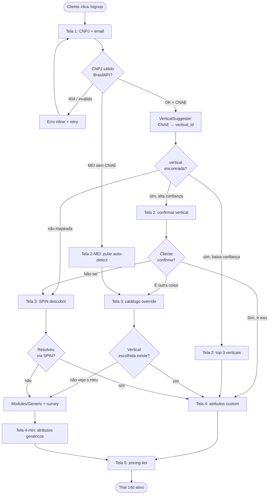

# Onboarding Wizard — Decision Tree Modular Especializado — 2026-05-10

**Status:** proposal
**Autor:** Claude Code (product designer + UX engineer)
**Contexto:** ADR 0121 (oimpresso modular especializado por vertical) — cliente novo precisa identificar o módulo vertical correto no cadastro.
**Cliente piloto referência:** ROTA LIVRE (biz=4, Larissa, Modules/ComunicacaoVisual)
**Meta:** ≥80% conversion funnel completo, ≤3 minutos médio, ≤15% override rate (auto-detect funcionando bem)

---

## Visão geral



---

## Fluxo principal (5 telas)

### Tela 1 — CNPJ + email

**Objetivo:** capturar identidade legal + contato sem fricção.

**UI:**
- Campo CNPJ (mask `00.000.000/0000-00`) — autofocus
- Campo email
- Checkbox "Sou MEI / não tenho CNAE definido" (alternativa)
- Botão `Continuar` (disabled até CNPJ válido)
- Link discreto: "Quero testar sem cadastrar" → demo readonly biz=demo

**Comportamento:**
- Validação CNPJ client-side (algoritmo dígitos verificadores) antes de chamar API
- Loader 2-3s durante BrasilAPI lookup
- Auto-fill silencioso: razão social, endereço, CNAE primário, CNAE secundários, situação cadastral
- Cache 24h em `onboarding_attempts.brasilapi_payload` (LGPD: dado público, ok)
- Erro 404 BrasilAPI → "CNPJ não encontrado na Receita. Verifica e tenta de novo, ou continua mesmo assim" (fallback manual)

**Anti-padrões evitados:**
- ❌ Pedir senha aqui (só após escolher vertical — reduz drop-off)
- ❌ Pedir telefone obrigatório (LGPD minimização)
- ❌ Captcha visível (rate limit IP server-side é suficiente)

---

### Tela 2 — Confirmar Vertical Sugerida

**Caminho A — alta confiança (≥80% match CNAE→vertical):**

```
┌─────────────────────────────────────────────────┐
│ Olá, [Razão Social]!                            │
│                                                 │
│ Detectamos seu CNAE primário:                   │
│   1813-0/01 — Impressão de material           │
│   para uso publicitário                         │
│                                                 │
│ Sugerimos o módulo:                             │
│                                                 │
│  ┌───────────────────────────────────────────┐  │
│  │  Comunicação Visual                       │  │
│  │  Gráfica rápida · Plotter · Fachadas     │  │
│  │  3 features destacadas                    │  │
│  └───────────────────────────────────────────┘  │
│                                                 │
│  [   Sim, é isso   ]  ← botão GRANDE primário   │
│                                                 │
│  É outra coisa  ·  Não sei ainda                │
└─────────────────────────────────────────────────┘
```

**Caminho B — baixa confiança (<80% match) ou múltiplos CNAEs secundários:**

- Mostra top-3 verticais ordenadas por score
- Cards lado a lado (mobile: stack vertical)
- Caso especial: "Você tem múltiplas atividades. Qual é a principal hoje?"
- Mensagem rodapé: "Você pode adicionar outros módulos depois (ex: Serviços, Financeiro Pro)."

**Caminho C — MEI sem CNAE:**

- Pula direto pra Tela 3 (catálogo) — sem auto-suggestão

---

### Tela 3 — Override / Catálogo / SPIN

**Caso 3a — Cliente clicou "É outra coisa":**

Catálogo grid (3 cols desktop, 1 col mobile) com TODAS verticais existentes:

| Vertical | Headline | 3 features |
|---|---|---|
| ComunicacaoVisual | "Gráfica rápida, plotter, fachada" | Orçamento m² · NFS-e · Job board |
| Vestuario | "Confecção, moda, varejo" | PDV · Grade tamanho/cor · Ecommerce |
| OficinaAuto | "Mecânica, autopeças, lava-rápido" | OS · Estoque peças · Histórico veículo |
| Servicos | "Prestação de serviço PJ/PF" | Contrato · Recurring · NFS-e |
| Generic | "Outro segmento" | ERP base · Customizável · Avaliação |

Filtro busca topo: "Buscar por palavra-chave (ex: gráfica, oficina)".

CTA secundária: **"Não vejo o meu segmento"** → abre survey curto (3 perguntas) + cai em Modules/Generic com flag `pending_vertical_evaluation`.

**Caso 3b — Cliente clicou "Não sei ainda" (SPIN 3-5 perguntas):**

Estilo conversacional Jana:

1. **Situação:** "O que você vende? (escolha 1-3)" → checkboxes [produtos físicos / serviço / projeto sob medida / assinatura recorrente / digital]
2. **Problema:** "Qual o maior problema operacional hoje?" → [orçamento demora / estoque bagunça / cobrança esquece / não sei meu lucro / outro]
3. **Implicação:** "Quantos pedidos por mês em média?" → faixa [<50 / 50-200 / 200-500 / >500]
4. **Need-payoff (condicional):** se sinalizou "não sei meu lucro" → "Quer ver o lucro real por pedido?" → vira hook pra módulo Financeiro
5. **Confirmação:** "Pelas respostas, sugerimos **Modules/X**. Confirma?" → volta pra Tela 2 caminho A

Algoritmo de mapeamento SPIN→vertical em `Modules/Onboarding/Services/SpinToVerticalResolver.php`.

---

### Tela 4 — Atributos custom do vertical

**Objetivo:** capturar 3-5 atributos do JSONSchema do vertical pra pré-popular dashboards e templates de NF.

**Exemplos por vertical:**

| Vertical | Pergunta 1 | Pergunta 2 | Pergunta 3 |
|---|---|---|---|
| **ComunicacaoVisual** | Porte do plotter? (até 1.6m / 1.6-3.2m / >3.2m / não tenho) | Faz instalação no cliente? (sim/não) | Vende m² ou unidade? (m² / un / ambos) |
| **Vestuario** | Quantos PDVs? (1 / 2-5 / >5) | Tem ecommerce? (sim/não/planejo) | Marca própria ou revenda? (própria / revenda / ambos) |
| **OficinaAuto** | Tipo: mecânica / autopeças / lava-rápido / multi | Quantos elevadores? | Atende frota PJ? (sim/não) |
| **Servicos** | Cobra por hora / projeto / mensalidade / misto | Emite NFS-e? (sim — qual cidade / não / planejo) | Tem equipe ou solo? |
| **Generic** | Nº de funcionários | Faturamento mensal estimado (faixas) | Maior dor hoje (livre, opcional) |

**Caso especial — múltiplos CNAEs detectados:**
- Se BrasilAPI retornou ComunicacaoVisual + Servicos secundário → adicionar 1 pergunta extra: "Você também faz instalação/montagem como serviço separado?" → se sim, marcar `addon_servicos_interest=true` em `onboarding_attempts` (nudge cross-sell em 30 dias).

**UX:**
- Progressive disclosure: 1 pergunta por vez em mobile, 3 colunas em desktop
- Skip opcional ("Pulo, configuro depois") — só primeiras 2 perguntas obrigatórias
- Salva resposta a cada interação (não perde se fechar aba)

---

### Tela 5 — Pricing tier sugerido

**Lógica de sugestão:**

```
tier_sugerido = f(vertical, tamanho_declarado, addons_marcados)

Vestuario com 1 PDV + sem ecommerce → Starter R$ 89/mo
Vestuario com 5 PDV + ecommerce      → Pro R$ 249/mo
ComunicacaoVisual <500 pedidos/mo    → Starter R$ 89/mo
ComunicacaoVisual instalação + m²    → Pro R$ 249/mo
Generic                              → Trial-only avaliação 30d
```

**UI:**

```
Plano sugerido: Pro
R$ 249/mo · cancela quando quiser

✓ Inclui módulo ComunicacaoVisual completo
✓ NFS-e ilimitada
✓ Jana IA (orçamento + cobrança)
✓ Suporte humano prioritário
✓ Multi-business (até 3 CNPJs no mesmo login)

[ Começar trial 14 dias grátis ]   ← sem cartão

Quero ver outros planos →
Comparar tudo →
```

**Trial 14d sem cartão** — reduz fricção (Stripe coleta cartão só no D14).

---

## Casos extremos (decision tree completo)

```mermaid
flowchart TD
    A([Edge case]) --> B{Tipo}

    B -->|Múltiplos CNAEs| MC[Sugere vertical primária<br/>+ flag addon_interest]
    MC --> MC2[Cross-sell em 30d via Jana]

    B -->|CNAE não mapeado<br/>ex: contabilidade| NM[Modules/Generic]
    NM --> NM2[Survey 'que módulo faltou?']
    NM2 --> NM3[Email Wagner: avaliar<br/>se ≥10 clientes mesma vertical]

    B -->|Migra do legacy<br/>OfficeImpresso| LEG[Sugere ComunicacaoVisual default]
    LEG --> LEG2[Tela extra: 'importar dados<br/>do sistema antigo?']
    LEG2 --> LEG3[Job assíncrono migração<br/>com progress bar]

    B -->|2 negócios mesmo CNPJ<br/>família| FAM[Multi-business desde D1]
    FAM --> FAM2[Tela 4 expandida:<br/>'cadastra 2º negócio agora ou depois?']

    B -->|MEI sem CNAE| MEI[Pula auto-detect<br/>vai direto Tela 3 catálogo]

    B -->|Cliente reabre signup| REOPEN[Restaura onboarding_attempt<br/>onde parou — não reinicia]

    B -->|CNPJ inativo<br/>baixado/suspenso| INAT[Aviso: 'situação cadastral<br/>{situacao}'] 
    INAT --> INAT2[Bloqueia trial pago<br/>libera só Generic free]

    B -->|BrasilAPI offline| OFF[Fallback manual:<br/>cliente digita CNAE + razão social]
    OFF --> OFF2[Job retry assíncrono<br/>completa cadastro D+1]
```

**Detalhes operacionais:**

- **Múltiplos CNAEs:** sugere primária + grava `addon_interest_modules` JSON em `onboarding_attempts` → Jana puxa em 30 dias com mensagem proativa "vi que você também faz X, quer ativar Modules/Y?" (ADR 0105 — só se métrica detectar drift, não disparar cego).

- **CNAE não mapeado (ex: 6920-6/01 contabilidade):** entra em `Modules/Generic` com flag `pending_vertical_evaluation=true`. Job semanal `EvaluateNewVerticalDemand` agrupa por CNAE — se ≥10 clientes mesma vertical não-coberta em 90d, abre task automática `tasks-create` pra time avaliar criar módulo dedicado.

- **Migração legacy OfficeImpresso:** detectado por flag passada na URL `/signup?from=legacy&legacy_id=XXX`. Tela 2 já vem com vertical pré-selecionada e checkbox "importar clientes/produtos do sistema antigo".

- **PJ familiar com 2 negócios:** se durante Tela 4 cliente marca "tenho outro negócio" → expande seção `secondary_business` com mini-cadastro (nome fantasia + vertical) → cria 2 registros `business` linkados ao mesmo `user_id` (multi-business nativo desde D1, sem ter que migrar depois).

- **CNPJ inativo:** BrasilAPI retorna `situacao_cadastral: BAIXADA/SUSPENSA/INAPTA` → onboarding continua mas trial pago bloqueado, libera só `Generic` free com aviso "regularize seu CNPJ pra liberar emissão fiscal".

- **BrasilAPI offline:** circuit breaker (3 falhas/min) → modo manual: cliente digita CNAE de uma combobox + razão social. Job assíncrono `EnrichOnboardingDataJob` completa quando API voltar.

- **Reabertura de signup:** `onboarding_attempts.token` em cookie 30d → ao reabrir, restaura tela exata onde parou.

---

## Schema técnico

### Tabela `onboarding_attempts`

```php
Schema::create('onboarding_attempts', function (Blueprint $table) {
    $table->id();
    $table->string('token', 64)->unique(); // cookie persistente 30d
    $table->string('cnpj', 14)->nullable()->index();
    $table->string('email');
    $table->json('brasilapi_payload')->nullable(); // cache 24h
    $table->string('cnae_primario', 10)->nullable()->index();
    $table->json('cnae_secundarios')->nullable();
    $table->string('vertical_suggested')->nullable(); // ex: 'comunicacao_visual'
    $table->string('vertical_chosen')->nullable();
    $table->boolean('vertical_overridden')->default(false);
    $table->json('spin_answers')->nullable(); // se passou pelo SPIN
    $table->json('vertical_attributes')->nullable(); // Tela 4 respostas
    $table->json('addon_interest_modules')->nullable(); // múltiplos CNAEs
    $table->string('tier_suggested')->nullable();
    $table->string('tier_chosen')->nullable();
    $table->enum('status', ['started', 'cnpj_validated', 'vertical_chosen', 'attributes_filled', 'completed', 'abandoned'])->default('started');
    $table->string('completed_step')->nullable(); // 'tela_3', 'tela_5'
    $table->unsignedBigInteger('business_id')->nullable(); // FK após completar
    $table->unsignedBigInteger('user_id')->nullable();
    $table->timestamp('completed_at')->nullable();
    $table->timestamps();

    $table->index(['status', 'created_at']);
    $table->index(['vertical_suggested', 'vertical_chosen']); // pra calcular override rate
});
```

**Multi-tenant nota:** tabela é PRE-business (cliente ainda não tem `business_id`). Após completar, `onboarding_attempts.business_id` aponta pro registro recém-criado. Apenas superadmin vê. Não tem global scope (não há tenant ainda).

### Service `Modules/Onboarding/Services/VerticalSuggester.php`

```php
class VerticalSuggester
{
    /** @return array{vertical_id: string, confidence: float, candidates: array} */
    public function suggestFromCnae(string $cnaePrimario, array $cnaeSecundarios = []): array
    {
        // 1. Lookup mapa cnae→vertical (config/onboarding/cnae_to_vertical.php)
        // 2. Score por match: primário=1.0, secundário=0.4
        // 3. Retorna top match + lista candidates
        // 4. Confidence = score do top - score do 2º (gap)
        //    >0.5 = alta confiança (Caminho A)
        //    <0.5 = baixa confiança (Caminho B — mostra top-3)
    }

    public function suggestFromSpin(array $spinAnswers): array { /* ... */ }
}
```

**Mapa CNAE → vertical** em `config/onboarding/cnae_to_vertical.php` (versionado git, não DB — append-only sem ADR-mãe nova é proibido pra mapeamento canônico).

### Component `<OnboardingWizard>` Inertia/React

```
resources/js/Pages/Onboarding/
├── Wizard.tsx                     (orquestrador 5 telas)
├── _components/
│   ├── Step1Cnpj.tsx
│   ├── Step2ConfirmVertical.tsx
│   ├── Step3OverrideCatalog.tsx
│   ├── Step3SpinFlow.tsx
│   ├── Step4Attributes.tsx
│   ├── Step5Pricing.tsx
│   ├── ProgressBar.tsx            (5 dots no topo)
│   └── VerticalCard.tsx           (reutilizado Tela 2 + 3)
└── Wizard.charter.md              (S4+: contrato vivo)
```

**Estado:** `useReducer` com action types por tela. Persiste em `onboarding_attempts` a cada step via `router.post('/onboarding/save-step')` debounced 800ms.

**Routes** em `Modules/Onboarding/Routes/web.php`:

```
GET  /signup                     → OnboardingController@show (Wizard.tsx)
POST /onboarding/save-step       → autosave por tela
POST /onboarding/validate-cnpj   → BrasilAPI lookup
POST /onboarding/complete        → cria business + user + assinatura trial
```

---

## Acessibilidade

- **Mobile-first**: design começa em 360px (Android low-end) → escala pra desktop
- **Suporte teclado**: Tab/Shift+Tab navega, Enter avança, Esc volta. Cliente legacy (ex: ROTA LIVRE Larissa) usa muito teclado — testar sem mouse antes de release
- **Screen reader**: aria-labels em cards, aria-live no loader BrasilAPI, role=progressbar nos 5 dots
- **Voice fallback**: `<JanaReadAloud>` componente — se cliente cego ativar, Jana TTS lê texto da tela e aceita resposta por voz (caminho B/C SPIN especialmente serve aqui)
- **Contraste WCAG 2.1 AA**: 4.5:1 mínimo em texto, 3:1 em UI elements. Cards de vertical sem dependência de cor (ícone + texto)
- **Touch targets**: ≥44x44px nos botões mobile
- **Reduced motion**: respeitar `prefers-reduced-motion: reduce` nos loaders e transitions
- **Tempo médio meta**: ≤3min (caminho A com auto-detect alto), ≤5min (caminho B/C)

---

## Métricas

### Funnel principal (medido em `onboarding_attempts`)

| Step | Conversion meta | Drop-off ceiling |
|---|---|---|
| Tela 1 (CNPJ) → validado | ≥95% | <5% |
| Validado → Tela 2 carrega | ≥99% | <1% |
| Tela 2 → confirma OU override | ≥92% | <8% |
| Tela 3 (se override) → escolhe | ≥85% | <15% |
| Tela 4 → atributos preenchidos | ≥90% | <10% |
| Tela 5 → trial ativado | ≥88% | <12% |
| **Total funnel** | **≥80%** | — |

### Métricas de qualidade

- **Override rate** (cliente escolhe vertical diferente da sugerida): **<15%** = `VerticalSuggester` está calibrado. Se >25%, revisar mapa CNAE→vertical (provavel coverage gap).
- **SPIN trigger rate** (cliente cai no fluxo "Não sei"): meta <10%. Se >20%, melhorar mensagem da Tela 2 (clientes não estão entendendo CNAE).
- **Generic conversion rate** (acaba em Modules/Generic): meta <8%. Se >15%, demanda forte por vertical não-existente — disparar avaliação de novo módulo.
- **Multi-business at signup** (cadastra 2+ negócios D1): tracking só, sem meta — informativo pra produto.
- **Tempo médio**: P50 ≤3min, P95 ≤6min.
- **Reopen rate** (volta no token cookie): meta <20% (alto = fricção em alguma tela específica).

### Health check (skill `multi-tenant-patterns` + `jana:health-check`)

Adicionar check em `app/Console/Commands/JanaHealthCheck.php`:

```sql
-- onboarding_funnel_drop_24h
SELECT
  ROUND(100.0 * SUM(status='completed') / COUNT(*), 2) AS funnel_pct,
  AVG(TIMESTAMPDIFF(SECOND, created_at, completed_at)) AS avg_seconds
FROM onboarding_attempts
WHERE created_at > NOW() - INTERVAL 24 HOUR;
```

Alert se funnel_pct <70% por 2 dias seguidos OU avg_seconds >300.

---

## Roadmap implementação (referência — não escopo desta proposal)

1. **Sprint N**: scaffold `Modules/Onboarding/` (skill `criar-modulo`) + migration `onboarding_attempts` + `VerticalSuggester` + mapa CNAE config
2. **Sprint N+1**: Telas 1-2 (CNPJ + vertical confirm) + integração BrasilAPI + Pest fixtures isolamento multi-tenant pre-business
3. **Sprint N+2**: Telas 3-5 + SPIN flow + edge cases (legacy migration, multi-business, MEI)
4. **Sprint N+3**: Voice fallback Jana + acessibilidade A11y audit + smoke biz=1 (Wagner WR2 SC) — NUNCA biz=4 cliente (proibição Tier 0)
5. **Sprint N+4**: Métricas + dashboard funnel + canary 7d antes de roteamento default em `/signup` produção

---

## Open questions (pendente Wagner / Eliana)

1. **Trial sem cartão 14d** vs **trial com cartão 30d** — qual reduz mais churn? (precisa A/B)
2. **MEI fluxo simplificado** — vale criar tier especial Starter MEI R$ 39/mo? (revenue vs complexidade)
3. **Migração legacy OfficeImpresso** — qual o volume previsto de clientes que vão migrar? (impacta priorização da feature import)
4. **Eliana revisa LGPD** — captura de CNPJ + email pré-consentimento explícito é OK? (provavel sim, é interesse legítimo pré-contratual, mas Eliana confirma quando estudar — Wagner 2026-05-09 sem pressão)
5. **Voice fallback Jana** — release D1 ou pode ser fast-follow? (trade-off acessibilidade vs scope)

---

## Refs

- ADR 0121 — oimpresso modular especializado por vertical (mãe desta proposal)
- ADR 0105 — cliente como sinal qualificado (justifica não disparar cross-sell cego em múltiplos CNAEs)
- ADR 0093 — multi-tenant Tier 0 (`onboarding_attempts.business_id` aponta pra registro pós-completion)
- ADR 0094 — Constituição v2 (princípio Context as a Product — onboarding É o primeiro context que o cliente recebe)
- Skill `criar-modulo` — pra scaffold de `Modules/Onboarding/`
- Skill `mwart-comparative` — pra Page Inertia `Onboarding/Wizard.tsx`
- BrasilAPI — `https://brasilapi.com.br/api/cnpj/v1/{cnpj}` (público, sem auth, rate limit 3 req/s)
