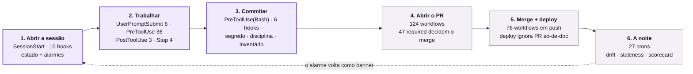

# Fluxo — As máquinas, do seu editor ao deploy

> **O censo não mora aqui.** Quem são as máquinas, uma a uma, com descrição e invocador, é
> [`MAQUINAS-INVENTARIO.md`](MAQUINAS-INVENTARIO.md) — **derivado**, regerado por
> `node scripts/governance/maquinas-inventario.mjs --write`. Este documento responde a outra
> pergunta, que nenhum censo responde: **em que ordem elas encostam em você**.
>
> **Toda medição abaixo é datada de 2026-09-22**, feita neste repositório, com o comando ao lado.
> Número sem data apodrece; número com data é história — se o de hoje incomodar, **re-rode o
> comando**, não edite o número.

## O modelo em uma frase

As máquinas não são uma parede no fim — são **seis estações ao longo do caminho**, e cada uma tem
um custo de erro diferente. Quanto mais cedo a estação, mais barata ela é: um hook que te para
antes do `Edit` custa segundos; o mesmo defeito pego no PR custa uma rodada de CI; pego depois do
merge, custa um incidente em produção.

A regra que organiza todas elas está na [ADR 0224](../decisions/0224-hooks-block-vs-advisory-claude-4.8-aware.md):
**predicado determinístico pode bloquear; predicado semântico só avisa.** Quando uma máquina
"só reclamou" e deixou passar, quase sempre é porque a pergunta dela não é decidível por máquina —
não porque alguém esqueceu de ligá-la.

## A linha do tempo



O tracejado é a parte que as pessoas não enxergam: **o cron da madrugada não te manda e-mail** —
ele deixa o resultado onde a Estação 1 vai buscar, e você o lê como banner na sessão seguinte.

---

## Estação 1 — Abrir a sessão (10 hooks)

Disparam no evento `SessionStart`, todos com matcher curinga (ninguém escapa). É a única estação
que **não pode reprovar nada**: ela só carrega estado e acende alarme.

O que você vê no topo da sessão vem daqui — o brief consolidado, o índice de handoff, o banner das
skills Tier A, o alarme do ledger de lições (`licoes-code-two-strikes`) e a régua do regime de
evolução (`loop-fechar-check`).

**Por que importa pro seu trabalho:** o alarme de lições que aparece ali **não é decoração** — ele
lista as classes de erro que já reincidiram e ainda não têm defesa mecânica. Ler aquilo antes de
começar é mais barato que descobrir no PR.

## Estação 2 — Enquanto você trabalha (49 hooks)

A estação mais densa, e a que mais gente subestima. Quatro eventos, em ordem de acontecimento:

**`UserPromptSubmit` (6)** — roda no seu prompt, antes de o agente pensar. É onde o opt-in de fonte
de design é cobrado (`block-figma-without-optin`, `block-design-sync-without-optin`), onde o
protocolo de comparação de runtime é injetado (`design-compare-protocol`) e onde o sinal de
encerramento de sessão é forçado (`force-r12-closing-signal`).

**`PreToolUse` (36)** — a maior concentração de bloqueio do sistema, distribuída por matcher:

- **ao ler** — `block-ancora-no-olho` (print de auditoria não é âncora de design) e
  `charter-da-tela-que-o-controller-serve`.
- **ao escrever** — 17 hooks no matcher de escrita. Aqui moram as travas Tier 0: auto-memória
  privada, valor em BRL no canon, drift de memória append-only, schema de frontmatter, violação de
  MWART, pré-flight de módulo, BOM em arquivo PHP, marcador de merge esquecido.
- **ao rodar comando** — `block-destructive`, `pii-redactor`, `commit-discipline-check`,
  `block-claim-without-evidence`, mais `block-test-fora-ct100` e `block-sonda-que-mente` (que
  também alcançam `PowerShell` e `Monitor`).
- **ao buscar** — `block-instrumento-sem-porta-viva`: se existe comando derivado que responde à sua
  pergunta, ele te manda usá-lo em vez de grepar no olho.

**`PostToolUse` (3)** — depois do fato: sintaxe PHP após escrita, tarefas órfãs em documento de
auditoria, e o smoke de UI pós-merge.

**`Stop` (4)** — quando o agente vai encerrar o turno: memória pendente, e três *nudges* que checam
a forma da resposta (recomendar em vez de dar menu, não diagnosticar sem evidência).

**Por que importa pro seu trabalho:** esta estação é a que protege **antes** de existir custo. Um
`Edit` barrado aqui não gasta rodada de CI, não gasta PR, não gasta tempo de review.

## Estação 3 — O commit (6 hooks)

Tecnicamente é a Estação 2 outra vez — o `git commit` entra pelo matcher `Bash` do `PreToolUse` —
mas vale separar, porque o que acontece aqui tem consequência diferente.

Além das travas de segredo e disciplina, roda o `maquinas-inventario-no-commit`: se você criou ou
apagou uma máquina, ele **regenera o inventário e o coloca no stage**, no mesmo commit. É por isso
que o censo nunca fica velho sem alguém perceber.

⚠️ **A pegadinha que custa caro aqui é o `git add -A`.** Rodar uma ferramenta de governança "só pra
espiar um número" pode produzir artefato derivado como efeito colateral; com `-A`, ele entra no seu
commit sem você ver. Rode `git status` antes de estagiar.

## Estação 4 — O PR (124 workflows, 47 decidem)

Dos 146 workflows do repositório, **124 disparam em `pull_request`** — mas só **47 contexts** têm
poder de barrar o merge. Os outros são advisory: ficam vermelhos, gastam runner, e **não impedem
nada**.

Isso é deliberado, não negligência: a [ADR 0314](../decisions/0314-poda-gates-onda-2-lei-fusoes.md)
fixa que **required = só Tier 0** — dinheiro, PII, multi-tenant, fiscal. Qualidade e higiene entram
como advisory e sobem por decisão explícita do dono, com mordida provada.

O dono de "o que é required" é [`governance/required-checks-baseline.json`](../../governance/required-checks-baseline.json),
e ele é a **união de duas fontes** — a proteção clássica e o ruleset:

```bash
# medido 2026-09-22 — clássico 46 + ruleset 1 = união 47
node -e "const j=require('./governance/required-checks-baseline.json');
const a=j.classic_protection?.required_status_checks?.contexts||[];
const b=j.rulesets?.contexts||[];
console.log('uniao:', new Set([...a,...b]).size)"
```

Ler só a proteção clássica é um erro conhecido: dá 46, e o check que existe apenas no ruleset
(`Governance Gate`) some da sua lista — quem conclui "não é required" mergeia num deadlock.

⚠️ **Leitura do verde num PR com dois ou mais pushes.** Desde setembro/2026, dezenas de workflows
advisory rodam em `opened` / `reopened` / `ready_for_review`, **sem `synchronize`** — corte medido
e correto de volume de fila. A consequência prática: a lane que não re-rodou **não fica verde, ela
some da lista**, e o total cai. Zero falhas num head com menos checks é *ausência de medição*, não
aprovação. Os required não têm esse buraco — o `required-always-run.mjs` reprova required que omita
`synchronize`. A receita de listar o que sumiu está em [`proibicoes.md`](../proibicoes.md), seção
"Sempre fazer".

## Estação 5 — Merge e deploy (76 workflows)

**76 workflows disparam em `push`** — a maioria é a mesma lane rodando agora contra `main`, para
gravar o estado de referência que as catracas comparam depois.

O deploy é o [`deploy.yml`](../../.github/workflows/deploy.yml), e ele tem uma cláusula que muda o
seu dia: dispara em push na `main`, mas com `paths-ignore` para `memory/`, qualquer `.md` e
`prototipo-ui/`.

Ou seja: **PR só de documentação não vai a produção.** Isso é bom (documentação não derruba o ar) e
é uma armadilha (você não confirma nada em produção mergeando um `.md`).

⚠️ **O merge é o ato, não o começo dele.** O deploy roda `artisan migrate --force` automático — não
existe janela entre "mergeei a migration" e "apliquei em produção". Migration destrutiva vai em PR
separado, ou com `skip_migrate`. O modelo mental completo do deploy é
[`FLUXO-DEPLOY.md`](FLUXO-DEPLOY.md); aqui fica só o elo com a linha do tempo.

## Estação 6 — A noite (27 crons)

O que nenhum PR consegue medir roda agendado: drift entre documento e realidade, frescor de
BRIEFING e de comparação visual, scorecard SDD, métricas de fluxo, sentinela de exposição Tier 0,
canário de qualidade da Jana, saúde da memória.

**Esta é a estação que fecha o ciclo.** O cron não te interrompe — ele escreve o resultado onde a
Estação 1 vai ler, e ele chega até você como banner na próxima sessão. É o desenho do pilar
*cadência* da [ADR 0256](../decisions/0256-knowledge-survival-meia-vida-catraca-sentinela.md):
conhecimento derivado e enforçado sobrevive; escrito e lembrado apodrece.

---

## Como usar esta linha do tempo quando algo dá errado

A pergunta certa não é *"que máquina me barrou?"* — é **"em que estação isso deveria ter sido
pego?"**. Se um defeito chegou à Estação 5, a lição raramente é sobre o defeito: é sobre a estação
que o deixou passar.

| Sintoma | Estação onde a resposta mora |
|---|---|
| "esse hook nunca falou comigo" | 2 — confira se ele está no wiring; traço no inventário significa que existe e nunca roda |
| "o PR está bloqueado com tudo verde" | 4 — required que nunca nasceu; compare a união contra os check-runs do head |
| "o check ficou verde e o bug foi pra prod" | 4 — verde de lane que não executou é ausência de medição |
| "mergeei e nada mudou no ar" | 5 — o `paths-ignore` provavelmente pulou o deploy |
| "esse número está velho e ninguém viu" | 6 — ou falta sentinela, ou o cron está morto |

## Os comandos que reproduzem os números acima

```bash
# o censo inteiro, e se ele está fresco
node scripts/governance/maquinas-inventario.mjs --check

# hooks por evento, derivado do wiring
node -e "const s=require('./.claude/settings.json');
for (const [ev, arr] of Object.entries(s.hooks||{}))
  console.log(ev, arr.flatMap(g => g.hooks||[]).length)"

# workflows por gatilho
grep -l 'pull_request' .github/workflows/*.yml | wc -l
grep -l 'cron:' .github/workflows/*.yml | wc -l
```

## O que este documento deliberadamente não faz

Ele **não lista as máquinas**. Essa lista tem dono derivado, e recopiá-la aqui criaria um segundo
censo que drifta no dia seguinte — que é exatamente o que a
[ADR 0329](../decisions/0329-doutrina-documentacao-de-processo-executavel.md) proíbe: um fato, uma
fonte, os outros são ponteiros.

Os donos vivos de cada eixo:

| Eixo | Dono |
|---|---|
| Censo consolidado | [`MAQUINAS-INVENTARIO.md`](MAQUINAS-INVENTARIO.md) (derivado) |
| Hooks, com evento e matcher | [`_HOOKS-INDEX.md`](../../.claude/hooks/_HOOKS-INDEX.md) (derivado) |
| Skills | [`_SKILLS-INDEX.md`](../../.claude/skills/_SKILLS-INDEX.md) (derivado) |
| Gates e workflows | `scripts/governance/gates-registry.json` |
| O que é required | [`required-checks-baseline.json`](../../governance/required-checks-baseline.json) |
| Painel do sistema | [`PAINEL-SISTEMA.md`](PAINEL-SISTEMA.md) (derivado) |

E ele **não decide** se uma máquina deveria bloquear ou avisar — isso é a ADR 0224 mais a soberania
do dono sobre promoção a required.

---

## Revisão executável de todos os fluxos

**Entrada:** todos os `memory/reference/FLUXO-*.md` e os paths executáveis citados neles. O Code é
o invocador humano; o workflow de governança executa a checagem estrutural.

```text
descobrir fluxos → validar contrato documental → resolver máquinas
  → localizar invocador → localizar teste ligado → executar provas existentes
  → consultar enforcement vivo → corrigir → repetir
```

A máquina é `scripts/governance/revisar-fluxos.mjs`. A decisão usa `PASSOU`, `FALHOU` ou
`NÃO MEDIDO`; falta de ambiente ou autenticação nunca vira sucesso. O falso-verde principal é
tratar script existente como script invocado, ou teste existente como teste ligado ao CI.

`node scripts/governance/revisar-fluxos.mjs --execute` pesquisa e executa as provas locais. Para
fechamento, o Code acrescenta `--live --strict`: `--live` consulta o GitHub em vez de usar
baseline local como prova do estado atual; `--strict` reprova lacuna documental ou máquina sem
prova localizada. A saída pode ser recibo humano ou JSON.

**Limite:** análise estática localiza invocadores prováveis; somente o oráculo vivo e um recibo
de execução provam o ambiente real. O bite-test da máquina roda no workflow de governança.
