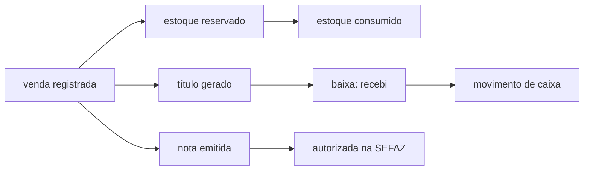

# Fluxo — Venda, do balcão à nota

> Este é o **percurso**. Cada parada tem um dono, e o dono é que manda: aqui não há valor de
> enum, não há regra fiscal transcrita e não há lista de estágio. Se este texto discordar do
> dicionário ou do código, **eles ganham** — e a correção é aqui.
>
> Para a entidade em si (o que é uma venda, quem escreve o quê), veja
> [Domínio — Venda](DOMINIO-VENDA.md).

## O percurso

As três pernas — estoque, financeiro e fiscal — **não são sequenciais entre si** e nem sempre
acontecem todas. É a fonte de metade das dúvidas de operação: *"a venda está pronta?"* depende
de qual perna você está perguntando.

## Parada por parada

### 1. A venda é registrada

Nasce no balcão, na oficina ou no canal online — e a origem fica registrada, porque muda o
resto do caminho. Venda **sem pagamento integral** não é erro: é venda a prazo, e o backend
deriva quanto falta a partir do que foi pago, em vez de a tela escolher um estado.

Dono do vocabulário: [`memory/dominio/vendas.md`](../dominio/vendas.md).

### 2. O estoque sai da prateleira — em dois tempos

Reservar e consumir **são momentos diferentes**. Entre um e outro a mercadoria já não está
disponível para outra venda, mas ainda não baixou. Quem move de um para o outro é a máquina de
estados, através de efeitos isolados — não o controller, e não a tela.

É por isso que "o estoque está errado" quase nunca é erro de contagem: costuma ser uma venda
parada num estágio que reservou e não consumiu, ou o contrário.

Dono: [`memory/dominio/estoque.md`](../dominio/estoque.md) · efeitos em [`app/Domain/Fsm/`](../../app/Domain/Fsm).

### 3. O que o cliente deve vira título

Venda a prazo **gera título automaticamente**, por observer — não por digitação. Este é o ponto
que mais confunde quem vem de planilha: **não se cria o "contas a receber" à mão**, porque ele
já nasce da venda. Digitar de novo é o caminho clássico para o cliente aparecer devendo duas
vezes.

Depois, receber é dar **baixa** no título (total quita, parcial deixa em aberto), e a baixa é
que **registra o movimento de caixa** — o caixa não se edita direto.

Vocabulário que vale a pena não errar, porque troca o significado: **estorno** é de pagamento;
**devolução** é de mercadoria. São domínios diferentes.

Dono: [`memory/dominio/financeiro.md`](../dominio/financeiro.md).

### 4. A nota

Modelo e ciclo dependem da operação, e o ciclo tem estados de falha reais (rejeitada, denegada,
erro de envio) que **não são bug do sistema** — são resposta da SEFAZ, e cada um pede uma ação
diferente.

O ponto irreversível: **cancelar nota autorizada exige evento fiscal.** Nunca é um `DELETE`, e
o número não volta a ficar livre. Quem tratar cancelamento como "apagar o registro" cria
divergência com o fisco que não se conserta pelo sistema.

Quando a venda tem peça **e** mão de obra, a operação se divide entre documentos diferentes —
o dono descreve o split.

Dono: [`memory/dominio/fiscal-faturamento.md`](../dominio/fiscal-faturamento.md).

## Onde este fluxo costuma travar

| Sintoma | Onde olhar primeiro |
|---|---|
| *"a venda sumiu do painel"* | estágio atual na máquina de estados — ela não sumiu, mudou de fase |
| *"o estoque não bateu"* | reservado ≠ consumido (parada 2), antes de recontar prateleira |
| *"o cliente aparece devendo duas vezes"* | título digitado à mão além do gerado pela venda (parada 3) |
| *"recebi mas o caixa não mostra"* | recebimento sem baixa — o caixa deriva da baixa, não da venda |
| *"a nota não sai"* | estado da emissão + regime tributário, não a venda |
| *"cancelei e o número sumiu"* | cancelamento é evento fiscal; número usado não volta |

## Antes de mudar qualquer coisa neste caminho

Alteração que toque **valor** ou **estoque** tem regra própria e mais dura: conferir o cálculo
por dois caminhos independentes e **apresentar o impacto antes de aplicar**. Nasceu de um
incidente real de produção, não de zelo teórico.

Dono: [`memory/proibicoes.md`](../proibicoes.md) (§ *Cálculo de valor ou estoque*).
