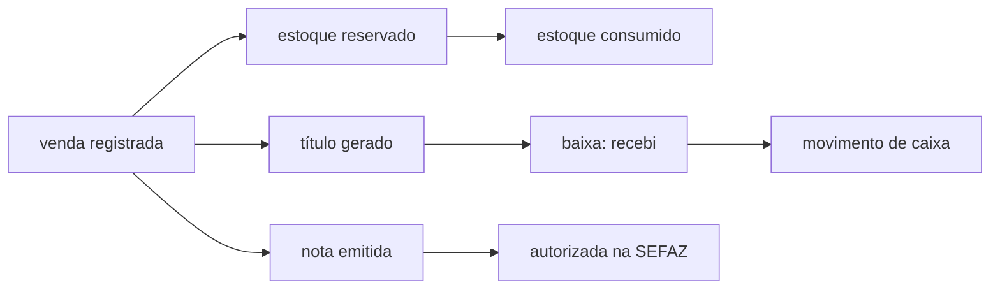

# Fluxo — Venda, do balcão à nota

> Este é o **percurso**. Cada parada tem um dono, e o dono é que manda: aqui não há valor de
> enum, não há regra fiscal transcrita e não há lista de estágio. Se este texto discordar do
> dicionário ou do código, **eles ganham** — e a correção é aqui.
>
> Para a entidade em si (o que é uma venda, quem escreve o quê), veja
> [Domínio — Venda](DOMINIO-VENDA.md).

## O percurso

As três pernas — estoque, financeiro e fiscal — **não são sequenciais entre si** e nem sempre
acontecem todas. É a fonte de metade das dúvidas de operação: *"a venda está pronta?"* depende
de qual perna você está perguntando.

## Parada por parada

### 1. A venda é registrada

Nasce no balcão, na oficina ou no canal online — e a origem fica registrada, porque muda o
resto do caminho. Venda **sem pagamento integral** não é erro: é venda a prazo, e o backend
deriva quanto falta a partir do que foi pago, em vez de a tela escolher um estado.

Dono do vocabulário: [`memory/dominio/vendas.md`](../dominio/vendas.md).

### 2. O estoque sai da prateleira — em dois tempos

Reservar e consumir **são momentos diferentes**. Entre um e outro a mercadoria já não está
disponível para outra venda, mas ainda não baixou. Quem move de um para o outro é a máquina de
estados, através de efeitos isolados — não o controller, e não a tela.

É por isso que "o estoque está errado" quase nunca é erro de contagem: costuma ser uma venda
parada num estágio que reservou e não consumiu, ou o contrário.

Dono: [`memory/dominio/estoque.md`](../dominio/estoque.md) · efeitos em [`app/Domain/Fsm/`](../../app/Domain/Fsm).

### 3. O que o cliente deve vira título

Venda a prazo **gera título automaticamente**, por observer — não por digitação. Este é o ponto
que mais confunde quem vem de planilha: **não se cria o "contas a receber" à mão**, porque ele
já nasce da venda. Digitar de novo é o caminho clássico para o cliente aparecer devendo duas
vezes.

Depois, receber é dar **baixa** no título (total quita, parcial deixa em aberto), e a baixa é
que **registra o movimento de caixa** — o caixa não se edita direto.

Vocabulário que vale a pena não errar, porque troca o significado: **estorno** é de pagamento;
**devolução** é de mercadoria. São domínios diferentes.

Dono: [`memory/dominio/financeiro.md`](../dominio/financeiro.md).

### 4. A nota

Modelo e ciclo dependem da operação, e o ciclo tem estados de falha reais (rejeitada, denegada,
erro de envio) que **não são bug do sistema** — são resposta da SEFAZ, e cada um pede uma ação
diferente.

O ponto irreversível: **cancelar nota autorizada exige evento fiscal.** Nunca é um `DELETE`, e
o número não volta a ficar livre. Quem tratar cancelamento como "apagar o registro" cria
divergência com o fisco que não se conserta pelo sistema.

Quando a venda tem peça **e** mão de obra, a operação se divide entre documentos diferentes —
o dono descreve o split.

Dono: [`memory/dominio/fiscal-faturamento.md`](../dominio/fiscal-faturamento.md).

## Onde este fluxo costuma travar

| Sintoma | Onde olhar primeiro |
|---|---|
| *"a venda sumiu do painel"* | estágio atual na máquina de estados — ela não sumiu, mudou de fase |
| *"o estoque não bateu"* | reservado ≠ consumido (parada 2), antes de recontar prateleira |
| *"o cliente aparece devendo duas vezes"* | título digitado à mão além do gerado pela venda (parada 3) |
| *"recebi mas o caixa não mostra"* | recebimento sem baixa — o caixa deriva da baixa, não da venda |
| *"a nota não sai"* | estado da emissão + regime tributário, não a venda |
| *"cancelei e o número sumiu"* | cancelamento é evento fiscal; número usado não volta |

## As quatro perguntas que este percurso não respondia

Medido em 2026-08-17 contra o gate da Trilha D (D7), que pede *ator, máquina, módulo, dado,
auth, tenant, retry, falha parcial e rollback explícitos*. A máquina já estava aqui (parada 2)
e a falha parcial também — é a frase *"as três pernas não são sequenciais"*, que é literalmente
falha parcial sem o rótulo. **Estas quatro faltavam**, e todas têm dono no código.

Vale a regra desta página: aqui vai o **percurso e o dono**, nunca o valor. Número de tentativa,
nome de papel e lista de efeito **mudam** — quem sabe é o arquivo apontado, não este texto.

### Quem tem permissão de mover a venda

Não é "quem está logado". Cada ação da máquina de estados tem **papéis cadastrados**, e a
resposta é dada em **dois lugares diferentes** — o que explica um sintoma que confunde:

| Pergunta | Quem responde |
|---|---|
| *o botão aparece?* | [`StageActionPolicy`](../../app/Domain/Fsm/Policies/StageActionPolicy.php) |
| *a ação executa?* | [`ExecuteStageActionService`](../../app/Domain/Fsm/Services/ExecuteStageActionService.php) |

Os dois checam a empresa e os papéis. **Não são a mesma regra**, e o próprio código avisa que
divergir entre eles faz a tela oferecer o que o backend recusa. Por isso *"o botão não aparece"*
e *"clicou e negou"* se diagnosticam em arquivos diferentes — o primeiro é o Policy, o segundo
é o Service.

Ação marcada como **crítica sem nenhum papel cadastrado** é recusada na execução (falha
fechada, deliberada). Quem recusa lança exceção própria.

Dono: os dois arquivos acima · papéis em [`SaleStageActionRole`](../../app/Domain/Fsm/Models/SaleStageActionRole.php)
· recusa em [`UnauthorizedActionException`](../../app/Domain/Fsm/Exceptions/UnauthorizedActionException.php).

### De quem é esta venda

O percurso inteiro é **por empresa**. Isso não é detalhe de implementação: é a razão de a venda
de um cliente nunca aparecer no painel de outro, e é irrevogável ([ADR 0093](../decisions/0093-multi-tenant-isolation-tier-0.md)).

A pegadinha operacional está na parada 3: o título nasce por **observer**, e observer dispara
**job**, e job **não tem sessão**. Quem escreveu o job precisou passar a empresa explicitamente —
o comentário `// SUPERADMIN:` no arquivo existe exatamente para marcar esse ponto. Se um dia um
título aparecer na empresa errada, é aqui que se olha primeiro, não na tela.

Dono: [`CriarTituloDeVendaJob`](../../Modules/Financeiro/Jobs/CriarTituloDeVendaJob.php)
· regra em [`memory/proibicoes.md`](../proibicoes.md) (§ *Multi-tenant Tier 0*).

### O que acontece quando uma perna falha na hora

As pernas assíncronas **repetem sozinhas** — e repetir só é seguro porque o título tem chave
única por empresa/origem/parcela: a segunda tentativa não cria um segundo título. É essa
unicidade, não a sorte, que impede o *"cliente devendo duas vezes"* da tabela acima quando a
causa é retry (o outro caminho, digitar à mão, segue valendo).

O número de tentativas e o intervalo vivem no próprio job — **não são reproduzidos aqui de
propósito**, porque mudam.

Dono: [`CriarTituloDeVendaJob`](../../Modules/Financeiro/Jobs/CriarTituloDeVendaJob.php) (`$tries`/`$backoff` + a nota de idempotência no topo).

### Desfazer não é apagar

Cancelar uma venda que já andou **não desfaz o registro** — dispara uma cascata que precisa
conversar com sistemas de fora: fisco, meio de pagamento e o aviso ao cliente. Cada um pode
falhar por conta própria, então o cancelamento também tem **falha parcial** — e é por isso que
"cancelei" nem sempre significa "cancelou em todos os lugares".

O ponto irreversível da parada 4 continua valendo e é mais forte que a cascata: número de nota
autorizada **não volta a ficar livre**, aconteça o que acontecer com o resto.

Dono: [`CancelarVendaCascade`](../../app/Domain/Fsm/SideEffects/CancelarVendaCascade.php)
· contrato provado em [`CancelarVendaCascadeSideEffectTest`](../../tests/Feature/Domain/Fsm/CancelarVendaCascadeSideEffectTest.php)
· percurso próprio em [`FLUXO-CANCELAMENTO.md`](FLUXO-CANCELAMENTO.md).

> ⚠️ **Estado dos outros percursos** (medido 2026-08-17, atualizado no mesmo dia):
> [`FLUXO-CANCELAMENTO.md`](FLUXO-CANCELAMENTO.md) tinha o mesmo buraco e **foi fechado** — as
> quatro perguntas estão respondidas lá, com âncora no seeder da ação e nos quatro jobs da
> cascata. [`FLUXO-DEPLOY.md`](FLUXO-DEPLOY.md) **segue aberto**, e é o mais sério: um percurso
> de deploy sem linha de rollback é a lacuna que a auditoria de infra já tinha apontado por outro
> caminho. Não foi escrito porque exige saber o procedimento **real** de reversão em produção;
> inventar um passo que parece canon é pior do que a ausência declarada.
>
> Dos **7 fluxos** que o D7 pede (venda, cancelamento, fiscal, WhatsApp, IA, migração, deploy),
> **3 têm documento** — fiscal, WhatsApp e migração não têm nenhum.

## Antes de mudar qualquer coisa neste caminho

Alteração que toque **valor** ou **estoque** tem regra própria e mais dura: conferir o cálculo
por dois caminhos independentes e **apresentar o impacto antes de aplicar**. Nasceu de um
incidente real de produção, não de zelo teórico.

Dono: [`memory/proibicoes.md`](../proibicoes.md) (§ *Cálculo de valor ou estoque*).
