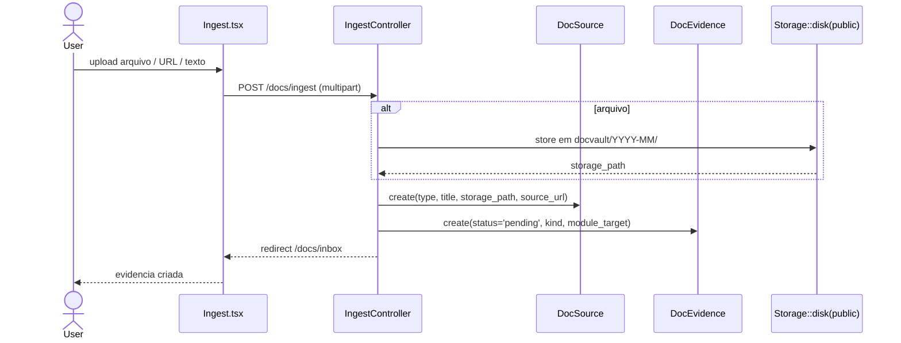
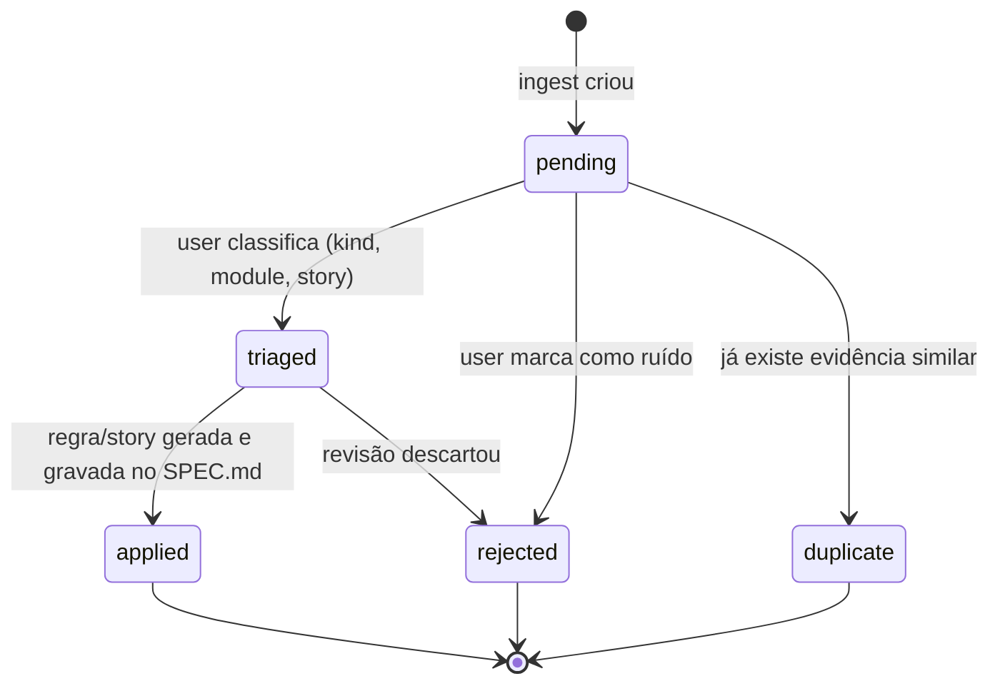
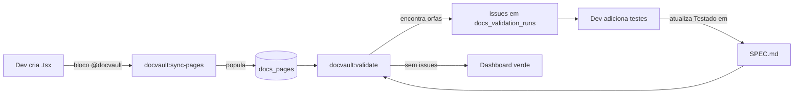
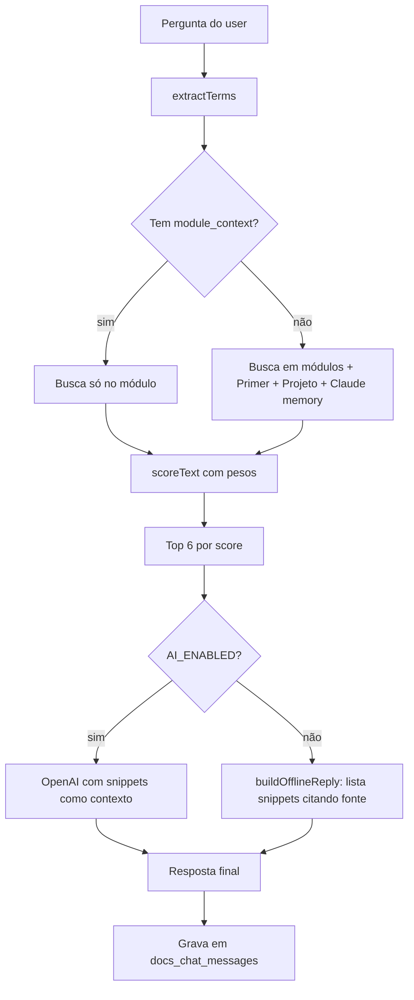
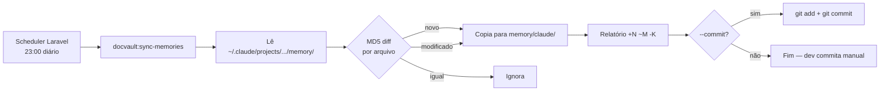

# Fluxos principais · DocVault

## F1 · Ingestão de evidência

## F2 · Triagem e aplicação

## F3 · Ciclo da rastreabilidade tripla (ADR 0005)

## F4 · Busca no ChatAssistant

## F5 · Sincronização diária Claude → repo

