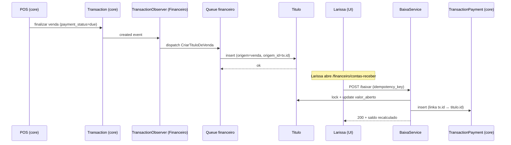
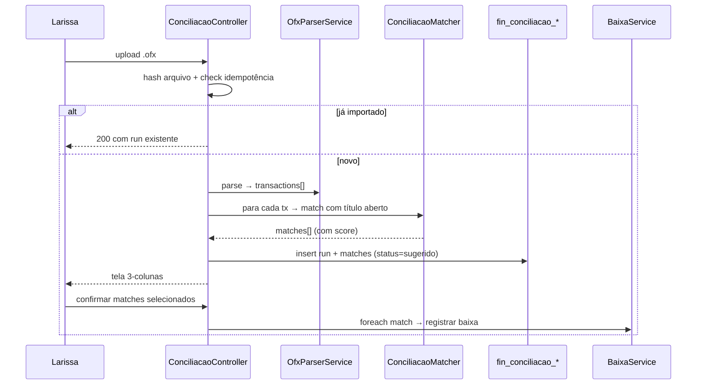
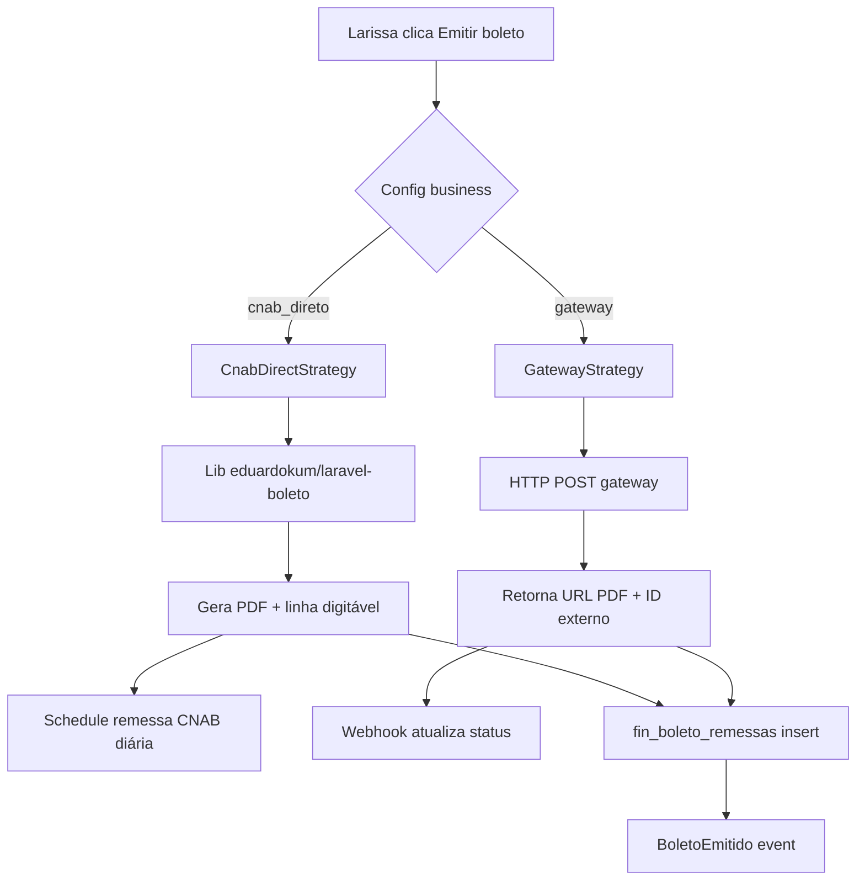

# Arquitetura — Financeiro

## 1. Objetivo

Módulo financeiro completo brasileiro, plugado no UltimatePOS 6.7 / Laravel 13.6 / PHP 8.4 sem alterar o core. Toda extensibilidade via hooks `DataController` (padrão UltimatePOS) e eventos Laravel.

## 2. Decisões arquiteturais cardinais

| Decisão | ADR | Resumo |
|---|---|---|
| Módulo nwidart isolado, não monkey-patch no core | [adr/arq/0001](adr/arq/0001-modulo-isolado-via-nwidart.md) | Prefix tabelas `fin_`, namespace `Modules\Financeiro\` |
| Comunicação cross-módulo só por evento | [adr/arq/0002](adr/arq/0002-eventos-em-vez-de-chamadas-diretas.md) | Listener idempotente com fila |
| Boleto via strategy (CNAB direto vs gateway) | [adr/arq/0003](adr/arq/0003-boleto-strategy-cnab-vs-gateway.md) | Tenant escolhe; defaults Asaas |
| Idempotência obrigatória em baixa e webhook | [adr/tech/0001](adr/tech/0001-idempotencia-em-toda-mutacao-financeira.md) | `idempotency_key` único, `event_id` único |
| Soft delete com proteção de integridade | [adr/tech/0002](adr/tech/0002-soft-delete-com-trava-historico.md) | Conta com movimento não deleta |

## 3. Camadas

```
┌─────────────────────────────────────────────────────────────┐
│  Pages Inertia (resources/js/Pages/Financeiro/)            │
│  + shadcn/ui + TanStack Query + Recharts                    │
└─────────────────────────────────────────────────────────────┘
                          ↕  Inertia
┌─────────────────────────────────────────────────────────────┐
│  Controllers (Modules/Financeiro/Http/Controllers/)         │
│  ContaReceberController · ContaPagarController · ...        │
│  + FormRequests (validação) + Resources (transform JSON)   │
└─────────────────────────────────────────────────────────────┘
                          ↕
┌─────────────────────────────────────────────────────────────┐
│  Services (Modules/Financeiro/Services/)                    │
│  TituloService · BaixaService · BoletoService · OfxParser   │
│  ConciliacaoMatcher · JurosMoraService · RelatorioService   │
└─────────────────────────────────────────────────────────────┘
                          ↕
┌─────────────────────────────────────────────────────────────┐
│  Models (Modules/Financeiro/Models/)                        │
│  + BusinessScope trait + LogsActivity                       │
│  + Observers (TransactionObserver no core escuta sells)     │
└─────────────────────────────────────────────────────────────┘
                          ↕
┌─────────────────────────────────────────────────────────────┐
│  Database (prefix `fin_`, exceção: `boleto_*`, `pg_*` se    │
│  compartilhado com RecurringBilling)                        │
└─────────────────────────────────────────────────────────────┘
```

## 4. Modelos e tabelas

### 4.1 Núcleo

| Modelo | Tabela | Finalidade |
|---|---|---|
| `Titulo` | `fin_titulos` | Direito a receber ou obrigação a pagar |
| `TituloBaixa` | `fin_titulo_baixas` | Pagamento parcial/total de título |
| `CaixaMovimento` | `fin_caixa_movimentos` | Toda entrada/saída de conta bancária ou caixa |
| `ContaBancaria` | `fin_contas_bancarias` | Conta corrente / poupança / caixa físico |
| `Categoria` | `fin_categorias` | Etiqueta livre (ex: "Aluguel Loja A") |
| `PlanoConta` | `fin_planos_conta` | Estrutura DRE BR (47 contas pré-seedadas) |

### 4.2 Boleto / PIX

| Modelo | Tabela | Finalidade |
|---|---|---|
| `BoletoRemessa` | `fin_boleto_remessas` | Status de boleto emitido (gerado/enviado/pago/vencido/cancelado) |
| `BoletoArquivoCnab` | `fin_boleto_arquivos_cnab` | Remessa CNAB enviada / retorno recebido |
| `PixCobranca` | `fin_pix_cobrancas` | QR estático/dinâmico + status |

### 4.3 Conciliação

| Modelo | Tabela | Finalidade |
|---|---|---|
| `ConciliacaoRun` | `fin_conciliacao_runs` | Cada importação OFX = 1 run com hash + status |
| `ConciliacaoMatch` | `fin_conciliacao_matches` | Match entre row do extrato ↔ título oimpresso |

### 4.4 Schema essencial — `fin_titulos`

```sql
CREATE TABLE fin_titulos (
    id BIGINT UNSIGNED PRIMARY KEY AUTO_INCREMENT,
    business_id INT UNSIGNED NOT NULL,
    numero VARCHAR(20) NOT NULL,                    -- sequencial business-isolado
    tipo ENUM('receber', 'pagar') NOT NULL,
    status ENUM('aberto', 'parcial', 'quitado', 'cancelado') NOT NULL DEFAULT 'aberto',

    cliente_id BIGINT UNSIGNED NULL,                -- FK contacts (UltimatePOS core)
    cliente_descricao VARCHAR(255) NULL,            -- fallback se cliente não cadastrado

    valor_total DECIMAL(22,4) NOT NULL,
    valor_aberto DECIMAL(22,4) NOT NULL,
    moeda CHAR(3) NOT NULL DEFAULT 'BRL',

    emissao DATE NOT NULL,
    vencimento DATE NOT NULL,
    competencia_mes CHAR(7) NOT NULL,               -- YYYY-MM (regime competência)

    origem ENUM('manual', 'venda', 'compra', 'despesa', 'recurring', 'folha') NOT NULL,
    origem_id BIGINT UNSIGNED NULL,                 -- transaction.id, recurring_invoice.id, etc.
    parcela_numero TINYINT UNSIGNED NULL,           -- 1, 2, 3 ... NULL se à vista
    parcela_total TINYINT UNSIGNED NULL,
    titulo_pai_id BIGINT UNSIGNED NULL,             -- FK self (parcela aponta pai)

    plano_conta_id BIGINT UNSIGNED NULL,            -- FK fin_planos_conta
    categoria_id BIGINT UNSIGNED NULL,              -- FK fin_categorias

    observacoes TEXT NULL,
    metadata JSON NULL,                             -- shape específico por origem

    created_by INT UNSIGNED NOT NULL,
    updated_by INT UNSIGNED NULL,
    created_at TIMESTAMP NOT NULL DEFAULT CURRENT_TIMESTAMP,
    updated_at TIMESTAMP NULL ON UPDATE CURRENT_TIMESTAMP,
    deleted_at TIMESTAMP NULL,

    INDEX idx_business_status_venc (business_id, status, vencimento),
    INDEX idx_business_origem (business_id, origem, origem_id),
    INDEX idx_business_cliente (business_id, cliente_id),
    UNIQUE KEY uk_origem (business_id, origem, origem_id, parcela_numero) -- idempotência
);
```

### 4.5 Schema — `fin_titulo_baixas`

```sql
CREATE TABLE fin_titulo_baixas (
    id BIGINT UNSIGNED PRIMARY KEY AUTO_INCREMENT,
    business_id INT UNSIGNED NOT NULL,
    titulo_id BIGINT UNSIGNED NOT NULL,
    conta_bancaria_id BIGINT UNSIGNED NOT NULL,

    valor_baixa DECIMAL(22,4) NOT NULL,
    juros DECIMAL(22,4) NOT NULL DEFAULT 0,
    multa DECIMAL(22,4) NOT NULL DEFAULT 0,
    desconto DECIMAL(22,4) NOT NULL DEFAULT 0,

    data_baixa DATE NOT NULL,
    meio_pagamento ENUM('dinheiro', 'pix', 'boleto', 'cartao_credito', 'cartao_debito',
                         'transferencia', 'cheque', 'compensacao') NOT NULL,

    idempotency_key CHAR(36) NOT NULL,
    transaction_payment_id BIGINT UNSIGNED NULL,    -- FK core (vínculo retro)

    observacoes TEXT NULL,
    created_by INT UNSIGNED NOT NULL,
    created_at TIMESTAMP NOT NULL DEFAULT CURRENT_TIMESTAMP,

    UNIQUE KEY uk_idempotency (business_id, idempotency_key),
    INDEX idx_titulo (titulo_id),
    INDEX idx_business_data (business_id, data_baixa),
    FOREIGN KEY (titulo_id) REFERENCES fin_titulos(id),
    FOREIGN KEY (conta_bancaria_id) REFERENCES fin_contas_bancarias(id)
);
```

## 5. Integrações

### 5.1 Hooks UltimatePOS registrados

No `Modules\Financeiro\Providers\FinanceiroServiceProvider::boot()`:

```php
// Pattern UltimatePOS — ver reference_ultimatepos_integracao.md
\App\Utils\ModuleUtil::moduleData('financeiro', [
    'menu_admin' => fn($business_id) => $this->buildAdminMenu($business_id),
    'permissions' => $this->permissionList(),
    'superadmin_package' => $this->packageDefinition(),
]);
```

| Hook | O que injeta |
|---|---|
| `modifyAdminMenu()` | Sub-menu "Financeiro" na sidebar admin (5 itens: Contas a Receber, Contas a Pagar, Caixa, Conciliação, Relatórios) |
| `user_permissions()` | 12 permissões Spatie (formato `financeiro.{area}.{action}`) registradas no cadastro de Roles |
| `superadmin_package()` | 3 pacotes pro Superadmin: Free / Pro (R$ 199) / Enterprise (R$ 599) com limites por plano |
| `getModuleVersionInfo()` | Versão do módulo + dependências exibidas em `/admin/business/settings` |

### 5.2 Observers no core (sem editar core)

`Modules\Financeiro\Observers\TransactionObserver` registrado no boot:

```php
\App\Models\Transaction::observe(\Modules\Financeiro\Observers\TransactionObserver::class);
```

Eventos escutados:
- `created` — venda/compra finalizada com `payment_status=due` → cria título
- `updated` — pagamento adicionado/cancelado → recalcula título vinculado
- `deleted` — venda cancelada → título cancelado (não deletado, status='cancelado')

### 5.3 Eventos publicados pelo Financeiro

Outros módulos consomem:

```php
namespace Modules\Financeiro\Events;

class TituloCriado { public Titulo $titulo; }
class TituloBaixado { public Titulo $titulo; public TituloBaixa $baixa; }
class TituloCancelado { public Titulo $titulo; public string $motivo; }
class CaixaMovimentado { public CaixaMovimento $mov; }
class BoletoEmitido { public BoletoRemessa $remessa; }
class BoletoPago { public BoletoRemessa $remessa; }  // via webhook
```

### 5.4 Eventos consumidos do core / outros módulos

| Evento | Origem | Listener Financeiro |
|---|---|---|
| `App\Events\TransactionPaymentCreated` (interno UPos) | Core | `SincronizaBaixaTitulo` (se `transaction.id` aponta título) |
| `Modules\NfeBrasil\Events\NfeAutorizada` | NfeBrasil | `AnexarChaveNfeAoTitulo` |
| `Modules\RecurringBilling\Events\RecurringInvoiceGenerated` | RecurringBilling | `CriaTituloAReceber` |
| `Modules\PontoWr2\Events\FolhaFechada` | PontoWr2 | `CriaTitulosAPagarFolha` (1 por colaborador) |

### 5.5 Serviços externos

| Serviço | Para que | Lib / API |
|---|---|---|
| **Asaas / Iugu / Pagar.me** | Boleto + PIX (gateway) | HTTP client Laravel + retries |
| **Sicoob / BB / Itaú API** | Boleto direto + PIX direto (CNAB-less) | Lib `eduardokum/laravel-boleto` (CNAB) ou HTTP custom (PIX) |
| **OpenAI / AWS Textract** | OCR de boleto upload | API call em job, fallback manual |
| **OFX parser** | Importar extrato | `php-ofx-parser` ou parser próprio (formato simples) |

### 5.6 Regras de timezone (crítico — armadilha histórica)

Toda data persistida em UTC, mas exibida em `business.time_zone`:

- ✅ `format_now_local()` para pré-popular form com "agora" sem shift +3h (auto-memória `feedback_format_now_local_e_default_datetime.md`)
- ✅ `format_date($timestamp)` mantém shift histórico **intencional** para não quebrar dados decorados ROTA LIVRE (auto-memória `feedback_carbon_timezone_bug.md`)
- ❌ NUNCA usar `Carbon::createFromTimestamp()` cru — cai na armadilha
- ❌ NUNCA acessar `session('business.time_zone')` (Eloquent → null) — usar `session('business_timezone')` (auto-memória `project_session_business_model.md`)

## 6. Fluxos críticos

### 6.1 Venda → título a receber → baixa → vínculo retro



### 6.2 Conciliação OFX



### 6.3 Emissão de boleto (strategy)



## 7. Performance e escala

| Aspecto | Estratégia |
|---|---|
| Listagem 10k+ títulos | Server-side pagination + index `(business_id, status, vencimento)` |
| Relatório DRE 12 meses | Cache `fin:dre:{biz}:{periodo}` 30 min, invalidado em `TituloBaixado` |
| Caixa projetado | Cache `fin:caixa:{biz}:{periodo}` 5 min, invalidado em qualquer mutação |
| OFX 5k linhas | Job background, progresso via broadcast (channel `business.{id}.financeiro`) |
| Boleto remessa CNAB | Job diário 6h00 (queue `financeiro_remessa`) |

## 8. Segurança e compliance

- **Storage de boletos PDFs**: `storage/app/financeiro/{business_id}/...` (NÃO `public/`). Disco local com retenção 5 anos (compliance fiscal).
- **Webhook gateway**: validação de assinatura (HMAC do payload com `secret` por business salvo em `fin_gateway_credentials`).
- **OFX**: arquivo é apagado após parse (60 dias retenção configurável).
- **PII**: nome cliente em logs **mascarado** (`Larissa S***`) — config flag.
- **Rate limit**: `/financeiro/conciliacao` 5 req/min por user (upload pesado).
- **Audit log Spatie**: todo mutation em `fin_titulos`, `fin_titulo_baixas`, `fin_caixa_movimentos`, `fin_contas_bancarias`.

## 9. Decisões em aberto

- [ ] Plano de contas BR: usar referência DCASP (público) ou modelo Receita Federal (mais simples)?
- [ ] Regime contábil pode mudar dentro do ano (gera reexpressão)? Decisão fiscal.
- [ ] Multi-moeda: incluir BRL apenas no MVP, USD/EUR só Onda 5?
- [ ] Integração Receita Federal Mei/Simples para auto-cálculo DAS?
- [ ] Conciliação inteligente: usar embedding semântico para match de descrição?

## 10. Histórico

- **2026-04-24** — promovido de `_Ideias/Financeiro/` (status `researching`) para `requisitos/Financeiro/` (`spec-ready`)
- **2026-04 (mobile)** — ideia originada em conversa Claude (`_Ideias/Financeiro/evidencias/conversa-claude-2026-04-mobile.md`)

---

_Última regeneração: manual 2026-04-24_
_Regerar partes auto-geráveis: `php artisan module:requirements Financeiro` (após scaffold)_
_Ver no MemCofre: `/memcofre/modulos/Financeiro`_
