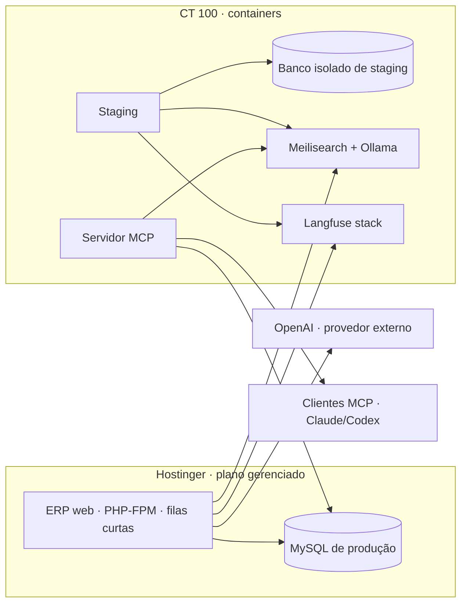
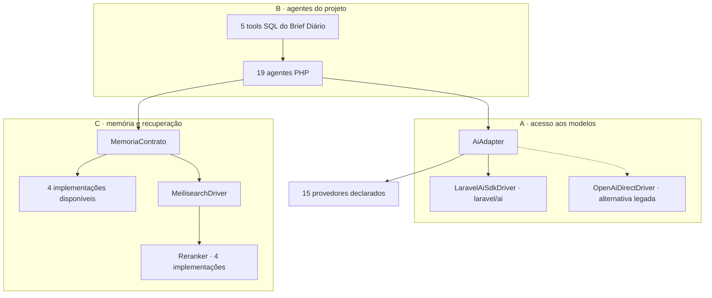
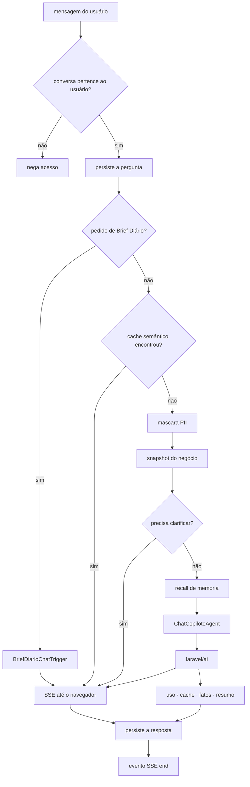
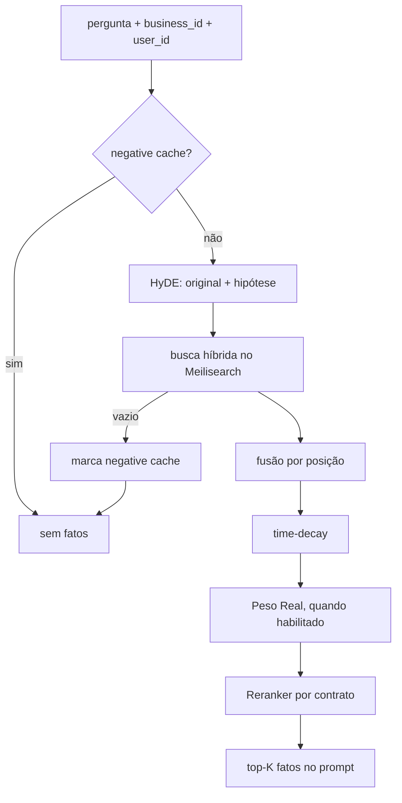
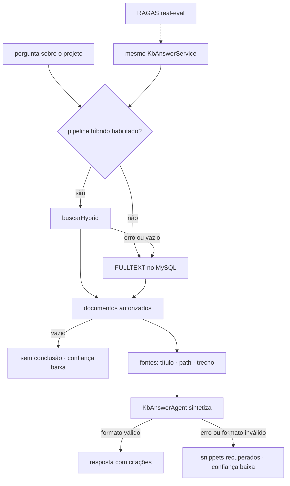

# Arquitetura viva da Jana

> ⚙️ **Gerado por `scripts/governance/system-map.mjs` em 2026-08-18.** NÃO edite à mão.
> Esta página deriva o que o repositório consegue provar. Saúde de máquina é verificada por probe — compose existente não significa container vivo.
> Resumo do sistema inteiro: [`PAINEL-SISTEMA.md`](../../reference/PAINEL-SISTEMA.md). Decisões donas: [ADR 0035](../../decisions/0035-stack-ai-canonica-wagner-2026-04-26.md), [ADR 0048](../../decisions/0048-framework-agentes-laravel-ai-vizra-rejeitada.md) e [ADR 0062](../../decisions/0062-separacao-runtime-hostinger-ct100.md).

## Responsabilidade deste documento

Este é o **dono canônico da arquitetura da Jana**: mostra onde a IA vive, como as zonas se conectam e quais componentes o código realmente registra. Regras funcionais continuam em [`SPEC.md`](SPEC.md), intenção do produto em [`BRIEFING.md`](BRIEFING.md), operação em [`RUNBOOK.md`](RUNBOOK.md) e decisões em ADRs.

## Topologia lógica

> “Hostinger” e “CT 100” são **zonas operacionais**, não promessa de contagem física. O MySQL gerenciado da Hostinger pode residir em host distinto do web shared.

O desenho mostra **quem chama quem**. Ele não multiplica um serviço compartilhado por consumidor: produção e MCP apontam para o mesmo banco de produção; Meilisearch, Ollama e Langfuse aparecem uma vez.

## As três camadas de IA

A camada A isola o SDK/provedor, a B contém comportamento do produto e a C contém persistência e recuperação. As quantidades vêm do mesmo censo por contrato usado no inventário abaixo; não são números mantidos no desenho.

## Fluxo principal: uma pergunta no chat

Fontes donas: [`ChatController.php`](../../../Modules/Jana/Http/Controllers/ChatController.php), [`LaravelAiSdkDriver.php`](../../../Modules/Jana/Services/Ai/LaravelAiSdkDriver.php) e [`ChatCopilotoAgent.php`](../../../Modules/Jana/Ai/Agents/ChatCopilotoAgent.php). Pergunta e resposta são persistidas pelo controller; cache, recall e efeitos posteriores vivem no driver.

## Dentro do recall de memória

O filtro multi-tenant é aplicado dentro da consulta. O chamador do chat transforma falha de recall em contexto vazio, preservando a conversa. Fonte dona: [`MeilisearchDriver.php`](../../../Modules/Jana/Services/Memoria/MeilisearchDriver.php) e método `recallMemoria()` do driver do chat.

## RAG sobre a memória canônica do projeto

A tool e a avaliação chamam o mesmo serviço para não criar um pipeline de teste que mede a si próprio. Fontes donas: [`KbAnswerService.php`](../../../Modules/Jana/Services/Kb/KbAnswerService.php) e [`KbAnswerTool.php`](../../../Modules/Jana/Mcp/Tools/KbAnswerTool.php).

## Inventário derivado do código

| Medida | Valor derivado | Fonte dona |
|---|---:|---|
| Agentes PHP de produto | **19** | `Modules/*/Ai/Agents/*Agent.php` + contrato `implements Agent` |
| Módulos com agentes PHP | **4** | árvore `Modules/` |
| Agentes sem referência de produção | **0** | referências PHP fora de `Tests/` |
| Tools registradas no MCP | **44** | [`OimpressoMcpServer.php`](../../../Modules/Jana/Mcp/OimpressoMcpServer.php) |
| Tools SQL do Brief Diário | **5** | `Modules/Jana/Ai/Tools/BriefDiario/` |
| Provedores declarados | **15** · default `openai` | `config/ai.php` — declaração, não credencial viva |
| Implementações de `MemoriaContrato` | **4** | contrato PHP, fora de `Tests/` |
| Implementações de `Reranker` | **4** | contrato PHP, fora de `Tests/` |
| Agentes de engenharia | **27** | `.claude/agents/*.md` — outra camada, não runtime PHP |
| Serviços em compose versionado | **15** | `docker/**/docker-compose.yml` — declaração, não uptime |
| Checks no baseline versionado de merge | **46** | `governance/required-checks-baseline.json` — o probe vivo é `protection-drift.mjs` |

## Agentes PHP por módulo

| Módulo | Qtd. | Classes |
|---|---:|---|
| Crm | 3 | [ClienteProximaAcaoAgent](../../../Modules/Crm/Ai/Agents/ClienteProximaAcaoAgent.php) · [ClienteResumoAgent](../../../Modules/Crm/Ai/Agents/ClienteResumoAgent.php) · [ClienteSegmentoAgent](../../../Modules/Crm/Ai/Agents/ClienteSegmentoAgent.php) |
| Forja | 1 | [ProjectDecomposerAgent](../../../Modules/Forja/Ai/Agents/ProjectDecomposerAgent.php) |
| Jana | 14 | [BriefDiarioAgent](../../../Modules/Jana/Ai/Agents/BriefDiarioAgent.php) · [BriefingAgent](../../../Modules/Jana/Ai/Agents/BriefingAgent.php) · [ChatCopilotoAgent](../../../Modules/Jana/Ai/Agents/ChatCopilotoAgent.php) · [ClarificadorAgent](../../../Modules/Jana/Ai/Agents/ClarificadorAgent.php) · [DetectarSupersedeAgent](../../../Modules/Jana/Ai/Agents/DetectarSupersedeAgent.php) · [ExtrairFatosAgent](../../../Modules/Jana/Ai/Agents/ExtrairFatosAgent.php) · [HealthNarratorAgent](../../../Modules/Jana/Ai/Agents/HealthNarratorAgent.php) · [KbAnswerAgent](../../../Modules/Jana/Ai/Agents/KbAnswerAgent.php) · [ProximaPerguntaAgent](../../../Modules/Jana/Ai/Agents/ProximaPerguntaAgent.php) · [PrUiJudgeAgent](../../../Modules/Jana/Ai/Agents/PrUiJudgeAgent.php) · [SaleInsightAgent](../../../Modules/Jana/Ai/Agents/SaleInsightAgent.php) · [SinteseSemanalAgent](../../../Modules/Jana/Ai/Agents/SinteseSemanalAgent.php) · [SugestoesMetasAgent](../../../Modules/Jana/Ai/Agents/SugestoesMetasAgent.php) · [WeeklyDigestAgent](../../../Modules/Jana/Ai/Agents/WeeklyDigestAgent.php) |
| Whatsapp | 1 | [InboxAssistAgent](../../../Modules/Whatsapp/Ai/Agents/InboxAssistAgent.php) |

> ✅ Nenhuma classe de agente ficou sem referência PHP de produção.

## O que está conectado — e o que a árvore não prova

| Relação | Resultado desta geração | Limite honesto |
|---|---|---|
| Agentes → uso em produção | **todos têm referência PHP fora de testes** | referência estática não prova execução em runtime |
| Arquivos de tool → registro MCP | **registro e arquivos têm a mesma quantidade** | igualdade de quantidade não substitui o gate de exposição em runtime |
| Tokens do streaming → resposta do turno | **o padrão antigo de ordem incorreta não foi detectado** | medidor estrutural; um teste de integração deve validar os valores persistidos |
| Compose → serviço vivo | **não provado pela árvore** | use os probes; arquivo versionado só prova intenção de subir |
| Provider declarado → credencial válida | **não provado pela árvore** | `config/ai.php` não prova segredo, rede nem quota |
| Diagrama → ordem do código | **ancorado por marcadores ordenados** | mudança estrutural faz o gerador falhar e exige revisão humana da explicação |

## Tools do servidor MCP

| Módulo dono | Qtd. | Registro |
|---|---:|---|
| Forja | 5 | BriefFetchTool · HandoffPendingTool · HandoffAckTool · HandoffSubmitTool · HandoffLeverTool |
| Jana | 39 | CyclesActiveTool · MyWorkTool · MyInboxTool · TriageTool · CycleGoalsTrackTool · CyclesCloseTool · CyclesCreateTool · TasksListTool · TasksDetailTool · TasksUpdateTool · TasksCommentTool · TasksCreateTool · TasksCurrentTool · DecisionsSearchTool · DecisionsFetchTool · SessionsRecentTool · ClaudeCodeUsageSelfTool · MemoriaSearchTool · MemoriaHistoricaTool · CcSearchTool · WhatsActiveTool · TasksClaimTool · TasksHeartbeatTool · WhatsLockedTool · SystemHealthAuditTool · TasksHealthTool · KbAnswerTool · HandoffFetchSummarizedTool · HandoffDiffTool · WeeklyDigestFetchTool · CharterFetchTool · HandoffDraftTool · FlagListTool · FlagGetTool · FlagSetTool · FlagEnvToggleTool · FlagCacheClearTool · LgpdEsquecerTitularTool · AutomationsListTool |

As **44** entradas acima são classes efetivamente registradas no array `$tools`. Uma classe `*Tool.php` solta não entra na contagem.

## Stacks Docker versionados

> Esta tabela responde “o que o repo declara?”. Para responder “o que está vivo agora?”, use os probes da seção seguinte.

| Compose | Serviços declarados | Qtd. |
|---|---|---:|
| [`docker/langfuse/docker-compose.yml`](../../../docker/langfuse/docker-compose.yml) | postgres-langfuse · clickhouse-langfuse · minio-langfuse · redis-langfuse · langfuse-web · langfuse-worker | 6 |
| [`docker/oimpresso-mcp/docker-compose.yml`](../../../docker/oimpresso-mcp/docker-compose.yml) | mcp · jana-online-eval-worker | 2 |
| [`docker/oimpresso-staging/docker-compose.yml`](../../../docker/oimpresso-staging/docker-compose.yml) | staging | 1 |
| [`docker/oimpresso-workers/docker-compose.yml`](../../../docker/oimpresso-workers/docker-compose.yml) | oimpresso-workers · oimpresso-workers-horizon · oimpresso-workers-scheduler · oimpresso-workers-redis | 4 |
| [`docker/ollama-embedder/docker-compose.yml`](../../../docker/ollama-embedder/docker-compose.yml) | ollama-embedder | 1 |
| [`docker/otel/docker-compose.yml`](../../../docker/otel/docker-compose.yml) | jaeger | 1 |

## Estado vivo: medir, não copiar

| Superfície | Probe/recibo | O que prova |
|---|---|---|
| Web live | [`https://oimpresso.com/login`](https://oimpresso.com/login) | aplicação responde agora |
| MCP | [`https://mcp.oimpresso.com/api/mcp/health`](https://mcp.oimpresso.com/api/mcp/health) | servidor MCP responde agora |
| Staging | [`https://staging.oimpresso.com/login`](https://staging.oimpresso.com/login) | runtime de homologação responde agora |
| Langfuse | [`https://langfuse.oimpresso.com/api/public/health`](https://langfuse.oimpresso.com/api/public/health) | observabilidade responde agora |
| CT 100 | `tailscale ssh root@ct100-mcp "docker ps"` | containers realmente em execução |
| Hostinger | `php artisan schedule:list` + processo `queue:work` | cron e filas realmente carregados |

A página **não grava “verde”** no Markdown: esse estado venceria no minuto seguinte. Ela preserva o probe reproduzível.

## Como esta página continua viva

1. `system-map.mjs` varre agentes, registro MCP, tools de dados e arquivos compose.
2. Os fluxos acima têm conjuntos de âncoras ordenadas nos arquivos donos; se uma etapa some ou troca de ordem, a geração falha em vez de preservar um desenho mentiroso.
3. `node scripts/governance/system-map.mjs --check` compara o Markdown commitado com a geração atual.
4. [`.github/workflows/system-map.yml`](../../../.github/workflows/system-map.yml) roda no PR quando uma fonte muda e também diariamente.
5. O job diário regenera e abre auto-PR; ninguém precisa editar contagem à mão.
6. Fatos de runtime ficam como probes. Se for necessário histórico de uptime, o dono deve ser monitoramento/telemetria — nunca esta página.

### O que ainda é humano

- explicar **por que** as camadas existem;
- decidir se um serviço em standby deve ser ativado ou removido;
- registrar mudança arquitetural em ADR;
- interpretar falha de probe e impacto no negócio.

---
_Gerado por `scripts/governance/system-map.mjs` · 2026-08-18 · arquitetura derivada das fontes canônicas._
