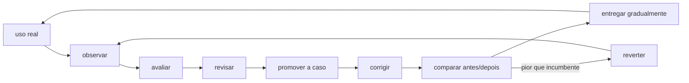

# OBSERVABILITY — Modules/Jana

> Declaração canônica de pontos de hook OTel (D9.a Observability v3 — 2026-05-16).
> **Jana JÁ tem OTel forte** — `Modules/Jana/Services/Memoria/Telemetry/RetrievalSpan*.php` (POPO + Builder + Decorator) está implementado seguindo OTel GenAI semantic conventions 2026. Este doc CATALOGA o que existe + declara spans futuros.

> **Atualização 2026-07-17 (destaleamento — grade de réguas observabilidade-agente):** os spans D9.a Wave 17 foram implementados mas este doc nunca foi atualizado. A tabela "PLANEJADOS" ficou 2 meses afirmando `não-live` sobre 6 spans que estão LIVE — e a grade de mercado leu o doc stale como "spans do agente não instrumentados" (falso-negativo). Corrigido abaixo com **os nomes REAIS de span + file:line** (os nomes antigos do doc — `jana.context.snapshot` etc — nunca bateram com o código: o real é `jana.context.para_business`). Fonte da verdade = o `OtelHelper::spanBiz(...)`/`::span(...)` no código, não esta tabela.

## Status vivo

- **status:** proposto
- **owner:** W/C
- **criado:** 2026-07-28
- **reviewed_at:** 2026-07-28
- **próxima-revisão:** 2026-08-04
- **cycle:** não apostado
- **verdade-viva:** este documento; quando o plano for apostado, as tasks MCP deverão apontar para o slug reservado `jana-ciclo-observar-aprender`
- **gate-de-saída do plano:** um caso real observado percorre trace → avaliação → revisão humana → golden set → correção → validação antes/depois → rollout → verificação em produção
- **kill-condition:** qualquer etapa que permita à IA alterar prompt, retrieval, configuração ou código a partir do próprio score sem revisão humana e sem teste contra o incumbente

## Objetivo do plano

Fechar o ciclo de **observação e aprendizado da Jana** sem criar autoaprendizado circular:



**Definição de aprendizado neste plano:** uma observação só vira aprendizado quando deixa uma proteção reproduzível — caso no golden set, teste, regra operacional ou decisão revisável — e uma mudança posterior demonstra resultado melhor que o incumbente. Trace, nota ou comentário isolado é apenas sinal.

### Donos — sem duplicação

| Assunto | Fonte dona |
|---|---|
| Intenção do produto e decisões abertas | [`BRIEFING.md`](BRIEFING.md#doutrina-do-produto-e-decisões-abertas) |
| Topologia e inventário derivável | [`ARCHITECTURE.md`](ARCHITECTURE.md) + [`PAINEL-SISTEMA.md`](../../reference/PAINEL-SISTEMA.md) |
| Diagnóstico e alvo dos deltas D1–D6 | [proposta atual→alvo](../../decisions/proposals/2026-07-28-camada-ia-atual-x-alvo-e-doutrina-resgatada.md) |
| Etapas, testes, aceite, rollback e métricas do ciclo | **este documento** |
| Estado de runtime | `jana:health-check --json` + destino Langfuse; documento não substitui probe |

As tabelas abaixo resumem somente o necessário para executar. Quando houver divergência de diagnóstico, a proposta é corrigida; quando houver divergência de execução, este plano é corrigido. Números de inventário nunca são recopiados aqui.

## Estado real de partida — 2026-07-28

| Elo | Estado verificável | Fonte dona | Lacuna |
|---|---|---|---|
| Chat streaming → evento LLM | construído | `LaravelAiSdkDriver::responderChatStream()` + eventos `StreamingAgent`/`AgentStreamed` do `laravel/ai` | falta teste integrado que exerça o SDK real, não só evento fabricado |
| Evento LLM → Langfuse | construído | `LangfuseAgentTelemetryListener` | `LANGFUSE_ENABLED` continua default `false`; runtime precisa ser provado pelo destino |
| Langfuse vivo | endpoint público respondeu HTTP 200 em 2026-07-28 | `/api/public/health` | servidor vivo não prova recebimento de traces |
| Traces chegando | heartbeat construído | `jana:health-check` → `langfuse_trace_uptime_24h` | precisa de recibo autenticado de produção |
| Trace ponta a ponta do chat | parcial | listener cobre a chamada ao modelo | cache hit, clarificação, persistência e erro SSE não compartilham um span raiz |
| OTel no streaming | parcial | `emitirOtelGenAi()` existe no caminho bloqueante | streaming não chama emissão OTel explícita |
| Avaliação online | construída, **dark** | `JudgeTraceOnlineJob` + `OllamaRagasJudge` + `recordScore()` | `copiloto.online_eval.enabled=false` |
| Privacidade da avaliação | construída | juiz local + `PiiRedactor` | precisa smoke de infra com modelo de chat local disponível |
| Feedback humano do chat | ausente no fluxo servido | não há vínculo mensagem → feedback → trace no chat | sem rótulo humano, faithfulness não prova resposta correta |
| Produção → golden set | aberto | golden set e RAGAS offline existem | nenhum promotor revisado leva caso real confirmado ao corpus |
| Mudança → comparação | parcial | baselines/gates RAGAS existem | não há vínculo obrigatório entre trace-causa, caso novo e delta antes/depois |
| Pós-deploy → confirmação | aberto | Langfuse e heartbeat existem | resultado da mudança não fecha automaticamente no mesmo caso de origem |

### Correção da afirmação “streaming não emite rastro nenhum”

Ela descrevia o estado anterior ao listener global entregue em 2026-07-02. O código atual registra `StreamingAgent`/`AgentStreamed` e cria trace + generation no Langfuse. O residual correto é:

1. a chamada LLM do streaming **tem** emissor Langfuse no código;
2. a requisição inteira do chat **não tem** um trace raiz que sobreviva do início ao fim do generator;
3. OpenTelemetry explícito continua restrito ao caminho bloqueante;
4. mecanismo construído ou servidor HTTP 200 não substituem prova de traces recebidos;
5. a avaliação de qualidade online existe, mas está desligada.

## Escopo e não objetivos

**Incluído**

- chat SSE da Jana;
- Langfuse, OpenTelemetry e correlação com mensagens;
- avaliação online local e PII-redigida;
- revisão humana de sinais;
- promoção revisada ao golden set;
- mudança por PR, avaliação antes/depois, rollout e rollback;
- alertas de ausência de fluxo.

**Não incluído**

- treinar ou ajustar pesos de um modelo fundacional;
- enviar dados de cliente a juiz externo;
- permitir alteração autônoma de prompt/código/configuração;
- criar outro painel, outro índice de observabilidade ou outro avaliador paralelo;
- considerar score do próprio juiz como verdade sem calibração humana;
- usar limite arbitrário: critérios de reversão comparam a mudança ao incumbente.

## Princípios invariantes

1. **Observação ≠ avaliação ≠ aprendizado.** Cada etapa deixa recibo próprio.
2. **O destino prova recebimento.** Log do emissor não prova que Langfuse recebeu.
3. **Faithfulness ≠ correção.** O score online só indica apoio no contexto; revisão humana continua necessária.
4. **Erro de instrumento não vira erro do modelo.** Juiz indisponível produz “sem medição”, nunca score zero fabricado.
5. **Multi-tenant Tier 0.** `business_id` vem da conversa/job; nunca de texto do usuário ou `session()` em fila.
6. **PII mínima.** OTel não recebe conteúdo; Langfuse recebe conteúdo apenas após `PiiRedactor`.
7. **Mudança sempre revisável.** Aprendizado vira fixture/teste/PR/ADR, nunca mutação silenciosa.
8. **Incumbente é a régua.** Promove somente se a candidata não piorar o comportamento atual no corpus protegido.
9. **Fail-open para o cliente, fail-visible para operação.** Telemetria não derruba chat, mas sua ausência acende o heartbeat.

## Plano de execução detalhado

### Etapa 0 — Congelar o baseline e provar o fluxo atual

**Pergunta:** o que funciona de verdade antes de qualquer mudança?

**Ações**

1. Rodar no runtime de produção:

   ```bash
   php artisan jana:health-check --json
   ```

2. Guardar somente o resultado não sensível de `langfuse_trace_uptime_24h`: estado, contagem e timestamp.
3. Enviar uma mensagem controlada no chat e confirmar no Langfuse:
   - trace do `ChatCopilotoAgent`;
   - `business_id` e `conversation_id`;
   - `stream=true`;
   - model, tokens e duração;
   - input/output redigidos.
4. Conferir fila `default` e falhas de `LangfuseTraceJob`.
5. Medir a situação do streaming antes da mudança: latência, erro, tokens persistidos e presença/ausência de trace raiz.

**Saída**

- recibo datado do baseline;
- lista de lacunas confirmadas/refutadas;
- nenhum segredo ou conteúdo bruto do cliente no recibo.

**Aceite**

- uma chamada real pode ser localizada do chat ao Langfuse;
- “servidor vivo” e “fluxo vivo” aparecem como provas separadas;
- se não houver trace, a etapa termina em diagnóstico, não avança fingindo baseline.

**Rollback:** não se aplica; etapa somente leitura.

---

### Etapa 1 — Criar o trace raiz ponta a ponta do chat SSE

**Pergunta:** conseguimos explicar uma requisição completa, inclusive quando o modelo não é chamado?

**Ações**

1. Iniciar o lifecycle de telemetria depois de validar ownership e antes de persistir a mensagem do usuário.
2. Criar:
   - span raiz OTel `jana.chat.stream`;
   - trace raiz Langfuse do chat;
   - um correlation/request ID comum aos dois.
3. Manter o contexto ativo durante toda a execução da callback SSE e da iteração do generator.
4. Propagar o ID do trace raiz ao `ChatCopilotoAgent`/listener. Quando esse ID existir, o listener registra a generation **dentro do trace existente**; fora do chat, preserva o fallback global `traceComGeneration()`.
5. Encerrar somente depois de:
   - resposta assistant persistida;
   - evento SSE `end` emitido; ou
   - erro/abandono explicitamente registrado.
6. Correlacionar sem conteúdo:
   - `business_id`;
   - `user_id`;
   - `conversation_id`;
   - IDs das mensagens user/assistant;
   - request/trace ID.
7. Registrar atributos de resultado:
   - `path=brief|semantic_cache|clarify|llm`;
   - cache hit/miss;
   - recall habilitado e quantidade de fatos;
   - tokens e duração quando houver modelo;
   - resposta completa/parcial;
   - classe do erro;
   - jobs pós-resposta despachados.
8. Propagar o contexto para spans filhos de contexto, recall, reranker e modelo.
9. Substituir o erro convertido silenciosamente em markdown por um resultado terminal estruturado — texto, usage, path, status e erro sanitizado — ou callback equivalente. O cliente pode continuar recebendo mensagem amigável, mas a telemetria não pode classificar o turno como sucesso.
10. Corrigir junto o D1 diagnosticado na [proposta atual→alvo](../../decisions/proposals/2026-07-28-camada-ia-atual-x-alvo-e-doutrina-resgatada.md#d1--tokens-do-chat-vão-para-a-mensagem-errada--defeito): a resposta atual precisa existir antes de receber `tokens_in/tokens_out`, ou o driver deve devolver usage para o controller persistir atomicamente.

**Restrição técnica importante**

Não envolver `responderChatStream()` ingenuamente em `OtelHelper::spanBiz()`: o helper atual fecha o span quando o callback **devolve o `Generator`**, antes de os chunks serem consumidos. Implementar lifecycle próprio para generator ou estender o helper com API explícita start/update/error/end. O fechamento deve morar num `finally` da callback SSE, incluindo `connection_aborted()`; caso contrário, desconexão do navegador deixa trace pendurado ou falsamente bem-sucedido.

**Testes**

- provider fake emite dois chunks e usage;
- span permanece aberto durante os chunks;
- cache hit produz trace raiz sem generation;
- erro após primeiro chunk marca resposta parcial e status de erro;
- abandono do cliente fecha o trace como cancelado;
- primeiro turno grava tokens na mensagem atual, nunca no turno anterior;
- PII não aparece em atributos/export.

**Aceite**

- uma árvore explica entrada → decisão de caminho → retrieval/modelo → persistência;
- todo término fecha exatamente um span;
- cache hit e erro parcial continuam observáveis;
- zero duplicação de generation Langfuse.

**Rollback**

- kill-switch OTel existente;
- listener Langfuse permanece independente;
- se houver impacto de latência, desliga-se o novo span sem desligar o chat.

---

### Etapa 2 — Tornar a fiação Langfuse obrigatoriamente testada

**Pergunta:** uma mudança no SDK/listener consegue matar o streaming sem o CI perceber?

**Ações**

1. Colocar `LangfuseAgentTelemetryListenerTest.php` numa lane executada por PR.
2. Acrescentar teste integrado com provider fake:
   - chamar `Agent::stream()`;
   - consumir o generator;
   - provar `StreamingAgent` + `AgentStreamed`;
   - provar dispatch de um único `LangfuseTraceJob`;
   - provar `stream=true`, business e usage.
3. Criar mutante/controle negativo removendo o registro de `AgentStreamed`; o teste precisa falhar.
4. Manter teste do heartbeat `200 e mudo → vermelho`.
5. Fazer a lane disparar quando mudarem listener, driver, provider, config Langfuse ou versão `laravel/ai`.

**Aceite**

- o teste exercita a fiação real SDK → evento → listener → job;
- evento manual fabricado continua como unit, mas deixa de ser a única prova;
- teste aparece no JUnit da lane e não apenas na full suite noturna.

**Rollback:** remover somente a nova instrumentação; não remover o teste do listener global já existente.

---

### Etapa 3 — Ativar e provar a avaliação online local

**Pergunta:** parte do tráfego real recebe avaliação confiável sem egress de dados?

**Pré-condições**

- [W] autoriza explicitamente a avaliação online;
- Ollama do CT 100 possui o modelo de chat declarado;
- baseline offline com o mesmo juiz foi executado;
- PiiRedactor e fila estão saudáveis.

**Ações**

1. No CT 100, confirmar modelo local:

   ```bash
   docker exec ollama-embedder ollama list
   ```

2. Executar avaliação controlada:

   ```bash
   php artisan jana:ragas-real-eval --judge=local
   ```

3. Calibrar o juiz local contra amostra humana; não escolher limiar apenas porque “parece bom”.
4. Em PR auditável, mudar `copiloto.online_eval.enabled` para `true`, mantendo:
   - `judge=local`;
   - `sample_rate=0.05`;
   - PII redigida;
   - zero fallback reflexo para provedor externo.
5. Fazer smoke em staging e depois produção.
6. Confirmar `ragas_faithfulness_online` no mesmo trace.
7. Estender o dono existente `jana:health-check` com um consumidor **advisory** do score; ele relata cobertura, faixa calibrada e ausência de medição, mas nunca bloqueia o chat ou o deploy.
8. Monitorar quatro ausências separadamente:
   - sem trace;
   - trace sem dispatch de judge;
   - judge indisponível;
   - judge respondeu, mas score não chegou.

**Aceite**

- amostras reais recebem score do juiz local;
- indisponibilidade vira “não medido”, não zero;
- nenhuma chamada sai para juiz externo;
- custo e fila não degradam o caminho servido.
- o `jana:health-check` distingue score ruim, ausência de score e instrumento indisponível;
- o veredito permanece advisory até haver calibração humana repetida.

**Rollback**

- voltar `enabled=false` em PR;
- manter traces e heartbeat;
- scores históricos permanecem como recibo, nunca reescritos.

---

### Etapa 4 — Capturar feedback humano ligado à resposta

**Pergunta:** a resposta foi útil/correta para quem conhece o problema?

**Ações**

1. Adicionar feedback por mensagem assistant:
   - útil;
   - incorreta;
   - insuficiente;
   - desatualizada;
   - contexto errado;
   - outro.
2. Persistir evento append-only com:
   - `business_id`;
   - `user_id`;
   - `conversa_id`;
   - `mensagem_id`;
   - `trace_id`;
   - rótulo e timestamp;
   - comentário opcional redigido.
3. Exigir ownership da conversa e scope multi-tenant.
4. Emitir `user_feedback` como score/evento correlacionado no Langfuse.
5. Permitir correção por novo evento, nunca UPDATE destrutivo do rótulo anterior.
6. Não transformar clique isolado em ground truth: feedback negativo apenas cria candidato à revisão.

**Testes**

- usuário de outro tenant não lê/grava feedback;
- mensagem inexistente ou não-assistant é rejeitada;
- comentário passa por redação;
- clique repetido é idempotente ou gera revisão append-only conforme contrato;
- trace ausente não impede registrar feedback, mas fica explicitamente “não correlacionado”.

**Aceite**

- resposta real possui rótulo humano rastreável;
- nenhum feedback cru entra automaticamente em prompt/memória;
- feedback pode ser auditado por business sem vazamento.

**Rollback:** esconder a UI e suspender ingestão; preservar eventos já registrados.

---

### Etapa 5 — Transformar sinais em candidatos revisáveis

**Pergunta:** quais observações merecem virar aprendizado durável?

**Entradas**

- feedback humano negativo;
- faithfulness abaixo da faixa calibrada;
- erro/timeout;
- resposta parcial;
- custo ou latência pior que o incumbente;
- divergência entre juiz e humano;
- repetição de pergunta com baixa satisfação.

**Ações**

1. Criar fila de candidatos deduplicada por assinatura segura do caso.
2. Mostrar ao revisor:
   - pergunta redigida;
   - resposta;
   - fontes/contexto recuperado;
   - caminho do pipeline;
   - scores automáticos;
   - feedback humano;
   - versão do prompt/modelo/retrieval.
3. Classificar causa:
   - retrieval não encontrou;
   - contexto encontrou conteúdo errado/stale;
   - prompt não usou o contexto;
   - modelo alucinou;
   - ferramenta falhou;
   - expectativa do usuário não estava declarada;
   - instrumento/juiz errou.
4. Registrar decisão humana:
   - confirmar defeito;
   - falso positivo do juiz;
   - precisa de mais evidência;
   - risco/PII impede promoção;
   - duplicata de caso existente.
5. Só casos confirmados avançam.

**Aceite**

- todo candidato possui causa ou declaração honesta de incerteza;
- score automático nunca promove sozinho;
- duplicatas apontam para um caso dono.

**Rollback:** pausar geração de candidatos; sinais originais continuam no Langfuse.

---

### Etapa 6 — Promover caso confirmado ao golden set

**Pergunta:** como o erro real passa a impedir regressão futura?

**Ações**

1. Redigir e minimizar o caso; remover PII e detalhes exclusivos do cliente.
2. Definir:
   - pergunta;
   - resposta/critério esperado;
   - fontes corretas;
   - tipo de falha;
   - métricas aplicáveis;
   - proveniência do trace sem conteúdo sensível.
3. Adicionar ao dono existente:
   - `Modules/Jana/Tests/Feature/Ai/fixtures/jana-gold-set.json` para RAGAS;
   - teste específico quando a falha for determinística;
   - corpus de recall existente quando o problema for retrieval.
4. Rodar validação estrutural do golden set.
5. Provar que o caso **falha no incumbente** antes da correção. Caso que já passa não prova o defeito.
6. Revisão humana aprova expected answer e fontes.

**Aceite**

- caso é reproduzível sem acesso ao trace original;
- falha antes da correção;
- não contém PII;
- cita a origem e a decisão de revisão;
- entra no mesmo conjunto/gate existente, nunca em suíte paralela.

**Rollback:** remover o candidato ainda não aceito; caso aceito só muda por revisão explícita com histórico.

---

### Etapa 7 — Corrigir a causa por PR e comparar com o incumbente

**Pergunta:** qual menor mudança resolve o caso sem prejudicar os demais?

**Ações**

1. Escolher a camada dona da causa:
   - conteúdo/indexação;
   - retrieval/reranker;
   - contexto;
   - prompt;
   - tool;
   - provider;
   - UX/expectativa.
2. Implementar uma hipótese por PR quando possível.
3. Executar o mesmo corpus no commit-base e na candidata.
4. Comparar:
   - caso novo;
   - métricas agregadas por bucket;
   - erros/timeouts;
   - custo e latência;
   - casos antigos.
5. Recusar a candidata quando piorar o incumbente sem decisão humana explícita sobre o trade-off.
6. Vincular PR ao candidato/trace e ao caso promovido.

**Aceite**

- caso novo passa;
- nenhum caso protegido regride silenciosamente;
- delta antes/depois é reproduzível;
- a justificativa aponta causa, não apenas ajuste de número;
- mudança tem kill-switch quando altera runtime de IA.

**Rollback:** revert da mudança/flag; golden set permanece para impedir reincidência.

---

### Etapa 8 — Rollout gradual e verificação pós-deploy

**Pergunta:** a melhora de laboratório se confirma no tráfego real?

**Ações**

1. Deploy em staging e smoke do caso.
2. Liberar para recorte controlado de produção por mecanismo de flag já existente.
3. Comparar candidata e incumbente usando a mesma janela/população possível.
4. Observar:
   - taxa de erro e resposta parcial;
   - latência;
   - tokens/custo;
   - cache/recall;
   - faithfulness online;
   - feedback humano;
   - volume sem medição.
5. Encerrar a janela apenas com amostra suficiente para comparar; não declarar vitória por uma resposta.
6. Promover gradualmente se a candidata não for pior.
7. Reverter se ficar pior que o incumbente ou se a telemetria ficar cega.

**Aceite**

- recibo pós-deploy liga versão → traces → métricas → feedback;
- resultado é melhor ou não pior que o incumbente;
- observabilidade permaneceu viva durante a comparação;
- rollout/reversão são reproduzíveis.

**Rollback:** kill-switch/flag e retorno ao incumbente; registrar motivo e preservar evidência.

---

### Etapa 9 — Fechar o aprendizado e alimentar a próxima observação

**Pergunta:** o que o sistema passou a saber/proteger que antes não sabia?

**Ações**

1. Registrar o desfecho no candidato:
   - confirmado/refutado;
   - causa;
   - caso de teste;
   - PR;
   - deploy;
   - resultado pós-deploy.
2. Fechar a task somente após prova em produção quando o DoD exigir runtime.
3. Atualizar documentação dona se o contrato mudou.
4. Manter o caso no golden set.
5. Verificar recorrência: nova ocorrência deve apontar para o aprendizado anterior.
6. Medir tempo de cada elo para localizar onde o ciclo trava.

**Aceite final do ciclo**

Um caso real percorreu todas as etapas e uma repetição equivalente passou a ser:

- detectada mais cedo;
- reproduzível fora de produção;
- bloqueada por teste/gate ou tratada por regra operacional;
- comparada ao incumbente;
- validada depois do deploy.

Sem esses cinco recibos, o plano continua aberto.

## Matriz de responsabilidades

| Responsável | Decide/faz |
|---|---|
| **[W]** | autoriza online-eval; aprova tratamento LGPD; valida resposta esperada; aposta execução; aprova rollout e trade-offs |
| **[C] / implementação** | instrumentação, testes, caso mínimo, correção, comparação e documentação |
| **Máquina** | coleta traces; heartbeat; amostragem; score; regressão; alertas; correlação |
| **Revisor humano** | separa defeito real de falso positivo; aprova golden set; impede autoavaliação circular |
| **Operação** | saúde Langfuse/Ollama/filas; deploy; rollback; retenção |

## Métricas do próprio ciclo

Não condensar em uma nota única. Medir separadamente:

| Elo | Métrica |
|---|---|
| Uso → trace | requisições servidas com trace raiz / requisições servidas |
| Trace → score | traces elegíveis com score / traces amostrados |
| Score → revisão | candidatos aguardando e tempo até revisão |
| Revisão → golden | confirmados promovidos / confirmados |
| Golden → correção | casos com PR e delta antes/depois |
| Correção → produção | mudanças validadas pós-deploy / mudanças entregues |
| Aprendizado | reincidências detectadas pelo caso já existente |
| Instrumento | traces/scores ausentes, ilegíveis ou produzidos por juiz indisponível |

Cada denominador deve vir da fonte dona. Ausência de instrumento aparece como “não medido”, nunca zero.

## Ordem recomendada de execução

| Ordem | Etapa | Dependência | Resultado |
|---:|---|---|---|
| 1 | 0 — baseline | nenhuma | verdade operacional |
| 2 | 2 — CI Langfuse | código já existente | fiação protegida |
| 3 | 1 — trace raiz SSE | baseline | observação ponta a ponta |
| 4 | 3 — online-eval local | autorização [W] + Ollama | avaliação real |
| 5 | 4 — feedback humano | trace correlacionável | ground truth revisável |
| 6 | 5–6 — candidato e golden | sinais + humano | aprendizado durável |
| 7 | 7 — mudança comparada | caso que falha | correção segura |
| 8 | 8–9 — rollout e fecho | candidata aprovada | ciclo completo |

## Decisões que permanecem com [W]

1. Autorizar `copiloto.online_eval.enabled=true` com juiz local.
2. Definir quem revisa feedback/candidatos e em qual cadência.
3. Aprovar a persistência append-only de feedback de cliente.
4. Escolher o primeiro recorte de rollout.
5. Apostar o plano num cycle; até isso ocorrer, o estado permanece `proposto`.

## Spans canônicos JÁ IMPLEMENTADOS (verificados no código · file:line = âncora)

| Service / Método | Span name (REAL) | Status | Âncora |
|---|---|---|---|
| `RetrievalTelemetryDecorator::recall()` | `jana.retrieval.recall` | ✅ live | `business_id`, `query.sha256`, `count.results`, `driver`, `reranker` |
| `MeilisearchDriver::recall()` (decorated) | `jana.retrieval.meilisearch` | ✅ live | `business_id`, `index`, `limit`, `hybrid.enabled` |
| `LlmReranker::rerank()` | `jana.rerank.llm` | ✅ live | `business_id`, `model`, `count.candidates`, `count.kept` |
| `HydeQueryExpander::expand()` | `jana.hyde.expand` | ✅ live | `business_id`, `query.sha256`, `count.expansions` |
| `LangfuseClient::recordSpan()` | (exporter) | ✅ live | `RetrievalSpan` POPO → POST Langfuse self-host CT 100 |
| `ContextSnapshotService::montar()` | `jana.context.para_business` | ✅ live | [ContextSnapshotService.php:21](../../../Modules/Jana/Services/ContextSnapshotService.php#L21) — nome antigo do doc: `jana.context.snapshot` |
| `BriefDiarioService::gerar()` | `jana.brief_diario.snapshot` | ✅ live | [BriefDiarioService.php:46](../../../Modules/Jana/Services/BriefDiarioService.php#L46) — nome antigo: `jana.brief.gerar` |
| `ApuracaoService::apurar()` | `jana.apuracao.run` | ✅ live | [ApuracaoService.php:30](../../../Modules/Jana/Services/ApuracaoService.php#L30) — nome antigo: `jana.apuracao.apurar` |
| `HealthSnapshotService::snapshot()` | `jana.health.snapshot` | ✅ live | [HealthSnapshotService.php:36](../../../Modules/Jana/Services/HealthSnapshotService.php#L36) |
| `ProfileDistiller::distill()` | `jana.profile.distill` | ✅ live | [ProfileDistiller.php:52](../../../Modules/Jana/Services/Memoria/ProfileDistiller.php#L52) |
| `SemanticCacheService::lookup()` | `jana.semantic_cache.buscar` | ✅ live | [SemanticCacheService.php:59](../../../Modules/Jana/Services/Cache/SemanticCacheService.php#L59) (`OtelHelper::span`) — nome antigo: `jana.cache.semantic` |
| `ContextualizerService` (contextual retrieval) | `jana.contextual_retrieval.contextualize` | ✅ live | [ContextualizerService.php:82](../../../Modules/Jana/Services/Memoria/Contextual/ContextualizerService.php#L82) — não estava catalogado |
| `DocumentChunker` (contextual retrieval) | `jana.contextual.chunk` | ✅ live | [DocumentChunker.php:34](../../../Modules/Jana/Services/Memoria/Contextual/DocumentChunker.php#L34) — não estava catalogado |
| `LaravelAiSdkDriver::emitirOtelGenAi()` | `gen_ai.span` (OTel GenAI) | 🟡 blocking live | turno LLM bloqueante: tokens/custo/latência/erro + `gen_ai.business_id`; streaming não chama este método |
| `LangfuseAgentTelemetryListener::onEnd()` | trace + generation | 🟡 construído, runtime depende de config | cobre `AgentPrompted` e `AgentStreamed`; online-eval pode nascer deste trace |
| `JudgeTraceOnlineJob::handle()` | `ragas_faithfulness_online` | 🟡 construído, dark | juiz local disponível; `copiloto.online_eval.enabled=false` impede execução no tráfego |

## Spans canônicos PLANEJADOS (o que ainda NÃO é live)

| Service / Método | Span name | Atributos obrigatórios | Trigger |
|---|---|---|---|
| `ChatController::sendStream()` | `jana.chat.stream` | tenant, conversa, mensagens, path, cache, recall, usage, duração, resultado | trace raiz generator-aware; Etapa 1 |
| `JudgeTraceOnlineJob` | subspan/estado operacional do judge | trace, judge local, duração, resultado medido/não-medido | ativação controlada; Etapa 3 |
| Feedback da mensagem | `jana.chat.feedback` | tenant, mensagem, trace, rótulo | contrato append-only; Etapa 4 |

## Princípios Tier 0

- **OTel GenAI semantic conventions 2026** — atributos seguem https://opentelemetry.io/docs/specs/semconv/gen-ai/
- **Lightweight bridge atual** — POPO sem dependência `open-telemetry/sdk`; pronto pra SDK full quando CT 100 receber extensão PECL ([config/otel.php](../../../config/otel.php))
- **business_id SEMPRE atributo** ([ADR 0093](../../decisions/0093-multi-tenant-isolation-tier-0.md))
- **PII redaction** — `query` SEMPRE sha256 quando `config('copiloto.telemetry.redact_query')` = true (default true)
- **Zero-cost driver=null** — `NullMemoriaDriver` não cria span; `RetrievalTelemetryDecorator` checa flag antes de wrapping

## Exportadores configurados

| Exportador | Trigger | Onde |
|---|---|---|
| `LangfuseClient` | `recordSpan()` síncrono | CT 100 self-host (`langfuse.oimpresso.com`) |
| `mcp_audit_log` | INSERT 1 linha por query | Hostinger MySQL ([ADR 0053](../../decisions/0053-mcp-server-governanca-como-produto.md)) |
| Log channel `copiloto-ai` | debug local | `storage/logs/copiloto-ai.log` |

## Refs
- [config/otel.php](../../../config/otel.php)
- [Modules/Jana/Services/Memoria/Telemetry/RetrievalSpan.php](../../../Modules/Jana/Services/Memoria/Telemetry/RetrievalSpan.php)
- [Modules/Jana/Services/Memoria/Telemetry/RetrievalSpanBuilder.php](../../../Modules/Jana/Services/Memoria/Telemetry/RetrievalSpanBuilder.php)
- [Modules/Jana/Services/Memoria/Telemetry/RetrievalTelemetryDecorator.php](../../../Modules/Jana/Services/Memoria/Telemetry/RetrievalTelemetryDecorator.php)
- ADR canon: 0035 (stack IA), 0052 (3 ângulos), 0053 (MCP), 0093 (multi-tenant)
