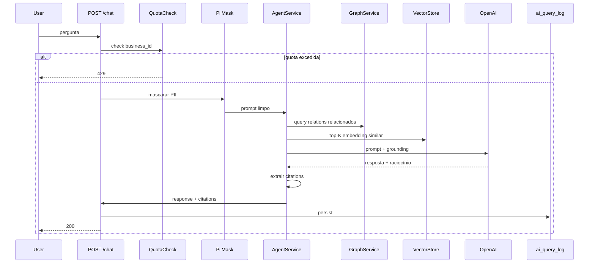
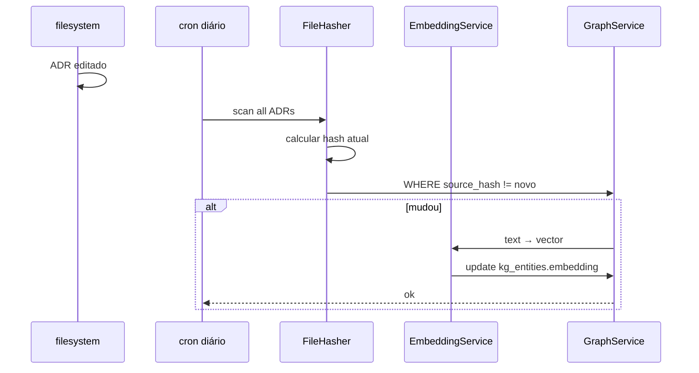

# Arquitetura — LaravelAI

## 1. Objetivo

Plataforma de IA contextual sobre dados do oimpresso. Knowledge Graph + RAG + agente conversacional, multi-tenant nativo, sem alucinação (cita fontes sempre).

## 2. Decisões arquiteturais cardinais

| Decisão | ADR | Resumo |
|---|---|---|
| Eloquent + pgvector pro MVP, Neo4j futuro | [adr/arq/0001](adr/arq/0001-eloquent-mvp-vs-neo4j-producao.md) | Zero infra extra MVP; migrar quando >50k nodes |
| Estende MemCofre vs módulo separado | [adr/arq/0002](adr/arq/0002-estende-memcofre-vs-modulo-separado.md) | Estende — reusa RAG parcial existente |
| Inertia (não SPA separada) | [adr/arq/0003](adr/arq/0003-inertia-vs-spa.md) | Mesma stack do oimpresso; auth compartilhado |
| Embeddings OpenAI `text-embedding-3-small` | [adr/tech/0001](adr/tech/0001-embeddings-openai-vs-local.md) | Custo + qualidade; fallback sentence-transformers |
| Multi-tenant scope no banco, não no agente | [adr/tech/0002](adr/tech/0002-multitenant-scope-no-grafo.md) | `business_id` em toda query; agente não pode override |
| Sync via Observer + hash | [adr/tech/0003](adr/tech/0003-sync-via-observer-hash.md) | Embeddings regenerados em mudança detectada |
| React Flow pro grafo visual | [adr/ui/0001](adr/ui/0001-grafo-react-flow.md) | Open-source, popular, performance ok até 5k nodes |
| Timeline audit via Recharts | [adr/ui/0002](adr/ui/0002-timeline-audit-recharts.md) | Mesmo Recharts dos outros módulos; consistência |

## 3. Camadas

```
┌─────────────────────────────────────────────────────────────┐
│  Pages Inertia — admin tenant + chat contextual flutuante  │
│  + React Flow (visualização) + Recharts (audit timeline)    │
└─────────────────────────────────────────────────────────────┘
                          ↕
┌─────────────────────────────────────────────────────────────┐
│  Services                                                    │
│  AgentService · GraphService · VectorStoreService           │
│  AuditQueryService · PiiMaskService · EmbeddingService      │
└─────────────────────────────────────────────────────────────┘
                          ↕
┌─────────────────────────────────────────────────────────────┐
│  Providers (LLMs)                                            │
│  OpenAIProvider · AnthropicProvider · (futuro: local)       │
│  + circuit breaker + fallback                                │
└─────────────────────────────────────────────────────────────┘
                          ↕
┌─────────────────────────────────────────────────────────────┐
│  Storage                                                     │
│  kg_entities (com VECTOR(1536) pgvector)                    │
│  kg_relations                                                │
│  ai_query_log · ai_feedback · ai_quota_usage                │
└─────────────────────────────────────────────────────────────┘
                          ↕
┌─────────────────────────────────────────────────────────────┐
│  Fontes alimentadoras (read-only)                           │
│  Spatie permissions + roles                                  │
│  activity_log Spatie                                         │
│  ADRs em memory/ (filesystem)                                │
│  Schemas Financeiro/NfeBrasil/RecurringBilling/etc.         │
└─────────────────────────────────────────────────────────────┘
                          ↕  Observer + cron sync
┌─────────────────────────────────────────────────────────────┐
│  Estende MemCofre — usa docs_evidences + docs_chat_messages │
└─────────────────────────────────────────────────────────────┘
```

## 4. Modelos e tabelas

### 4.1 Knowledge Graph

```sql
CREATE TABLE kg_entities (
    id BIGINT UNSIGNED PRIMARY KEY AUTO_INCREMENT,
    business_id INT UNSIGNED NOT NULL,
    type VARCHAR(50) NOT NULL,            -- 'user', 'role', 'permission', 'resource', 'adr', 'invoice', 'contract', etc.
    label VARCHAR(255) NOT NULL,
    external_id VARCHAR(100) NULL,        -- ID na tabela origem (users.id, etc.)
    properties JSON NOT NULL DEFAULT '{}',
    embedding VECTOR(1536) NULL,          -- pgvector ou JSON em MySQL antigo
    embedding_model VARCHAR(50) NULL,     -- 'openai-text-embedding-3-small'
    embedding_updated_at TIMESTAMP NULL,
    source_hash CHAR(64) NULL,            -- hash do dado fonte; sync detect changes
    created_at TIMESTAMP NOT NULL DEFAULT CURRENT_TIMESTAMP,
    updated_at TIMESTAMP NULL ON UPDATE CURRENT_TIMESTAMP,

    INDEX idx_business_type (business_id, type),
    INDEX idx_business_external (business_id, type, external_id),
    INDEX idx_source_hash (source_hash)  -- pra detectar mudanças
);

CREATE TABLE kg_relations (
    id BIGINT UNSIGNED PRIMARY KEY AUTO_INCREMENT,
    business_id INT UNSIGNED NOT NULL,
    from_entity_id BIGINT UNSIGNED NOT NULL,
    to_entity_id BIGINT UNSIGNED NOT NULL,
    relation VARCHAR(50) NOT NULL,        -- 'HAS_ROLE', 'CAN_ACCESS', 'GOVERNED_BY', 'CITED_IN'
    weight FLOAT DEFAULT 1.0,
    metadata JSON NULL,
    created_at TIMESTAMP NOT NULL DEFAULT CURRENT_TIMESTAMP,

    UNIQUE KEY uk_relation (business_id, from_entity_id, to_entity_id, relation),
    FOREIGN KEY (from_entity_id) REFERENCES kg_entities(id) ON DELETE CASCADE,
    FOREIGN KEY (to_entity_id) REFERENCES kg_entities(id) ON DELETE CASCADE,
    INDEX idx_from (from_entity_id, relation),
    INDEX idx_to (to_entity_id, relation)
);
```

### 4.2 Audit + Quota + Feedback

```sql
CREATE TABLE ai_query_log (
    id BIGINT UNSIGNED PRIMARY KEY AUTO_INCREMENT,
    business_id INT UNSIGNED NOT NULL,
    user_id INT UNSIGNED NOT NULL,
    question_text TEXT NOT NULL,         -- já com PII mascarado
    response_summary TEXT NOT NULL,
    citations JSON NOT NULL,
    provider VARCHAR(30) NOT NULL,
    model VARCHAR(50) NOT NULL,
    tokens_input INT UNSIGNED NOT NULL DEFAULT 0,
    tokens_output INT UNSIGNED NOT NULL DEFAULT 0,
    latency_ms INT UNSIGNED NOT NULL,
    created_at TIMESTAMP NOT NULL DEFAULT CURRENT_TIMESTAMP,

    INDEX idx_business_time (business_id, created_at)
);

CREATE TABLE ai_quota_usage (
    business_id INT UNSIGNED NOT NULL,
    mes_competencia CHAR(7) NOT NULL,    -- 2026-04
    queries_used INT UNSIGNED NOT NULL DEFAULT 0,
    tokens_used BIGINT UNSIGNED NOT NULL DEFAULT 0,
    PRIMARY KEY (business_id, mes_competencia)
);

CREATE TABLE ai_feedback (
    id BIGINT UNSIGNED PRIMARY KEY AUTO_INCREMENT,
    query_log_id BIGINT UNSIGNED NOT NULL,
    rating ENUM('helpful', 'not_helpful', 'wrong') NOT NULL,
    comment TEXT NULL,
    created_at TIMESTAMP NOT NULL DEFAULT CURRENT_TIMESTAMP,
    FOREIGN KEY (query_log_id) REFERENCES ai_query_log(id) ON DELETE CASCADE
);
```

## 5. Integrações

### 5.1 Hooks UltimatePOS

`Modules\LaravelAI\Providers\LaravelAIServiceProvider::boot()`:

| Hook | Injeta |
|---|---|
| `modifyAdminMenu()` | "IA & Knowledge" (3 itens: Chat, Grafo, Audit Query) |
| `user_permissions()` | 5 permissões (`laravel-ai.{chat,graph,audit,rag,admin}.{view,use}`) |
| `superadmin_package()` | Add-on Pro R$ 199 / Enterprise R$ 599 com quotas diferentes |

### 5.2 Sync com fontes externas

**Spatie permissions/roles:**
```php
// Listener
class SyncSpatiePermissoesAoGrafo {
    public function handle(PermissionAttached $event): void {
        // upsert kg_entities + kg_relations refletindo mudança
    }
}
```

**Activity log:**
- Não duplicado em kg_entities (volume alto demais)
- Consultado on-demand via `AuditQueryService` direto na tabela `activity_log`

**ADRs filesystem:**
- Cron diário detecta mudanças via hash → re-embed → upsert kg_entities (type='adr')
- Watcher Laravel opcional pra real-time

**Schemas Financeiro/NfeBrasil/RecurringBilling:**
- Por demanda: ao perguntar "qual o status do contract X", busca direto na tabela do módulo (não duplica)
- Embeddings só de descrições semânticas (ex: ADR explicando o módulo)

### 5.3 Eventos publicados

```php
namespace Modules\LaravelAI\Events;
class QueryAnswered { public AiQueryLog $log; }
class FeedbackReceived { public AiFeedback $feedback; }
class QuotaExceeded { public Business $business; public string $competencia; }
class ProviderFailed { public string $provider; public string $reason; }  // pra alerting
```

### 5.4 Eventos consumidos

| Evento | Origem | Listener |
|---|---|---|
| `Spatie\Permission\Events\PermissionAttached` | Spatie | `SyncSpatiePermissoesAoGrafo` |
| `Spatie\Permission\Events\RoleAttached` | Spatie | `SyncSpatieRolesAoGrafo` |
| `App\Events\AdrUpdated` (custom MemCofre) | MemCofre | `RegenerateAdrEmbedding` |
| `App\Events\BusinessCreated` | Core | `BootstrapBusinessGraph` (seed inicial) |

## 6. Fluxos críticos

### 6.1 Pergunta → resposta com citação



### 6.2 Sync ADR após edit



## 7. Performance e escala

| Aspecto | Estratégia |
|---|---|
| Latência query agente | < 5s p95 (1-2s embed + 1-3s LLM) |
| Cache hit rate | > 60% via cache (business, question_hash) |
| Volume queries | 1k/mês Pro, 10k/mês Enterprise — quota dura |
| pgvector index | HNSW com `m=16, ef=64` (balance speed/recall) |
| Embeddings cost | ~$0.02 por 1M tokens; tenant médio gasta ~$30/mês |
| Sync ADR | Cron 03:00; <100 ADRs em <30s |

## 8. Segurança e compliance

- **PII mascarado** antes de prompt LLM (R-AI-004)
- **Multi-tenant scope** no banco, agente NÃO pode override (R-AI-001)
- **Rate limit** por user 30 queries/min
- **Quota** por business mensal
- **Audit log** completo em `ai_query_log`
- **Fallback provider** se OpenAI down (R-AI-010) — circuit breaker
- **No-export**: queries não saem dos data centers do provider (OpenAI: opt-out training; Anthropic: default no-train)
- **LGPD**: PII mascarado + audit local + opt-out tenant possível

## 9. Decisões em aberto

- [ ] Multi-modal (visualizar gráficos via IA): vale Onda 6?
- [ ] Custom embeddings por tenant (Enterprise): retorno do investimento?
- [ ] Local LLM (Ollama, LM Studio) pra tenant Enterprise paranoid? Margem cai mas controle aumenta
- [ ] Suporte a múltiplos idiomas (PT-BR + EN)? Para clientes internacionais
- [ ] Análise preditiva (ML interno): churn risk, NFe rejection probability — vale o esforço?

## 10. Histórico

- **2026-04-24** — promovido de `_Ideias/LaravelAI/` para `requisitos/LaravelAI/` (`spec-ready`)
- **2026-04 (mobile)** — ideia originada em conversa Claude (`_Ideias/LaravelAI/evidencias/conversa-claude-2026-04-mobile.md`)

---

_Última regeneração: manual 2026-04-24_
_Ver no MemCofre: `/memcofre/modulos/LaravelAI`_
