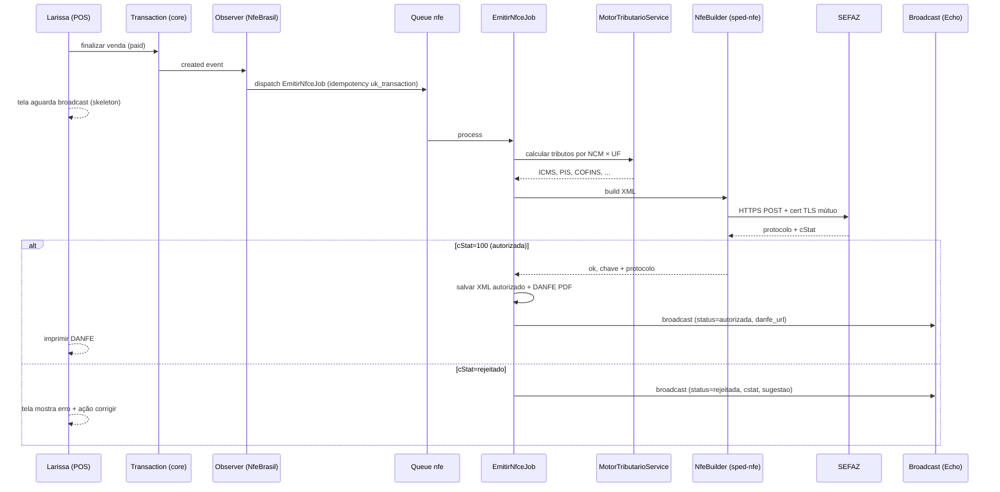
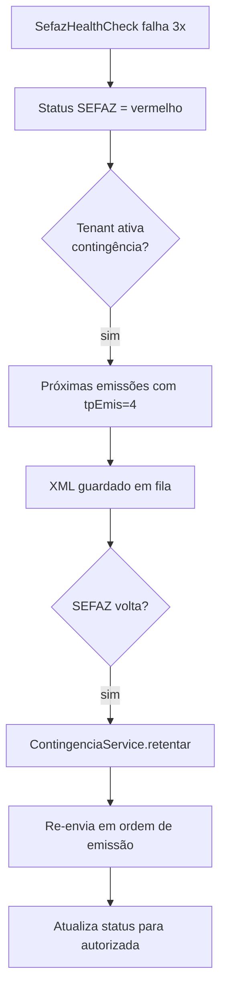

# Arquitetura — NfeBrasil

## 1. Objetivo

Módulo emissor fiscal completo brasileiro plugado no UltimatePOS 6.7. Emissão NFe/NFC-e/MDF-e/CT-e + SPED, com motor tributário multi-regime e schema flexível pra Reforma Tributária CBS/IBS (2026-2033).

## 2. Decisões arquiteturais cardinais

| Decisão | ADR | Resumo |
|---|---|---|
| Módulo nwidart isolado | [adr/arq/0001](adr/arq/0001-modulo-isolado-via-nwidart.md) | Prefix `nfe_*`; namespace `Modules\NfeBrasil\` |
| Lib base: `eduardokum/sped-nfe` | [adr/arq/0002](adr/arq/0002-lib-sped-nfe-vs-acbr.md) | Maduro BR; ACBr é desktop COM, rejeitado |
| Cert A1 storage criptografado por business | [adr/arq/0003](adr/arq/0003-cert-a1-storage-criptografado.md) | `openssl_encrypt` + chave por business |
| Schema flexível CBS/IBS | [adr/arq/0004](adr/arq/0004-schema-flexivel-cbs-ibs-reforma-tributaria.md) | Campos nullable, motor skip se null |
| Numeração com `lockForUpdate` | [adr/tech/0001](adr/tech/0001-numeracao-com-lockForUpdate.md) | Sequencial sem gap, sem dupla |
| Contingência EPEC/FS-DA com retentativa ordenada | [adr/tech/0002](adr/tech/0002-contingencia-epec-fsda-retentativa-ordenada.md) | Fila ordem emissão; re-envia quando volta |
| Retenção XML 5 anos write-once | [adr/tech/0003](adr/tech/0003-retencao-xml-5-anos-write-once.md) | Storage read-only + hash SHA256 + checagem diária |
| Fluxo emissão 1 clique no POS | [adr/ui/0001](adr/ui/0001-fluxo-emissao-1-clique-no-pos.md) | Async via queue; broadcast status; bloqueio mínimo |
| Monitor com cStat → sugestão correção | [adr/ui/0002](adr/ui/0002-monitor-cstat-sugestao-correcao.md) | Lookup table + CTA reemitir |

## 3. Camadas

```
┌─────────────────────────────────────────────────────────────┐
│  Pages Inertia (resources/js/Pages/NfeBrasil/)             │
│  + shadcn/ui + TanStack Query + Echo (broadcast)           │
└─────────────────────────────────────────────────────────────┘
                          ↕  Inertia
┌─────────────────────────────────────────────────────────────┐
│  Controllers + FormRequests + Resources                     │
└─────────────────────────────────────────────────────────────┘
                          ↕
┌─────────────────────────────────────────────────────────────┐
│  Services                                                    │
│  CertificadoService · CertificadoGuard · NumberSequenceService│
│  MotorTributarioService · NfeBuilderService · SefazClient   │
│  CancelamentoService · CcEService · ContingenciaService     │
│  SpedFiscalGenerator · DanfeGenerator (sped-da)             │
└─────────────────────────────────────────────────────────────┘
                          ↕
┌─────────────────────────────────────────────────────────────┐
│  Jobs (queue: nfe — separada de financeiro)                │
│  EmitirNfceJob · EmitirNfeJob · CancelarNfeJob · CcEJob    │
│  ConsultarStatusJob · GerarSpedJob · VerificarIntegridadeXmlJob│
└─────────────────────────────────────────────────────────────┘
                          ↕
┌─────────────────────────────────────────────────────────────┐
│  Models                                                      │
│  NfeEmissao · NfeEvento · Certificado · FiscalRule          │
│  Ncm · Cest · Cfop · CstOrigem · CSosn · CStatCorrecao      │
│  + BusinessScope + LogsActivity                             │
└─────────────────────────────────────────────────────────────┘
                          ↕
┌─────────────────────────────────────────────────────────────┐
│  Database (prefix `nfe_`)                                    │
│  + Storage `storage/app/nfe-brasil/{business_id}/...`        │
│    ├── cert/{uuid}.pfx.enc       (criptografado)           │
│    ├── xmls/{ano}/{mes}/{chave}.xml  (read-only)           │
│    ├── danfe/{chave}.pdf                                    │
│    └── sped/{ano}/{mes}/efd-icms-ipi.txt                   │
└─────────────────────────────────────────────────────────────┘
                          ↕  HTTPS + cert TLS mútuo
┌─────────────────────────────────────────────────────────────┐
│  SEFAZ webservices (NFe/NFC-e/MDF-e/CT-e por UF)           │
│  + SVAN/SVRS contingência                                   │
└─────────────────────────────────────────────────────────────┘
```

## 4. Modelos e tabelas

### 4.1 Núcleo

| Modelo | Tabela | Finalidade |
|---|---|---|
| `Certificado` | `nfe_certificados` | A1 .pfx criptografado + senha encrypt + validade |
| `NfeEmissao` | `nfe_emissoes` | NFe/NFC-e/MDF-e/CT-e emitida (1 row por documento) |
| `NfeEvento` | `nfe_eventos` | Cancelamento, CCe, manifestação (eventos da emissão) |
| `FiscalRule` | `nfe_fiscal_rules` | Regra tributária por (business, ncm, uf_origem, uf_destino) |
| `BusinessConfig` | `nfe_business_configs` | Regime, ambiente (homol/prod), CSC, série, etc. |
| `SefazStatus` | `nfe_sefaz_status` | Cache health-check por UF (verde/amarelo/vermelho) |
| `Consulta` | `nfe_consultas` | Cache de consultas SEFAZ (cadastro, status NFe, DFe) |

### 4.2 Datasets fiscais (lookup, populados por seeder)

| Modelo | Tabela | Finalidade |
|---|---|---|
| `Ncm` | `nfe_ncms` | NCM oficial Receita Federal (CSV download) |
| `Cest` | `nfe_cests` | CEST CONFAZ Convênio 142/2018 |
| `Cfop` | `nfe_cfops` | CFOPs RICMS / Portal NFe |
| `Cst` | `nfe_csts` | CST tradicional (não-Simples) |
| `Csosn` | `nfe_csosns` | CSOSN Simples Nacional |
| `CStatCorrecao` | `nfe_cstat_correcoes` | Mapa cStat → motivo + sugestão correção |

### 4.3 Schema essencial — `nfe_emissoes`

```sql
CREATE TABLE nfe_emissoes (
    id BIGINT UNSIGNED PRIMARY KEY AUTO_INCREMENT,
    business_id INT UNSIGNED NOT NULL,
    transaction_id BIGINT UNSIGNED NULL,             -- FK core (sells/purchases)

    modelo CHAR(2) NOT NULL,                         -- 55 (NF-e), 65 (NFC-e), 57 (CT-e), 58 (MDF-e)
    serie INT UNSIGNED NOT NULL,
    numero BIGINT UNSIGNED NOT NULL,                 -- sequencial por (business, modelo, serie)
    chave_acesso CHAR(44) NULL,                      -- preenchido após autorização
    protocolo VARCHAR(20) NULL,

    ambiente ENUM('homol', 'prod') NOT NULL,
    tp_emis TINYINT UNSIGNED NOT NULL DEFAULT 1,     -- 1=normal, 4=EPEC, 9=FS-DA, etc.
    natureza_operacao VARCHAR(60) NOT NULL,
    cfop CHAR(4) NOT NULL,

    cnpj_emitente CHAR(14) NOT NULL,
    cnpj_cpf_destinatario CHAR(14) NULL,
    nome_destinatario VARCHAR(60) NULL,

    valor_total DECIMAL(15,2) NOT NULL,
    valor_icms DECIMAL(15,2) NOT NULL DEFAULT 0,
    valor_icms_st DECIMAL(15,2) NOT NULL DEFAULT 0,
    valor_ipi DECIMAL(15,2) NOT NULL DEFAULT 0,
    valor_pis DECIMAL(15,2) NOT NULL DEFAULT 0,
    valor_cofins DECIMAL(15,2) NOT NULL DEFAULT 0,
    valor_cbs DECIMAL(15,2) NULL,                    -- Reforma 2026+
    valor_ibs DECIMAL(15,2) NULL,                    -- Reforma 2026+

    status ENUM('pendente', 'enviada', 'autorizada', 'rejeitada',
                'cancelada', 'denegada', 'inutilizada', 'contingencia') NOT NULL DEFAULT 'pendente',
    cstat INT UNSIGNED NULL,
    motivo VARCHAR(255) NULL,

    xml_hash CHAR(64) NULL,                          -- SHA256 do XML autorizado
    xml_path VARCHAR(255) NULL,
    danfe_path VARCHAR(255) NULL,

    emitida_em TIMESTAMP NULL,
    autorizada_em TIMESTAMP NULL,
    cancelada_em TIMESTAMP NULL,

    created_by INT UNSIGNED NOT NULL,
    created_at TIMESTAMP NOT NULL DEFAULT CURRENT_TIMESTAMP,
    updated_at TIMESTAMP NULL ON UPDATE CURRENT_TIMESTAMP,

    UNIQUE KEY uk_chave (chave_acesso),
    UNIQUE KEY uk_numero (business_id, modelo, serie, numero),
    UNIQUE KEY uk_transaction (business_id, transaction_id, modelo),  -- idempotência
    INDEX idx_business_status_modelo (business_id, status, modelo),
    INDEX idx_business_emitida (business_id, emitida_em)
);
```

### 4.4 Schema — `nfe_certificados`

```sql
CREATE TABLE nfe_certificados (
    id BIGINT UNSIGNED PRIMARY KEY AUTO_INCREMENT,
    business_id INT UNSIGNED NOT NULL,

    cn VARCHAR(255) NOT NULL,                        -- CN do cert (cnpj)
    cnpj_extraido CHAR(14) NOT NULL,
    not_before DATE NOT NULL,
    not_after DATE NOT NULL,

    pfx_path VARCHAR(255) NOT NULL,                  -- caminho do .pfx criptografado
    senha_encrypted TEXT NOT NULL,                   -- senha criptografada (Laravel encrypt)

    status ENUM('ativo', 'revogado', 'expirado') NOT NULL DEFAULT 'ativo',

    uploaded_by INT UNSIGNED NOT NULL,
    created_at TIMESTAMP NOT NULL DEFAULT CURRENT_TIMESTAMP,
    revogado_em TIMESTAMP NULL,

    INDEX idx_business_status (business_id, status),
    INDEX idx_not_after (not_after)                  -- pra alerta de vencimento
);
```

### 4.5 Schema — `nfe_fiscal_rules`

```sql
CREATE TABLE nfe_fiscal_rules (
    id BIGINT UNSIGNED PRIMARY KEY AUTO_INCREMENT,
    business_id INT UNSIGNED NOT NULL,

    ncm CHAR(8) NOT NULL,
    uf_origem CHAR(2) NOT NULL,
    uf_destino CHAR(2) NULL,                         -- NULL = aplica a qualquer UF destino

    -- ICMS tradicional
    cst CHAR(3) NULL,                                -- CST (regimes tradicionais)
    csosn CHAR(3) NULL,                              -- CSOSN (Simples Nacional)
    aliquota_icms DECIMAL(5,2) NULL,
    aliquota_icms_st DECIMAL(5,2) NULL,
    mva DECIMAL(7,4) NULL,                           -- Margem de Valor Agregado
    fcp DECIMAL(5,2) NULL,                           -- Fundo de Combate à Pobreza
    difal_aliquota DECIMAL(5,2) NULL,

    -- IPI / PIS / COFINS
    cst_ipi CHAR(2) NULL,
    aliquota_ipi DECIMAL(5,2) NULL,
    cst_pis CHAR(2) NULL,
    aliquota_pis DECIMAL(5,2) NULL,
    cst_cofins CHAR(2) NULL,
    aliquota_cofins DECIMAL(5,2) NULL,

    -- CBS / IBS (Reforma Tributária 2026-2033) — campos NULL hoje
    cbs_aliquota DECIMAL(5,2) NULL,
    cbs_cst VARCHAR(10) NULL,
    ibs_aliquota DECIMAL(5,2) NULL,
    ibs_cst VARCHAR(10) NULL,

    cest CHAR(7) NULL,
    metadata JSON NULL,

    created_at TIMESTAMP NOT NULL DEFAULT CURRENT_TIMESTAMP,
    updated_at TIMESTAMP NULL ON UPDATE CURRENT_TIMESTAMP,

    UNIQUE KEY uk_rule (business_id, ncm, uf_origem, uf_destino)
);
```

## 5. Integrações

### 5.1 Hooks UltimatePOS

No `Modules\NfeBrasil\Providers\NfeBrasilServiceProvider::boot()`:

| Hook | O que injeta |
|---|---|
| `modifyAdminMenu()` | Sub-menu "NFe Brasil" (5 itens: Configuração, Emissões, Monitor, SPED, Tributação) |
| `user_permissions()` | 14 permissões Spatie (`nfe.{area}.{action}`) |
| `superadmin_package()` | 3 pacotes: Starter R$ 99 / Pro R$ 299 / Enterprise R$ 599 + add-on cert R$ 199/ano |
| `getModuleVersionInfo()` | Versão + dependências (`eduardokum/sped-nfe`, `eduardokum/sped-da`) |

### 5.2 Observers no core

```php
\App\Models\Transaction::observe(\Modules\NfeBrasil\Observers\TransactionObserver::class);
```

- `created` (sells com `payment_status=paid`) + business config `auto_emitir_nfce=true` → dispatch `EmitirNfceJob`
- `updated` (mudança de payment) → não re-emite (impede dupla)
- `deleted` (venda cancelada) → se NFe autorizada, sugere cancelamento manual

### 5.3 Eventos publicados

```php
namespace Modules\NfeBrasil\Events;

class NfeAutorizada { public NfeEmissao $emissao; }      // Financeiro escuta pra DRE/título
class NfeRejeitada { public NfeEmissao $emissao; public string $motivo; }
class NfeCancelada { public NfeEmissao $emissao; public string $motivo; }  // Financeiro escuta pra estorno
class CcEEnviada { public NfeEvento $evento; }
class ContingenciaAtivada { public string $tipo; }       // alerta global
class ContingenciaDesativada {}
class CertificadoExpirando { public Certificado $cert; public int $dias; } // alerta proativo
```

### 5.4 Eventos consumidos

| Evento | Origem | Listener |
|---|---|---|
| `App\Events\TransactionCompleted` | Core (POS finaliza venda) | `EmitirNfceListener` |
| `Modules\Financeiro\Events\TituloBaixado` | Financeiro | (futuro) emitir recibo se cliente pediu |
| `Modules\RecurringBilling\Events\InvoicePaid` | RecurringBilling | `EmitirNfseListener` (extensão NfeBrasil pra serviços) |

### 5.5 Serviços externos (SEFAZ)

- **NFe/NFC-e webservices** — 27 UFs + SVAN + SVRS (SVRS é contingência nacional)
- **DFe Distribuição** — `WS-NFeDistribuicaoDFe` pra receber NFes endereçadas
- **MDF-e** — webservice nacional MDF-e
- **CT-e** — por UF
- **Tempo médio resposta SEFAZ:** 1-3s normal; pode chegar a 10s em pico

### 5.6 Regras de timezone

- ✅ `format_now_local()` para `dhEmi` (data/hora emissão NFe) — sem shift +3h
- ✅ Persistência em UTC; XML SEFAZ gera com offset do business timezone
- ❌ Nunca `Carbon::createFromTimestamp` direto

## 6. Fluxos críticos

### 6.1 Emissão NFC-e a partir de venda POS



### 6.2 Contingência EPEC



### 6.3 SPED Fiscal mensal

```mermaid
flowchart TD
    A[Contador acessa /nfe-brasil/sped] --> B[Seleciona mês YYYY-MM]
    B --> C[Dispatch GerarSpedJob]
    C --> D[Bloco 0 — Empresa]
    C --> E[Bloco C — NFes próprias C100/C170]
    C --> F[Bloco C — NFes terceiros C500]
    C --> G[Bloco H — Inventário (link Stock core)]
    C --> H[Bloco 9 — Totais]
    D & E & F & G & H --> I[Concatenar arquivo .txt]
    I --> J[Validar contra layout PVA]
    J --> K[Salvar em storage + gerar token compartilhável 14d]
    K --> L[E-mail contador com link]
```

## 7. Performance e escala

| Aspecto | Estratégia |
|---|---|
| Emissão online | < 5s p95 (1-3s SEFAZ + 500ms XML build + 200ms persistência) |
| Volume 1000 NFC-e/dia | Queue `nfe` com 4 workers paralelos; throughput ~10/s |
| Consulta cadastro | Cache 24h (rate limit SEFAZ 30 req/min) |
| Dataset NCM (15k rows) | Tabela com index `(ncm)`; Scout/Meilisearch se busca free-text futuro |
| SPED mensal 5k notas | Job background ~30-60s; progresso broadcast |
| XML retenção | Cold storage rotacionada por ano; query usa `xml_path` resolvido on-demand |

## 8. Segurança e compliance

- **Cert A1 storage**: criptografado + senha encrypt + permissão de file-system 0600
- **Senha cert**: NUNCA em logs (validado em teste)
- **XML retenção**: 5 anos write-once (job diário valida hash)
- **Audit log Spatie**: toda mutação fiscal
- **PII**: nome destinatário em logs mascarado (config flag)
- **Rate limit**: emissão por business 100 req/min (proteção spam)
- **Cert vencendo**: alerta 30/15/7/1 dia antes via e-mail + banner
- **Conformidade Portaria/CF**: legal review anual (revisão de retenção + acesso)

## 9. Decisões em aberto

- [ ] Cert A1 gerenciado pelo oimpresso: implicação legal (responsabilidade pela chave privada)?
- [ ] Manifestação automática (Confirmação): default opt-in ou opt-out?
- [ ] PVA (Programa Validador) integrado ou externo? Externo é mais robusto mas mais lento
- [ ] CBS/IBS: ativar campos hoje ou esperar legislação consolidar?
- [ ] Multi-CNPJ por business (filiais): stack atual permite? Precisa schema ajuste

## 10. Histórico

- **2026-04-24** — promovido de `_Ideias/NfeBrasil/` (status `researching`) para `requisitos/NfeBrasil/` (`spec-ready`)
- **2026-04 (mobile)** — ideia originada em conversa Claude (`_Ideias/NfeBrasil/evidencias/conversa-claude-2026-04-mobile.md`)

---

_Última regeneração: manual 2026-04-24_
_Regerar partes auto-geráveis: `php artisan module:requirements NfeBrasil` (após scaffold)_
_Ver no MemCofre: `/memcofre/modulos/NfeBrasil`_
