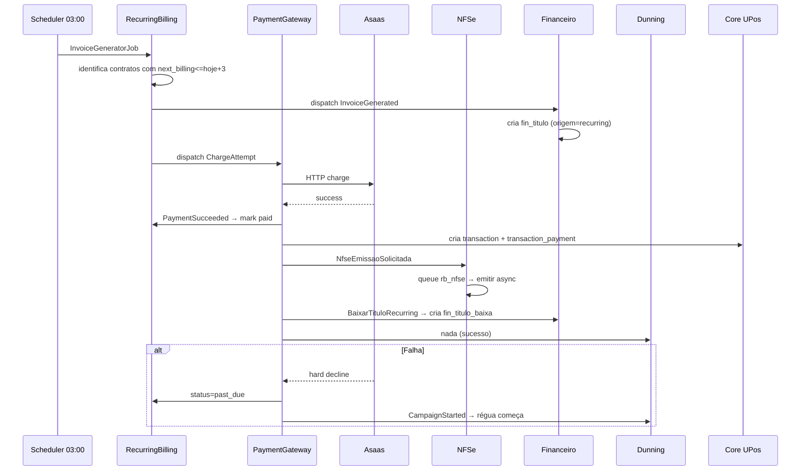
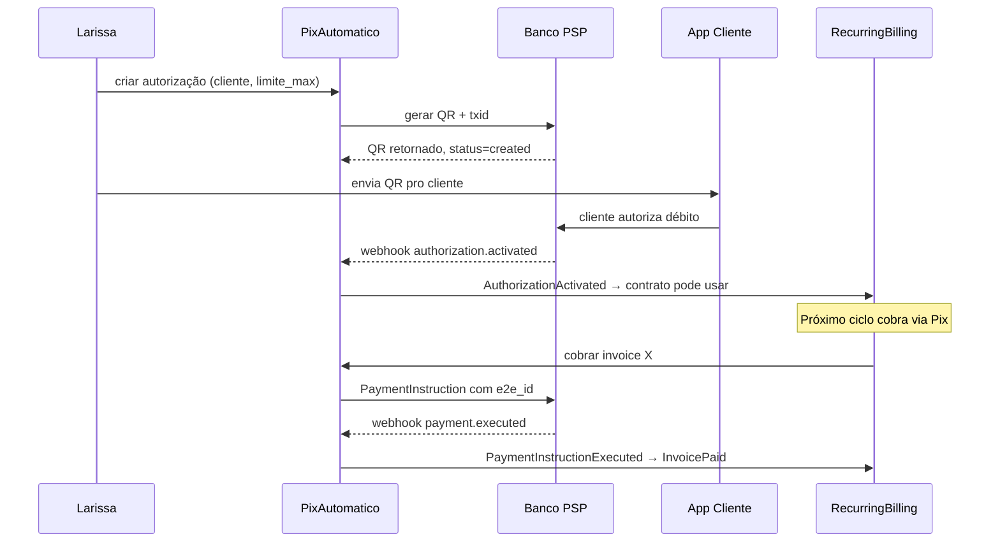
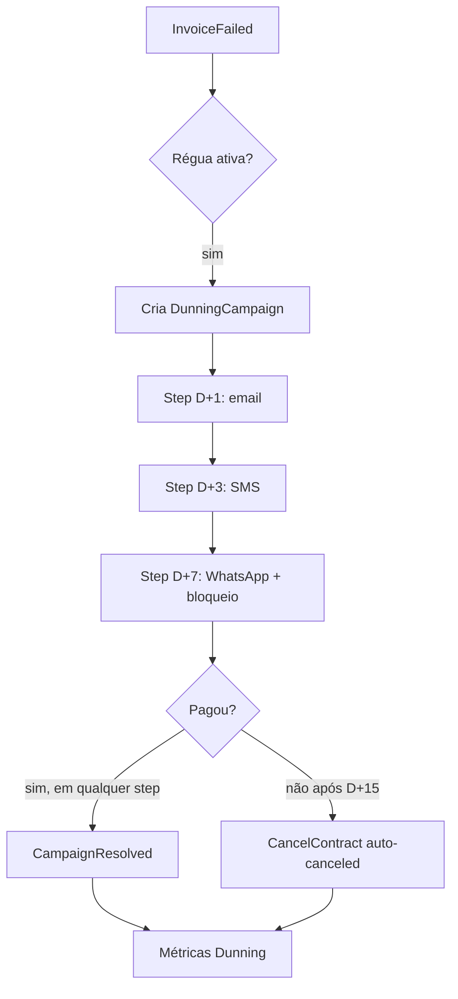

# Arquitetura — RecurringBilling

## 1. Objetivo

Plataforma de billing recorrente moderna brasileira, plugada em UltimatePOS, com **6 sub-módulos event-driven**: RecurringBilling (núcleo), PaymentGateway, PixAutomatico, NFSe, Dunning, Boleto.

## 2. Decisões arquiteturais cardinais

| Decisão | ADR | Resumo |
|---|---|---|
| 6 sub-módulos event-driven, não monolito | [adr/arq/0001](adr/arq/0001-6-modulos-event-driven.md) | Comunicação só por evento Laravel |
| NFSe é sub-módulo, não estende NfeBrasil direto | [adr/arq/0002](adr/arq/0002-nfse-submodulo-vs-nfebrasil.md) | NFSe assíncrona não pode travar billing |
| Pix Automático Jornada 3 (PAYMENTONAPPROVAL) | [adr/arq/0003](adr/arq/0003-pix-automatico-jornada-3-paymentonapproval.md) | Jornada simplificada Woovi |
| Take rate vs merchant-of-record | [adr/arq/0004](adr/arq/0004-take-rate-vs-merchant-of-record.md) | Take rate só em gateway próprio |
| Idempotência charge_attempts e webhooks | [adr/tech/0001](adr/tech/0001-idempotencia-charge-attempts-e-webhooks.md) | UNIQUE (event_id, provider) e (invoice, attempt) |
| Webhook Asaas at-least-once | [adr/tech/0002](adr/tech/0002-webhook-asaas-at-least-once-resposta-rapida.md) | Resposta 200 < 5s, processamento async |
| Proração mid-cycle | [adr/tech/0003](adr/tech/0003-proration-mid-cycle.md) | Service puro, 6 cenários cobertos |
| Portal B2C self-service white-label | [adr/ui/0001](adr/ui/0001-portal-b2c-self-service-white-label.md) | Cliente do tenant atualiza cartão sozinho |
| Timeline de assinatura visual | [adr/ui/0002](adr/ui/0002-timeline-assinatura-visual.md) | Recharts timeline mostra ciclo de vida |

## 3. Camadas (vista alto nível)

```
┌─────────────────────────────────────────────────────────────┐
│  Pages Inertia (admin tenant)  +  Pages Inertia (portal B2C)│
│  + shadcn/ui + TanStack Query + Recharts + Echo            │
└─────────────────────────────────────────────────────────────┘
                          ↕
┌─────────────────────────────────────────────────────────────┐
│  Sub-módulos (independentes, comunicam por evento)         │
│  ┌───────────────┐ ┌──────────┐ ┌──────────┐               │
│  │ Recurring     │ │ Payment  │ │ Pix      │               │
│  │ Billing (rb_) │ │ Gateway  │ │ Auto.    │               │
│  └───────────────┘ │ (pg_)    │ │ (pa_)    │               │
│                    └──────────┘ └──────────┘               │
│  ┌───────────────┐ ┌──────────┐ ┌──────────┐               │
│  │ NFSe (nfse_)  │ │ Dunning  │ │ Boleto   │               │
│  │               │ │ (dun_)   │ │ (bol_)   │               │
│  └───────────────┘ └──────────┘ └──────────┘               │
└─────────────────────────────────────────────────────────────┘
                          ↕  Eventos Laravel
┌─────────────────────────────────────────────────────────────┐
│  Queues separadas: rb_billing · rb_charges · rb_dunning     │
│  rb_nfse · rb_pix · rb_webhooks                             │
└─────────────────────────────────────────────────────────────┘
                          ↕  HTTPS + tokens / cert
┌─────────────────────────────────────────────────────────────┐
│  Asaas · Iugu · Pagar.me · Stripe · MercadoPago · BCB Pix   │
│  · Focus NFe · PlugNotas · NFEio                            │
└─────────────────────────────────────────────────────────────┘
```

## 4. Modelos e tabelas

### 4.1 Sub-módulo `RecurringBilling` (prefix `rb_`)

| Modelo | Tabela | Finalidade |
|---|---|---|
| `Plan` | `rb_plans` | Template de cobrança (ciclo, valor, trial, setup_fee, indice_reajuste) |
| `Contract` | `rb_contracts` | Contrato/subscription do cliente (status, anchor_date, next_billing_date) |
| `Invoice` | `rb_invoices` | Fatura gerada em cada ciclo |
| `ProrationEvent` | `rb_proration_events` | Audit de upgrades/downgrades/reajustes |

#### `rb_contracts` (essencial)

```sql
CREATE TABLE rb_contracts (
    id BIGINT UNSIGNED PRIMARY KEY AUTO_INCREMENT,
    business_id INT UNSIGNED NOT NULL,
    contact_id BIGINT UNSIGNED NOT NULL,        -- core UltimatePOS contacts
    plan_id BIGINT UNSIGNED NOT NULL,

    status ENUM('trialing', 'active', 'past_due', 'unpaid',
                'canceled_at_period_end', 'canceled') NOT NULL,
    anchor_date DATE NOT NULL,
    next_billing_date DATE NOT NULL,
    trial_ends_at DATE NULL,
    canceled_at TIMESTAMP NULL,
    cancel_reason VARCHAR(255) NULL,

    valor_override DECIMAL(15,2) NULL,          -- override do plano (negociação)
    payment_method ENUM('cartao', 'pix_automatico', 'boleto', 'manual') NOT NULL,
    default_card_id BIGINT UNSIGNED NULL,
    pix_authorization_id BIGINT UNSIGNED NULL,

    metadata JSON NULL,
    created_at TIMESTAMP NOT NULL DEFAULT CURRENT_TIMESTAMP,
    updated_at TIMESTAMP NULL ON UPDATE CURRENT_TIMESTAMP,

    INDEX idx_business_status (business_id, status),
    INDEX idx_next_billing (status, next_billing_date)  -- usado em job
);
```

#### `rb_invoices` (idempotência por contract+competencia)

```sql
CREATE TABLE rb_invoices (
    id BIGINT UNSIGNED PRIMARY KEY AUTO_INCREMENT,
    business_id INT UNSIGNED NOT NULL,
    contract_id BIGINT UNSIGNED NOT NULL,
    competencia_yyyy_mm CHAR(7) NOT NULL,
    transaction_id BIGINT UNSIGNED NULL,        -- link retro pro core (após pagamento)
    idempotency_key CHAR(36) NOT NULL,

    valor DECIMAL(15,2) NOT NULL,
    valor_proracao DECIMAL(15,2) NULL,
    issued_at DATE NOT NULL,
    due_at DATE NOT NULL,
    paid_at TIMESTAMP NULL,

    status ENUM('draft', 'open', 'paid', 'failed', 'voided') NOT NULL,

    UNIQUE KEY uk_competencia (business_id, contract_id, competencia_yyyy_mm),
    UNIQUE KEY uk_idempotency (business_id, idempotency_key),
    INDEX idx_business_status (business_id, status, due_at)
);
```

### 4.2 Sub-módulo `PaymentGateway` (prefix `pg_`)

| Modelo | Tabela | Finalidade |
|---|---|---|
| `Credential` | `pg_credentials` | API key + webhook secret por (business, provider, owner) |
| `PaymentMethod` | `pg_payment_methods` | Cartão tokenizado, conta bancária, Pix, etc. |
| `ChargeAttempt` | `pg_charge_attempts` | Cada tentativa de cobrança (success/decline) |
| `WebhookEvent` | `pg_webhook_events` | Idempotência: `(provider, event_id)` UNIQUE |

#### `pg_charge_attempts`

```sql
CREATE TABLE pg_charge_attempts (
    id BIGINT UNSIGNED PRIMARY KEY AUTO_INCREMENT,
    business_id INT UNSIGNED NOT NULL,
    invoice_id BIGINT UNSIGNED NOT NULL,
    attempt_number TINYINT UNSIGNED NOT NULL,
    provider VARCHAR(30) NOT NULL,
    payment_method_id BIGINT UNSIGNED NOT NULL,

    status ENUM('processing', 'succeeded', 'soft_decline', 'hard_decline', 'error') NOT NULL,
    decline_type VARCHAR(50) NULL,
    provider_transaction_id VARCHAR(100) NULL,
    response_payload JSON NULL,
    next_retry_at TIMESTAMP NULL,

    started_at TIMESTAMP NOT NULL,
    finished_at TIMESTAMP NULL,

    UNIQUE KEY uk_attempt (business_id, invoice_id, attempt_number)
);
```

### 4.3 Sub-módulo `PixAutomatico` (prefix `pa_`)

| Modelo | Tabela | Finalidade |
|---|---|---|
| `Authorization` | `pa_authorizations` | JRC autorização (created/activated/refused/expired/cancelled) |
| `PaymentInstruction` | `pa_payment_instructions` | Cobrança específica com e2e_id |
| `AuthorizationEvent` | `pa_authorization_events` | Audit de mudanças de estado |

### 4.4 Sub-módulo `NFSe` (prefix `nfse_`)

| Modelo | Tabela | Finalidade |
|---|---|---|
| `NfseEmissao` | `nfse_emissoes` | Emissão NFSe (modelo análogo NfeBrasil mas pra serviço) |
| `NfseProvider` | `nfse_providers_config` | Config Focus/PlugNotas/NFEio por business |

### 4.5 Sub-módulo `Dunning` (prefix `dun_`)

| Modelo | Tabela | Finalidade |
|---|---|---|
| `DunningRule` | `dun_rules` | Régua nomeada (ex: "Régua padrão", "Régua VIP") |
| `DunningStep` | `dun_steps` | Passos da régua (action, delay_days, template) |
| `DunningCampaign` | `dun_campaigns` | Instância ativa pra invoice falhada |
| `DunningStepExecution` | `dun_step_executions` | Cada execução de step (status, channel, sent_at) |

## 5. Integrações

### 5.1 Hooks UltimatePOS

`Modules\RecurringBilling\Providers\RecurringBillingServiceProvider::boot()`:

| Hook | O que injeta |
|---|---|
| `modifyAdminMenu()` | Sub-menu "Cobrança Recorrente" (8 itens — 1 por sub-módulo + dashboard) |
| `user_permissions()` | ~25 permissões (`recurring-billing.*`, `payment-gateway.*`, `pix-automatico.*`, `dunning.*`) |
| `superadmin_package()` | 3 pacotes Starter R$ 149 / Pro R$ 449 / Enterprise R$ 999 + take rate metering |
| `getModuleVersionInfo()` | Versão + dependências (lib gateways, etc.) |

### 5.2 Eventos publicados (alto-nível)

```php
namespace Modules\RecurringBilling\Events;
class InvoiceGenerated { public Invoice $invoice; }
class InvoicePaid { public Invoice $invoice; public ChargeAttempt $charge; }
class InvoiceFailed { public Invoice $invoice; public string $reason; }
class ContractCanceled { public Contract $contract; public string $motivo; }
class ContractReactivated { public Contract $contract; }

namespace Modules\PaymentGateway\Events;
class PaymentSucceeded { public ChargeAttempt $attempt; }
class PaymentFailed { public ChargeAttempt $attempt; public string $declineType; }
class CardSaved { public PaymentMethod $method; }

namespace Modules\PixAutomatico\Events;
class AuthorizationActivated { public Authorization $auth; }
class AuthorizationCanceled { public Authorization $auth; }
class PaymentInstructionExecuted { public PaymentInstruction $instr; }

namespace Modules\Dunning\Events;
class CampaignStarted { public Campaign $campaign; }
class CampaignResolved { public Campaign $campaign; public string $motivo; }
```

### 5.3 Eventos consumidos (alto-nível)

| Evento | Origem | Consumidores |
|---|---|---|
| `InvoiceGenerated` | RecurringBilling | PaymentGateway (cobrança) · NFSe (emissão pendente) · Financeiro (cria título) |
| `PaymentSucceeded` | PaymentGateway | RecurringBilling (marca paga + próximo ciclo) · Dunning (encerra campanha) · NFSe (emite) · Core UPos (cria transaction_payment) |
| `PaymentFailed` | PaymentGateway | Dunning (inicia/avança campanha) · RecurringBilling (status=past_due) |
| `ContractCanceled` | RecurringBilling | NFSe (cancela próxima emissão) · Dunning (encerra campanha) · PixAutomatico (cancela autorização) |

### 5.4 Integração com core UltimatePOS

Quando `InvoicePaid`:
- Cria `transactions` row (`type=sell`, `payment_status=paid`) no core
- Cria `transaction_sell_lines` com produto "Mensalidade — Plano X"
- Cria `transaction_payments` com método "Pix Automático" / "Cartão Recorrente" / etc.
- Linka `transactions.id` em `rb_invoices.transaction_id` (vínculo retro)

Por que? Garante que tudo no oimpresso usa `transactions` como fonte única de verdade. Relatórios de venda mostram receita recorrente automaticamente.

### 5.5 Integração com Financeiro

- `InvoiceGenerated` → cria `fin_titulos` (`origem=recurring`, `origem_id=invoice.id`)
- `InvoicePaid` → cria `fin_titulo_baixas` retro-vinculado
- Estrutura única: relatórios Financeiro mostram MRR + outros tipos juntos

### 5.6 Integração com NfeBrasil

NFSe estende padrões NfeBrasil (cert A1, hooks, etc.) mas é módulo separado:
- Razão: emissão de NFSe é assíncrona; falha não pode travar billing (R-RB-007)
- Compartilha: lib `eduardokum/sped-da` pro DAMSE (DANFE NFSe), padrões de timezone, idempotência

## 6. Fluxos críticos

### 6.1 Ciclo completo: gerar fatura → cobrar → emitir NFSe



### 6.2 Pix Automático autorização → cobrança



### 6.3 Dunning multicanal



## 7. Performance e escala

| Aspecto | Estratégia |
|---|---|
| Job geração faturas | Diário 03:00; 1k contratos / minuto via chunks de 100 |
| Webhook gateway 100/s pico | Resposta 200 < 200ms; processamento async em queue `rb_webhooks` |
| Smart retry agendamento | Job único `RetryDispatcher` ler `pg_charge_attempts.next_retry_at` |
| Portal B2C | Cache 5 min nos dashboards do cliente |
| MRR/ARR cálculo | Cache 30 min, invalidado em `InvoicePaid`/`ContractCanceled` |

## 8. Segurança e compliance

- **PCI compliance** — NUNCA armazenar PAN/CVV (R-RB-012); tokenização via provider iframe ou redirecionamento
- **Webhook signature** — HMAC validado (rejeita 401 se falha)
- **Credenciais gateway** — encrypt at rest
- **Audit log Spatie** — toda mutação crítica
- **LGPD** — dados PII (CPF, e-mail cliente final) cifrados em rest se solicitado
- **Reforma Tributária 2026** — split-payment pode mudar fluxo (CBS/IBS retidos na fonte). Schema flexível para `nfse_emissoes` e `pg_charge_attempts.metadata` (JSON), revisão antes de 2027

## 9. Decisões em aberto

- [ ] Lago vs Kill Bill como referência arquitetural — Lago se aproxima mais (event-driven moderno)
- [ ] Smart retry ML: vale construir agora (com 100 contratos) ou só depois 1k?
- [ ] Portal B2C: white-label completo (subdomain do tenant) ou compartilhado (login.oimpresso.com)?
- [ ] Boleto direto CNAB: vale o esforço ou ficar só com gateway?
- [ ] Reajuste IPCA: API BCB ou cache local atualizado mensalmente?

## 10. Histórico

- **2026-04-24** — promovido de `_Ideias/CobrancaRecorrente/` (status `researching`) para `requisitos/RecurringBilling/` (`spec-ready`)
- **2026-04 (mobile)** — ideia originada em conversa Claude com 2 rodadas de busca web (`_Ideias/CobrancaRecorrente/evidencias/conversa-claude-2026-04-mobile.md`)

---

_Última regeneração: manual 2026-04-24_
_Ver no MemCofre: `/memcofre/modulos/RecurringBilling`_
