# Patch zero-toque — `memory/requisitos/_Governanca/programa-ondas/PLANO-MESTRE.md`

**Intenção:** substituir a seção `## Trilha D — documentação técnica e operacional` (de `## Trilha D` até imediatamente antes de `## Índice das etapas (arquivos)`) pelo bloco abaixo. Nada mais no arquivo muda.

**Motivo:** a redação de 2026-08-05 descrevia o **mapa de cobertura**. Falta fechar o ciclo de ponta a ponta — descoberta → medição → dono → publicação → operação → incidente/drift → aprendizado → nova medição. Sem criar índice, roadmap, agente, gate ou cópia HTML.

**Linha do status vivo** (tabela de etapas) — trocar a célula da Trilha D para:

```
| **Trilha D — documentação técnica e operacional** ([W] 2026-08-05 · ciclo completo 2026-08-06) | § Trilha D deste plano | [US-INFRA-048](../../Infra/SPEC.md#us-infra-048--ativar-a-documentação-técnica-e-operacional-ponta-a-ponta) · `parent_plan=programa-ondas` | 🟡 D0 em execução; merge ratifica | cadência contínua, 1 achado acionável por vez |
```

---

## Trilha D — documentação técnica e operacional

> [W] autorizou esta trilha em 2026-08-05 a partir das **máquinas que já existiam** e ratificou o
> **ciclo completo** em 2026-08-06. Ela não cria índice, roadmap, agente, gate ou cópia HTML. Reusa
> o inventário derivado, os donos documentais, o MCP, o workflow `documentacao-tecnica` e a rota
> humana [`/documentacao`](https://oimpresso.com/documentacao).
>
> O programa não é "escrever documentação" — é manter um sistema que **mede, traduz, publica,
> opera, detecta drift e aprende**.

### D.1 Objetivo e fronteira

Fechar o ciclo de ponta a ponta para seis camadas inseparáveis:

| Camada | Componentes | Dono principal |
|---|---|---|
| **Infraestrutura** | Hostinger, Proxmox, CT 100, GitHub Actions, Windows/Firebird, router, Tailscale, PBX, SVN e dispositivos | `memory/reference/infra-*.md` + `memory/requisitos/Infra/RUNBOOK-*.md` |
| **Plataforma** | hooks, MCP, CI, skills, agents, scripts, baselines e observabilidade | índices gerados + arquitetura/Runbooks Jana, Forja e Infra |
| **Aplicação** | kernel, módulos transversais, verticais e integrações | `SCOPE.md` + `BRIEFING.md` + `SPEC.md` + `SUPERFICIE.md` + `ARCHITECTURE.md` + `RUNBOOK-*.md` |
| **Fluxos** | venda, estoque, financeiro, fiscal, WhatsApp, Jana, migração, deploy e recuperação | `GUIA-DO-SISTEMA.md` aponta; detalhe permanece no dono do fluxo |
| **Operação** | acesso, monitoramento, manutenção, backup, restore, rollback e incidentes | runbooks de operação + auditoria Ops/DR |
| **Visão humana** | [`oimpresso.com/documentacao`](https://oimpresso.com/documentacao) | renderiza `memory/GUIA-DO-SISTEMA.md`; exige autenticação |

**Fora de escopo:** documentação de produto por tela, cópia manual de inventário, reescrita de
ADRs aceitas, criação de máquina de governança e correção de achado adjacente durante outra etapa.

### D.2 O ciclo completo (11 estações)

```mermaid
flowchart LR
    A["1. Descobrir<br/>máquina, hook, MCP, módulo ou fluxo"] --> B["2. Medir o estado real<br/>inventário, código e probes"]
    B --> C["3. Classificar e localizar o dono"]
    C --> D["4. Priorizar o gap<br/>criticidade e impacto"]
    D --> E["5. Documentar no dono existente"]
    E --> F["6. Validar tecnicamente<br/>fonte, links e arquitetura"]
    F --> G["7. Validar operacionalmente<br/>executar o runbook"]
    G --> H["8. Publicar<br/>PR, merge e /documentacao"]
    H --> I["9. Operar e observar"]
    I --> J["10. Incidente ou drift"]
    J --> K["11. Aprender e corrigir<br/>runbook, lição ou decisão"]
    K --> B
```



O ciclo **não termina em publicar**. Estação 11 devolve o aprendizado à estação 2 — é o que
diferencia o programa de uma campanha de escrita.

### D.3 Onde cada estado vive

| Estado | Fonte única | Regra |
|---|---|---|
| Intenção, ondas e DoD | este plano | um único `## Status vivo` |
| Execução | tasks MCP | `parent_plan=programa-ondas`; `todo/doing/done` nunca duplicado aqui |
| Fatos técnicos e procedimentos | documentos donos no Git | ponteiro > cópia; segredo só por referência ao Vaultwarden |
| Inventários | `PAINEL-SISTEMA.md` + `MAQUINAS-INVENTARIO.md` | sempre derivados; nunca editar à mão |
| Visão humana | `/documentacao` | renderiza o Guia; exige autenticação |
| Prova de correção | `documentation-loop.mjs` | o mesmo ID precisa desaparecer no recibo antes→depois |

### D.4 Caminho canônico por tipo de artefato

#### Máquinas e ambientes

`inventário → arquitetura → acesso → operação → monitoramento → backup → restore → incidente`

Cada máquina crítica declara: função e responsável · serviços e dados · dependências ·
configuração versionada · acesso (sem copiar segredo) · probe de saúde · deploy/restart/rollback ·
backup, restore, RPO e RTO · falhas conhecidas · última validação com evidência.

#### Hooks

`arquivo do hook → índice gerado → família humana → cenário de bloqueio → troubleshooting`

Responde: quando dispara · que risco protege · bloqueia ou alerta · que entrada examina · que
mensagem produz · como provar que **morde e solta** · como diagnosticar falso positivo ou ausência
de disparo. **Não se escreve uma segunda lista de hooks** — o índice gerado continua sendo o
inventário.

#### MCP

`Git canon → sincronização → banco/cache → servidor CT 100 → autenticação → tool → auditoria`

Cobre: arquitetura e fronteiras · catálogo derivado das tools · tokens, papéis e permissões ·
isolamento por `business_id` · sincronização e drift · deploy e reload · health check · 401/403/404
e indisponibilidade · reindexação e recuperação · auditoria das ações · onboarding e offboarding.

#### Módulos

`árvore do código → superfície derivada → responsabilidade → requisitos → arquitetura → operação`

Portas documentais: `SCOPE.md` (responsabilidade e limites) · `BRIEFING.md` (estado e capacidade) ·
`SPEC.md` (requisitos) · `SUPERFICIE.md` (retrato derivado do código) · `ARCHITECTURE.md`
(construção e integrações, quando necessário) · `RUNBOOK-*.md` (operação e recuperação).

#### Fluxos ponta a ponta

Cada fluxo crítico informa: ator e ponto de entrada · máquinas e módulos atravessados · dado
transportado · autenticação e autorização · `business_id` · transação e idempotência · filas, retry
e timeout · logs, métricas e alertas · falha parcial · compensação ou rollback · procedimento de
recuperação.

### D.5 Ondas executáveis

| Onda | Escopo | Saída no dono existente | Gate de saída |
|---|---|---|---|
| **D0 · fundação** | inventários, donos, criticidade, gaps e estrutura de navegação | esta seção + navegação do Guia + tasks MCP | plano ligado ao MCP; inventários `--check`; baseline documental registrada |
| **D1 · infra crítica** | Hostinger, CT 100, Proxmox e GitHub Actions | referências de infra + runbooks de acesso/deploy/rollback/saúde | operador identifica onde roda, valida saúde e recupera sem editar servidor |
| **D2 · plataforma** | hooks, MCP, CI, skills, agents, scripts, baselines e observabilidade | índice derivado + explicação humana por família | cada família declara gatilho, bloqueio/advisory, risco, bite/release e diagnóstico |
| **D3 · MCP ponta a ponta** | Git→sync→cache→servidor→tool→audit | arquitetura Jana/MCP + runbooks de acesso, deploy, drift e recovery | auth, `business_id`, 401/403/404, reindexação e auditoria reproduzíveis |
| **D4 · módulos críticos** | Sells, Estoque, Financeiro, Fiscal, Repair e Jana | portas documentais aplicáveis por módulo | responsabilidade, requisito, arquitetura, superfície e operação alcançáveis |
| **D5 · verticais e integrações** | Vestuario, ComunicacaoVisual, OficinaAuto, WhatsApp, NFe/NFSe e gateways | mesmos donos modulares | integração e recuperação documentadas sem misturar produto com sistema |
| **D6 · legado e rede local** | Windows/Firebird, PBX, SVN, router e dispositivos | referências de infra + runbooks de legado | acesso, dependência e recuperação do legado explícitos |
| **D7 · fluxos transversais** | venda, cancelamento, fiscal, WhatsApp, IA, migração e deploy | diagramas Mermaid e ponteiros no Guia/donos | ator, máquina, módulo, dado, auth, tenant, retry, falha parcial e rollback explícitos |
| **D8 · continuidade** | backup, restore, perda de máquina, segredos e disaster recovery | auditoria Ops/DR + runbooks | RPO/RTO medidos, drill seguro, responsável e evidência datada |
| **D9 · publicação e onboarding** | `/documentacao`, trilha de entrada do time | Guia + donos corrigidos | navegação humana alcança infraestrutura, plataforma, módulos, fluxos e operação |
| **D10 · manutenção contínua** | detectores, revalidação de runbooks e aprendizado de incidentes | recibos do `documentation-loop` + lições | detectores reexecutados; runbooks revalidados; incidente vira lição e volta à estação 2 |

Ordem interna das ondas modulares: **kernel/transversais críticos → plataforma → verticais →
integrações → legado**. Uma onda pode avançar só até o próximo bloqueio humano; não abre trabalho
paralelo para esconder dependência.

### D.6 Ciclo de uma unidade de trabalho

1. **Selecionar:** uma task MCP e exatamente um achado acionável.
2. **Medir antes:** abrir fonte/configuração real, executar inventário/probe e guardar o ID estável.
3. **Localizar o dono:** corrigir o arquivo que já responde pelo assunto; nunca criar resumo paralelo.
4. **Priorizar:** criticidade × impacto; achado adjacente vira task nova, não desvio desta.
5. **Traduzir:** explicar para humano sem copiar tabela gerada nem congelar contagem em prosa.
6. **Validar tecnicamente:** fonte, links, diagrama, dependências, tenant, PII e ausência de segredo.
7. **Validar operacionalmente:** executar o runbook no ambiente correto e atualizar `last_validated`
   somente quando o resultado real bateu.
8. **Provar:** comparar `origin/main` com o trabalho pelo `documentation-loop`; alteração de data não fecha.
9. **Entregar:** PR de uma intenção; [W] ratifica pelo merge.
10. **Publicar:** confirmar a rota humana no próximo deploy de código ou `quick-sync` manual.
11. **Fechar e aprender:** task `done`, registro de sessão/handoff e lição quando houve erro ou
    incidente — o aprendizado reentra na estação 2 do ciclo.

### D.7 Batimento que mantém a trilha ativa

| Momento | Máquina existente | Efeito |
|---|---|---|
| Mudança em PR | staleness/impacto documental | mostra módulos e donos afetados; não edita automaticamente |
| Batimento agendado | `system-map` + `memory-health` | atualiza retratos derivados e acusa integridade/fato quebrado |
| Revisão semanal | `briefing-code-staleness` + `documentation-loop --snapshot` | oferece a fila de drift; o ZELADOR escolhe um item |
| Execução | workflow `.claude/workflows/documentacao-tecnica.js` | snapshot → correção no dono → recibo → PR, exatamente um item |
| Revisão do plano | `plan-health` + `jana:plan-drift` | acusa plano velho, ligação fantasma ou status divergente das tasks MCP |
| Incidente | runbook + `LICOES_CODE.md`/`proibicoes.md` quando aplicável | devolve o aprendizado ao próximo ciclo de medição |

O batimento é deliberadamente **advisory**: detecta e oferece trabalho, mas não decide conteúdo nem
merge. Manter ativo significa haver task aberta, revisão fresca e consumo regular dos achados — não
adicionar outro gate.

### D.8 Definição de pronto da trilha

- toda máquina crítica tem dono técnico, probe e runbook validado;
- hooks e tools MCP são inventariados por máquina e explicados por família para humanos;
- cada módulo ativo alcança suas portas documentais aplicáveis sem lista manual concorrente;
- cada fluxo crítico declara auth, `business_id`, dado, observabilidade, falha e recuperação;
- runbooks críticos carregam `owner` e `last_validated` sustentados por execução real;
- segredos aparecem apenas como ponteiro para o cofre;
- `/documentacao` navega por infraestrutura, plataforma, módulos, fluxos e operação;
- os detectores do escopo foram reexecutados e todo resíduo ficou fechado ou explicitamente justificado;
- as tasks MCP do `parent_plan=programa-ondas` não deixam trabalho concluído marcado como aberto;
- **um incidente já gerou aprendizado e voltou ao início do ciclo** — a prova de que a máquina gira.
